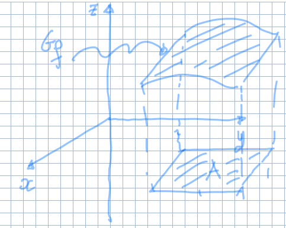

---
description:
  Studio di funzioni di più variabili (scalari e vettoriali). Grafici e curve di
  livello per funzioni scalari a più variabili.
lang: it
prev: false
title: Lezione (2025-02-24)
---

## Funzioni di più variabili e funzioni vettoriali

Nel corso si studieranno funzioni della forma:

$$
f: A \subseteq \R^n \to \R^k \text{ con } n \geq 2, k \geq 1
$$

Se $k = 1$, la funzione è definita **funzione scalare di più variabili**. Se
$k \geq 2$, è definita **funzione vettoriale di più variabili**.

In particolare studieremo i casi in cui $n = 2,3$ e $k = 1$.

## Grafico di una funzione scalare di più variabili

Per una funzione scalare di una variabile $f: A \subseteq \R \to \R$:

$$
G_f = \Set{(x, f(x)) \mid x \in A} \subset \R^2
$$

Se $f: A \subseteq \R^2 \to \R$:

$$
G_f = \Set{(x, y, f(x,y)) \mid (x,y) \in A} \subset \R^3
$$

Questo concetto può essere esteso a un numero maggiore di variabili. Tuttavia,
la visualizzazione di spazi di dimensione quattro o superiore diventa
problematica.

## Curve di livello di una funzione scalare di più variabili

Data una funzione $f: A \subseteq \R^2 \to \R$, e fissando un valore $t \in \R$,
la curva di livello di $f$ associata a $t$ è definita:

$$
C_t = \Set{(x, y) \in A \mid f(x,y) = t}
$$

:::tip

In termini pratici, le curve di livello di una funzione a due variabili sono
analoghe a quelle presenti sulle mappe topografiche per rappresentare
l'altitudine.

:::
