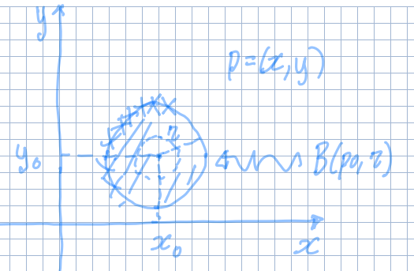

---
description:
  Distanza euclidea,  insiemi (aperti, chiusi, limitati), punti di frontiera e
  limiti di una funzione in più variabili, inclusi i teoremi fondamentali.
lang: it
title: Lezione (2025-03-03)
---

## Distanza euclidea in $\R^n$

La distanza euclidea tra 2 punti è una funzione
$d: \R^n \times \R^n \to [0, +\infty)$ definita:

$$
d(\mathbf{p}, \mathbf{q}) = \sqrt{\sum_{i = 1}^n (q_i - p_i)^2}
$$

:::note

Il prodotto cartesiano ($\times$) si usa per indicare che ci sono 2 argomenti.

:::

## Intorno

Un intorno di raggio $r$ di un punto $\mathbf{p}_0$ è la palla aperta di centro
$\mathbf{p}_0$ e distanza $r$ da $\mathbf{p}$:

$$
B(\mathbf{p}_0, r) = \Set{\mathbf{p} \in \R^n \mid d(\mathbf{p}, \mathbf{p}_0) < r}
$$

:::tip

Il fatto che la palla è aperta significa che non si deve includere la sua
circonferenza in caso di $\R^2$. In senso più generale non si deve includere la
frontiera dell'insieme dell'intorno.

:::

### Punto di frontiera

Preso un insieme $A \subseteq \R^2$, un punto $\mathbf{p} \in A$ si dice punto
di frontiera di $A$ se:

$$
\forall\ r > 0,\ B(\mathbf{p}, r) \cap A \neq \emptyset \land B(\mathbf{p}, r) \cap (\R^n \setminus A) \neq \emptyset
$$

L'insieme dei punti di frontiera di $A$ è detto **frontiera di $A$**. Si denota
con $\partial A$.

### Insieme aperto e chiuso

Un insieme è detto **chiuso** se contiene tutti i suoi punti di frontiera (cioè,
$\partial A \subseteq A$). Viceversa, un insieme è detto **aperto** se ogni suo
punto è un punto interno, ovvero, se per ogni $\mathbf{p} \in A$ esiste un
intorno $B(\mathbf{p}, r)$ tale che $B(\mathbf{p}, r) \subseteq A$.

### Insieme limitato

Un insieme è detto limitato se
$\exists\ r > 0 \mid A \subseteq B(\mathbf{0}, r)$, ovvero se esiste un raggio
abbastanza grande tale che una palla con centro all'origine contenga tutto
l'insieme $A$.

### Parte interna di un insieme

L'insieme dei punti interni di $A$ è dato da tutti i punti di $A$ esclusi i
punti di frontiera. Si denota con $\dot{A}$.

### Punto isolato di un insieme

$\mathbf{p} \in A$ si dice punto isolato di $A$ se $\mathbf{p}$ non è un punto
di accumulazione, cioè se:

$$
\exists\ r > 0 \mid B(\mathbf{p}, r) \cap A = \Set{\mathbf{p}}
$$

## Limite di una funzione in $n$ variabili.

Sia $f: A \subseteq \R^n \to \R$ e sia $\mathbf{p}_0 \in \R^n$ punto di
accumulazione di $A$. Si dice che:

$$
\lim_{\mathbf{p} \to \mathbf{p}_0} f(\mathbf{p}) = L \iff \forall\ \epsilon > 0, \exists\ \delta > 0 \mid \forall\ \mathbf{p} \in B(\mathbf{p}_0, \delta) \cap (A \setminus \{\mathbf{p}_0\}),\ |f(\mathbf{p}) - L| < \epsilon
$$

In pratica, questa condizione significa che per ogni tolleranza $\epsilon > 0$,
esiste un raggio $\delta > 0$ tale che se $\mathbf{p}$ è abbastanza vicino a
$\mathbf{p}_0$ (cioè
$\mathbf{p} \in B(\mathbf{p}_0, \delta) \cap (A \setminus \Set{\mathbf{p}_0})$),
allora la distanza tra $f(\mathbf{p})$ e $L$ è minore di $\epsilon$ (cioè
$|f(\mathbf{p}) - L| < \epsilon$). Se non esiste tale $\delta$ per un dato
$\epsilon$, allora il limite non esiste.

La relazione tra $\delta$ e $\epsilon$ non è fissa, ma dipende dalla funzione
considerata:

- $\epsilon$ indica quanta tolleranza vogliamo sull'output della funzione. È il
  parametro che 'comanda', poi a seconda del suo valore $\delta$ può cambiare
  oppure no.
- $\delta$ indica quanto input si sta considerando. In generale al diminuire di
  $\epsilon$ anche $\delta$ rimpicciolisce, infatti a volte si scrive
  $\delta(\epsilon)$.

:::caution

Si esclude $p_0$ dall'intorno perché non è detto che il valore del limite verso
un punto debba coincidere con il valore della funzione in quel punto.

:::

### Calcolo dei limiti

#### Unicità del limite

Sia $f: A \subseteq \R^n \to \R$ e sia $p_0$ punto di accumulazione per $A$, se
$\exists\ \lim_{p \to p_0} f(p) = L$, allora $L$ è unico.

Se il limite di una funzione $f$ differisce quando ci si avvicina a $p_0$ lungo
2 direzioni diverse, allora il limite non esiste.

#### Operazioni elementari

Dati $\lim_{p \to p_0} f(p) = L$ e $\lim_{p \to p_0} g(p) = M$:

- $\displaystyle \lim_{p \to p_0} f(p) + g(p) = L + M$
- $\displaystyle \lim_{p \to p_0} f(p)\ g(p) = L\ M$
- Se $\forall\ p \in A \setminus \Set{p_0},\ g(p) \neq 0$ e $M \neq 0$, allora
  $\displaystyle \lim_{p \to p_0} \frac{f(p)}{g(p)} = \frac{L}{M}$

#### Composizione di funzioni

Sia $F: \R \to \R$ una funzione continua e sia $h(p) = F(f(p))$, allora
$\lim_{p \to p_0} h(p) = F(L)$

#### Teorema del confronto

Siano $f, g, h: A \subseteq \R^n \to \R$ e supponiamo che
$\forall\ p \in A \setminus \{\mathbf{p}_0\},\ f(p) \leq g(p) \leq h(p)$ e che
$\lim_{p \to p_0} f(p) = \lim_{p \to p_0} h(p) = L$, allora
$\lim_{p \to p_0} g(p) = L$.

#### Limite lungo direzioni

Siano $f, g: A \subseteq \R^n \to \R$ e $\mathbf{p}_0 \in A$ un punto di
accumulazione di $A$. Allora sono equivalenti:

- Esiste un limite $L$ per $f$ lungo ogni sottoinsieme $B \subseteq A$ per cui
  $\mathbf{p}_0$ è un punto di accumulazione per $B$: $\exists\ L \in \R$ tale
  che $\lim_{p \to \mathbf{p}_0} f_{\vert B} (p) = L$.
- Esiste un limite generale per $f$: $\lim_{p \to \mathbf{p}_0} f(p) = L$.

In questo caso, l'insieme $B$ rappresenta i punti che tendono a $\mathbf{p}_0$
lungo una direzione specifica.

:::tip

Il teorema è efficace solo per dimostrare che il limite non esiste, dato che per
dimostrare il contrario sarebbe necessario calcolare il limite per tutte le
direzioni per cui $p$ può arrivare a $p_0$, incluse non solo rette ma anche
qualsiasi altro tipo di curva.

:::
