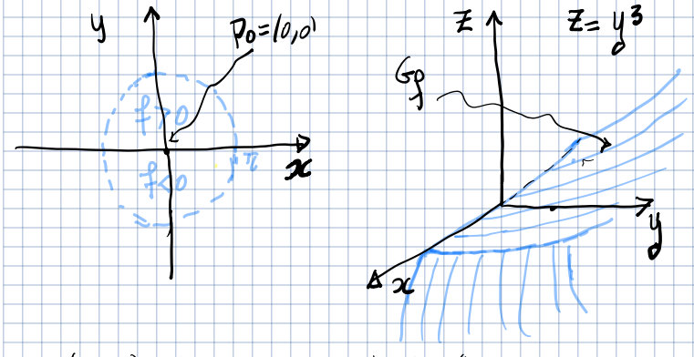

---
description:
  Studio dei massimi e minimi per funzioni di più variabili. Estremi liberi,
  punti di sella e matrice Hessiana per la classificazione dei punti critici.
lang: it
title: Lezione (2025-03-31)
---

## Massimi e minimi per funzioni di più variabili

**Problema**: Dato un insieme $A \subseteq \R^n$ e una funzione $f: A \to \R$,
determinare, se esistono, i punti di massimo e minimo di $f$.

- $\mathbf{x}_0 \in A$ è chiamato punto di massimo (o, rispettivamente, di
  minimo) relativo di $f$ se esiste $r > 0$ tale che:

  $$
  \forall\ \mathbf{x} \in A \cap B(\mathbf{x}_0, r),\ f(\mathbf{x}) \leq f(\mathbf{x}_0) \quad (\text{o, rispettivamente, } f(\mathbf{x}) \geq f(\mathbf{x}_0))
  $$

- $\mathbf{x}_0 \in A$ è chiamato punto di massimo (o, rispettivamente, di
  minimo) assoluto di $f$ se:

  $$
  \forall\ \mathbf{x} \in A,\ f(\mathbf{x}) \leq f(\mathbf{x}_0) \quad (\text{o, rispettivamente, } f(\mathbf{x}) \geq f(\mathbf{x}_0))
  $$

Se $\mathbf{x}_0$ è un punto di massimo o minimo assoluto, allora è anche un
punto di massimo o minimo relativo. Non vale la condizione inversa.

:::caution

Non confondere i punti di massimo e minimo di $f$ (ovvero l'input della
funzione) con il suo valore massimo o minimo (ovvero l'output).

:::

### Estremi liberi di una funzione di più variabili

Gli **estremi liberi** di una funzione $f$ sono i punti di massimo e minimo
relativi di $f$ che non giacciono sulla frontiera del dominio.

#### Teorema di Fermat

Sia $A \subseteq \R^n$ un insieme aperto e sia $f: A \to \R$. Supponiamo che
esista $\mathbf{x}_0 \in A$ tale che:

- $f$ sia differenziabile in $\mathbf{x}_0$. In particolare
  $\exists\ \nabla f(\mathbf{x}_0)$.
- $\mathbf{x}_0$ sia un estremo libero di $f$ in $A$.

Allora il gradiente in $\mathbf{x}_0$ è il vettore nullo:

$$
\nabla f(\mathbf{x}_0) = \mathbf{0}
$$

:::note

Un **punto stazionario** (o punto critico) di $f$ è un punto in cui $f$ è
differenziabile e $\nabla f(\mathbf{x}_0) = \mathbf{0}$.

Non ogni punto stazionario di $f$ è un punto di estremo libero.

:::

### Punti di sella

Un punto $\mathbf{x}_0 \in A$ è definito punto di sella se è un punto
stazionario di $f$ e se la differenza $f(\mathbf{x}) - f(\mathbf{x}_0)$ ammette
valori sia positivi che negativi in ogni intorno di $\mathbf{x}_0$.

## Segno di una matrice

**Problema**: Dato un insieme aperto $A \subseteq \R^n$ e una funzione
$f \in C^2(A)$, come determinare se un punto stazionario $\mathbf{x}$ è un
estremo libero o un punto di sella?

Sia $D_f^2(\mathbf{x}) \in \mathbb{M}_{n,n}$ l'Hessiana di $f$:

- $D_f^2(\mathbf{x})$ è definita positiva se:
  $\forall\ \mathbf{v} \in \R^n \setminus \Set{\mathbf{0}},\ (D_f^2(\mathbf{x})\ \mathbf{v}) \cdot \mathbf{v} > 0$:
- $D_f^2(\mathbf{x})$ è semi-definita positiva se:
  $\forall\ \mathbf{v} \in \R^n \setminus \Set{\mathbf{0}},\ (D_f^2(\mathbf{x})\ \mathbf{v}) \cdot \mathbf{v} \geq 0$:
- $D_f^2(\mathbf{x})$ è definita negativa se:
  $\forall\ \mathbf{v} \in \R^n \setminus \Set{\mathbf{0}},\ (D_f^2(\mathbf{x})\ \mathbf{v}) \cdot \mathbf{v} < 0$:
- $D_f^2(\mathbf{x})$ è semi-definita negativa se:
  $\forall\ \mathbf{v} \in \R^n \setminus \Set{\mathbf{0}},\ (D_f^2(\mathbf{x})\ \mathbf{v}) \cdot \mathbf{v} \leq 0$:

### Criterio per il segno di una matrice

Questo è un metodo più semplice per determinare il segno di una matrice
$\mathbf{A} \in \mathbb{M}_{n,n}$.

Definiamo il determinante di $A$ limitato alla $i$-esima colonna e $i$-esima
riga (minori principali):

$$
D_i = \det\left(\begin{bmatrix} a_{11} & \ldots & a_{1i} \\ \vdots & & \vdots \\ a_{i1} & \ldots & a_{ii} \end{bmatrix}\right)
$$

- $\mathbf{A}$ è definita positiva se e solo se
  $\forall\ i = 1,\ldots,n,\ D_i > 0$
- $\mathbf{A}$ è definita negativa se e solo se
  $\begin{dcases} D_i > 0 \text{ per } i \text{ pari} \\ D_i < 0 \text{ per } i \text{ dispari}\end{dcases}$

Se $\det(\mathbf{A}) = D_{n} \neq 0$ e nessuna delle condizioni precedenti è
soddisfatta, allora $\mathbf{A}$ non è semi-definita.

### Tipologia di punto critico in base al segno della matrice Hessiana

Sia $f \in C^2(A)$ e sia $\mathbf{x} \in A$ un punto stazionario di $f$. Allora
si ha:

- Se $D_f^2(\mathbf{x})$ è definita positiva, allora $\mathbf{x}$ è un punto di
  minimo relativo.
- Se $D_f^2(\mathbf{x})$ è definita negativa, allora $\mathbf{x}$ è un punto di
  massimo relativo.
- Se $D_f^2(\mathbf{x})$ non è né semi-definita positiva né semi-definita
  negativa, allora $\mathbf{x}$ è un punto di sella.
- Se $D_f^2(\mathbf{x})$ è semi-definita positiva o semi-definita negativa,
  allora $\mathbf{x}$ può essere un punto di massimo, minimo o di sella.
