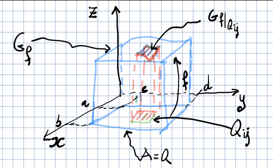

---
description:
  Integrali doppi per funzioni in R^n. Integrabilità secondo Riemann, somme
  superiore/inferiore e proprietà fondamentali degli integrali multipli.
lang: it
title: Lezione (2025-04-22)
---

## Integrali per funzioni di più variabili

Tratteremo gli integrali di funzioni $f: A \subseteq \R^n \to \R$, per
$n = 2,3$, noti anche come integrali multipli.

### Integrale doppio su un rettangolo

Consideriamo un rettangolo $Q = [a, b] \times [c, d]$ e una funzione
$f: A \to \R$ limitata su $Q$, ovvero tale che $\sup_Q f$ esista.

#### Suddivisione di un intervallo

Si definisce suddivisione dell'intervallo $[a, b]$ un insieme finito di punti
della retta reale $\Set{x_0, x_1, \ldots, x_{n - 1}, x_n}$ tale che
$a = x_0 < x_1 < \dots < x_n = b$.

Una suddivisione di un insieme in $\R^2$ è definita dalla coppia $(D_1, D_2)$,
dove $D_1$ e $D_2$ sono suddivisioni degli intervalli sui rispettivi assi del
piano.

#### Somma superiore e inferiore

La somma superiore (o inferiore) di $f$ rispetto alla suddivisione $D$ di $Q$ è
definita come il numero reale:

$$
S(f,D) = \sum_{i = 1}^m \sum_{j = 1}^n M_{ij}\ \text{area}(Q_{ij})
$$

o rispettivamente:

$$
s(f, D) = \sum_{i = 1}^m \sum_{j = 1}^n m_{ij}\ \text{area}(Q_{ij})
$$

Poiché $f$ è limitata, $M_{ij}$ e $m_{ij}$ sono numeri reali (non infiniti) che
corrispondono, rispettivamente, all'estremo superiore e inferiore di $f$
nell'intervallo definito dalla suddivisione.

##### Proprietà

- Se $f \geq 0$, le somme superiore e inferiore rappresentano il volume di un
  parallelepipedo di base $Q_{ij}$ e altezza $M_{ij}$ o $m_{ij}$.
- Per ogni suddivisione $D$ di $Q$:

  $$
  \text{area}(Q)\ \inf_Q f \leq s(f,D) \leq S(f,D) \leq \text{area}(Q)\ \sup_Q f
  $$

#### Funzione integrabile

Una funzione $f$ si dice integrabile secondo Riemann in $Q$ ($f \in R(Q)$) se:

$$
L = \sup \Set{s(f,D)} = \inf \Set{S(f,D)}
$$

ovvero se le somme superiore e inferiore coincidono.

Il numero reale $L$ è chiamato integrale doppio di $f$ e si denota:

$$
L = \iint_Q f(x,y)\ dx dy = \iint_Q f = \int_Q f
$$

#### Condizioni che assicurano $f \in R(Q)$

- Se $f \in C^0([a, b])$, allora $f \in R([a, b])$.
- Se $f: [a, b] \to \R$ è monotona, allora $f \in R([a, b])$.

:::note

Un esempio di funzione per cui l'integrale non esiste è una funzione con un
numero infinito di punti di discontinuità.

:::

#### Proprietà dell'integrale

- **Linearità**: $\iint (\alpha f + \beta g) = \alpha \iint f + \beta \iint g$.
- **Monotonia**: Se $g \leq f$ su $Q$, allora $\iint_Q g \leq \iint_Q f$.
- Se $|f| \in R(Q)$, allora $|\iint_Q f| \leq \iint_Q |f|$.
- **Teorema del valor medio**:
  $\inf_Q f \leq \frac{1}{\text{area}(Q)} \iint_Q f \leq \sup_Q f$. Se
  $f \in C^0(Q)$, esiste $\mathbf{p}_0 \in Q$ tale che
  $f(\mathbf{p}_0) = \frac{1}{\text{area}(Q)} \iint_Q f$.

#### Formula di riduzione sui rettangoli (Teorema di Fubini)

Siano $Q$ il rettangolo $[a, b] \times [c, d]$ e $f$ una funzione integrabile su
$Q$. Inoltre assumiamo che per ogni $x \in [a, b]$, la funzione $f$ sia
integrabile come $\int_c^d f(x,y)\ dy$. Allora:

$$
\iint_Q f = \int_a^b \left( \int_c^d f(x,y)\ dy \right) dx
$$

In particolare, per funzioni $f \in C^0(Q)$, vale:

$$
\iint_Q f = \int_a^b \left( \int_c^d f(x,y)\ dy \right) dx = \int_c^d \left( \int_a^b f(x,y)\ dx \right) dy
$$
