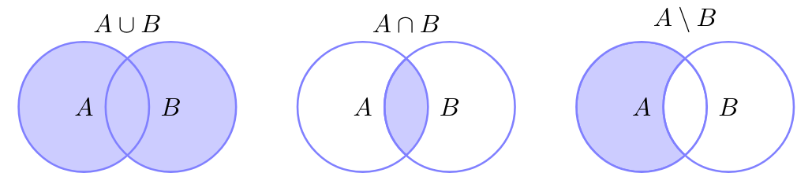

## Insiemi numerici

Gli insiemi sono composti da simboli, numeri o altri insiemi e possono essere
definiti in due modi:

- come elenco di elementi: $A = \Set{a,b,c,d,e}$;
- elementi con una proprietà comune: $B = \Set{x \in \R \mid x < 10}$;

Non importa l'ordine degli elementi.

La notazione che si usa per indicare che un elemento $a$ appartiene all'insieme
$A$ è:

$$
a \in A
$$

L'insieme vuoto è rappresentato dal simbolo $\emptyset$.

### Operazioni tra insiemi

- **Unione**: $A \cup B = \Set{x \mid x \in A \lor x \in B}$
- **Intersezione**: $A \cap B = \Set{x \mid x \in A \land x \in B}$
- **Differenza**: $A \setminus B = \Set{x \mid x \in A \land x \notin B}$
- **Prodotto cartesiano**:
  $A \times B = \Set{(a, b) \mid a \in A \land b \in B}$

Le prime 3 operazioni si possono rappresentare attraverso diagrammi di Venn:

### Sottoinsieme

Un insieme $A$ è un sottoinsieme di $B$ ($A \subseteq B$) se tutti gli elementi
di $A$ sono anche elementi di $B$.

Un sottoinsieme si dice **stretto** ($A \subset B$), se esiste almeno un
elemento $x$ tale che $x \in B \land x \notin A$.

- $C = A \cup B$ è un sottoinsieme sia di $A$, sia di $B$.
- Se $A \subseteq B$e $B \subseteq A$, allora $A = B$.
