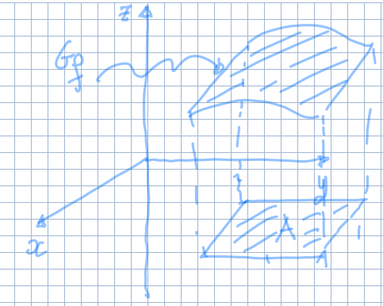

## Funzioni di più variabili e funzioni vettoriali

Nel corso studieremo funzioni nella forma:

$$
f: A \subseteq \R^n \to \R^k \text{ con } n \geq 2, k \geq 1
$$

Se $k = 1$ la funzione si dice **funzione scalare di più variabili**. Se
$k \geq 2$ la funzione si dice **funzione vettoriale di più variabili**.

In particolare studieremo i casi in cui $n = 2,3$ e $k = 1$.

## Grafico di una funzione scalare di più variabili

Ricordiamo che nel caso di una funzione scalare di una variabile
$f: A \subseteq \R \to \R$:

$$
G_f = \Set{(x, f(x)) \mid x \in A} \subset \R^2
$$

Se $f: A \subseteq \R^2 \to \R$:

$$
G_f = \Set{(x, y, f(x,y)) \mid (x,y) \in A} \subset \R^3
$$

Si può continuare analogamente con un numero maggiore di variabili. In tal caso
diventa difficile visualizzare uno spazio in 4 o più dimensioni.

## Curve di livello di una funzione scalare di più variabili

Sia $f: A \subseteq \R^2 \to \R$, fissato arbitrariamente un certo $t \in \R$,
la curva di livello di $f$ in $t$ è definita:

$$
C_t = \Set{(x, y) \in A \mid f(x,y) = t}
$$

:::tip

In pratica le curve di livello di una funzione a 2 variabili funzionano allo
stesso modo di quelle che di solito si vedono su una mappa per denotare
l'altezza sul livello del mare.

:::
