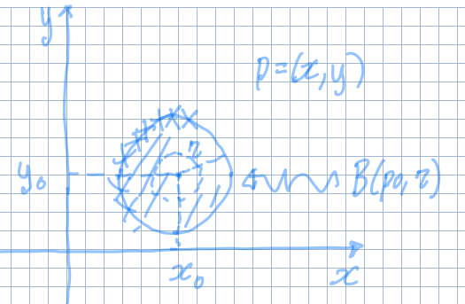

## Distanza euclidea in $\R^{n}$

La distanza euclidea tra 2 punti è una funzione
$d: \R^{n} \times \R^{n} \to [0, +\infty)$ definita:

$$
d(p, q) = \sqrt{(q_{1} - p_{1})^{2} + \ldots + (q_{n} - p_{n})^{2}}
$$

:::note

Il prodotto cartesiano ($\times$) si usa per indicare che ci sono 2 argomenti.

:::

## Intorno

Un intorno di raggio $r$ di un punto $p_{0}$ è la palla aperta di centro $p_{0}$
e distanza $r$ da $p$. Si denota con:

$$
B(p_{0}, r)
$$

Il fatto che la palla è aperta significa che non devo includere la sua
circonferenza in caso di $\R^{2}$. In senso più generale non devo includere la
frontiera dell'insieme dell'intorno.

Per uno spazio di dimensione maggiore, l'intorno si definisce:

$$
B(p_{0}, r) = \Set{p \in \R^{n} \mid d(p,p_{0}) < r}
$$

La definizione di intorno sta alla base di tutte le seguenti definizioni:

### Punto di frontiera

Preso un insieme $A \subseteq \R^{2}$, un punto $p \in A$ si dice punto di
frontiera di $A$ se:

$$
\forall\ r > 0,\ B(p, r) \cap A \neq \emptyset \land B(p, r) \cap (\R^{2} \setminus A) \neq \emptyset
$$

L'insieme dei punti di frontiera di $A$ è detto 'frontiera di $A$'. Si denota
con $\partial A$.

### Insieme aperto e chiuso

Un insieme è detto chiuso se contiene la sua frontiera. Viceversa esso è detto
aperto se non contiene alcun punto della sua frontiera, ovvero se ogni suo punto
è un punto interno.

### Insieme limitato

Un insieme è detto limitato se
$\exists\ R_{0} > 0 \mid A \subseteq B(0, R_{0})$, ovvero se esiste un raggio
abbastanza grande tale che una palla con centro all'origine contenga tutto
l'insieme $A$.

### Parte interna di un insieme

L'insieme dei punti interni di $A$ è dato da tutti i punti di $A$ esclusi i
punti di frontiera. Si denota con $\dot{A}$.

### Punto isolato di un insieme

$p \in A$ si dice punto isolato di $A$ se $p$ non è un punto di accumulazione,
cioè se:

$$
\exists\ r_{0} > 0 \mid B(p, r_{0}) \cap A = \Set{p}
$$

## Limite di una funzione in $n$ variabili.

Sia $f: A \subseteq \R^{n} \to \R$ e sia $p_{0} \in \R^{n}$ punto di
accumulazione di $A$. Si dice che:

$$
\exists\ \lim_{p \to p_{0}} f(p) = L \in \R \iff \forall\ \epsilon > 0,\  \exists\ \delta = \delta(\epsilon) > 0 \mid \forall\ p \in B(p_{0}, \delta) \cap (A \setminus \Set{p_{0}}),\ |f(p) - L| < \epsilon
$$

:::note

$\delta$ è una funzione che associa ad un certo $\epsilon$ sempre più piccolo,
un altro numero $\delta$ 'equalmente piccolo'. In pratica esso corrisponde alla
variabile $r$ usata nella definizione di limite data in
@[Lezione 13 (2024-10-09)](mention://7a5cfe85-756e-4795-9a34-0a853ae287cc/document/be4338bc-db75-4173-858a-a9cbf38ea0e4)
.

:::

### Calcolo dei limiti

#### Unicità del limite

Sia $f: A \subseteq \R^{2} \to \R$ e sia $p_{0}$ punto di accumulazione per $A$,
se $\displaystyle \exists\ \lim_{p \to p_{0}} f(p) = L$, allora $L$ è unico.

Se il limite di una funzione $f$ differisce quando ci si avvicina a $p_{0}$
lungo 2 direzioni diverse, allora il limite non esiste.

#### Operazioni elementari

- $\displaystyle \lim_{p \to p_{0}} f(p) + g(p) = L + M$
- $\displaystyle \lim_{p \to p_{0}} f(p)\ g(p) = L\ M$
- Se $\forall\ p \in (A \setminus \Set{p_{0}}, g(p) \neq 0$ e $M \neq 0$, allora
  $\displaystyle \lim_{p \to p_{0}} \frac{f(p)}{g(p)} = \frac{L}{M}$

#### Composizione di funzioni

Sia $F: \R \to \R$ una funzione continua e sia $h(p) = F(f(p))$, allora
$\displaystyle \lim_{p \to p_{0}} h(p) = F(L)$

#### Teorema del confronto

Siano $f,g,h: A \subseteq \R^{2} \to \R$. Supponiamo che
$\forall\ p \in A \setminus \Set{p_{0}},\ f(p) \leq g(p) \leq h(p)$ e che
$\displaystyle \exists\ \lim_{p \to p_{0}} f(p) = \lim_{p \to p_{0}} h(p) = L$,
allora $\displaystyle \lim_{p \to p_{0}} g(p) = L$.

#### Limite lungo direzioni

Siano $f,g: A \subseteq \R^{2} \to \R$ e $p_{0} \in A$ punto di accumulazione di
$A$. Allora sono equivalenti:

- Per ogni sottoinsieme $B \subseteq A$, per cui $p_{0}$ è un punto di
  accumulazione per $B$,
  $\displaystyle \exists\ \lim_{p \to p_{0}} f_{\vert B} (p) = L$.
- $\displaystyle \exists \lim_{p \to p_{0}} f(p) = L$

In questo caso gli insiemi $B$ sono i punti di una specifica direzione lungo cui
$p \to p_{0}$.

:::tip

Il teorema è efficace solo per dimostrare che il limite non esiste, dato che per
dimostrare il contrario sarebbe necessario calcolare il limite per tutte le
direzioni per cui $p$ può arrivare a $p_{0}$.

:::

:::caution

Per verificare l'esistenza del limite non basta che esso abbia lo stesso valore
su tutte le rette che passano per quel punto, ma deve essere uguale per
qualsiasi funzione che passa per $p_{0}$ (per questo corso basta verificare
rette e parabole).

:::

:::note

$\forall\ a,b \in \R,\ |a\ b| \leq 2(a^{2} + b^{2})$

:::
