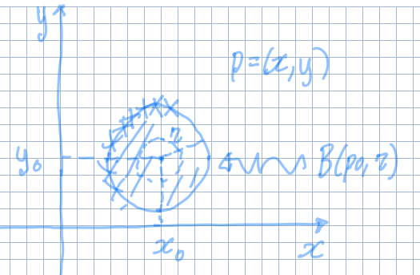

## Distanza euclidea in $\R^n$

La distanza euclidea tra 2 punti è una funzione
$d: \R^n \times \R^n \to [0, +\infty)$ definita:

$$
d(p, q) = \sqrt{\sum_{i = 1}^n (q_i - p_i)^2}
$$

:::note

Il prodotto cartesiano ($\times$) si usa per indicare che ci sono 2 argomenti.

:::

## Intorno

Un intorno di raggio $r$ di un punto $p_0$ è la palla aperta di centro $p_0$ e
distanza $r$ da $p$:

$$
B(p_0, r) = \Set{p \in \R^n \mid d(p, p_0) < r}
$$

:::tip

Il fatto che la palla è aperta significa che non devo includere la sua
circonferenza in caso di $\R^2$. In senso più generale non devo includere la
frontiera dell'insieme dell'intorno.

:::

### Punto di frontiera

Preso un insieme $A \subseteq \R^2$, un punto $p \in A$ si dice punto di
frontiera di $A$ se:

$$
\forall\ r > 0,\ B(p, r) \cap A \neq \emptyset \land B(p, r) \cap (\R^2 \setminus A) \neq \emptyset
$$

L'insieme dei punti di frontiera di $A$ è detto **frontiera di $A$**. Si denota
con $\partial A$.

### Insieme aperto e chiuso

Un insieme è detto **chiuso** se contiene la sua frontiera. Viceversa esso è
detto **aperto** se non contiene alcun punto della sua frontiera, ovvero se ogni
suo punto è un punto interno.

### Insieme limitato

Un insieme è detto limitato se
$\exists\ r > 0 \mid A \subseteq B(\mathbf{0}, r)$, ovvero se esiste un raggio
abbastanza grande tale che una palla con centro all'origine contenga tutto
l'insieme $A$.

### Parte interna di un insieme

L'insieme dei punti interni di $A$ è dato da tutti i punti di $A$ esclusi i
punti di frontiera. Si denota con $\dot{A}$.

### Punto isolato di un insieme

$p \in A$ si dice punto isolato di $A$ se $p$ non è un punto di accumulazione,
cioè se:

$$
\exists\ r > 0 \mid B(p, r) \cap A = \Set{p}
$$

## Limite di una funzione in $n$ variabili.

Sia $f: A \subseteq \R^n \to \R$ e sia $p_0 \in \R^n$ punto di accumulazione di
$A$. Si dice che:

$$
\begin{darray}{c}
\exists\ \lim_{p \to p_0} f(p) = L \in \R \\
\Updownarrow \\[7pt]
\forall\ \epsilon > 0,\ \exists\ \delta > 0 \mid \forall\ p \in B(p_0, \delta) \cap (A \setminus \Set{p_0}),\ |f(p) - L| < \epsilon
\end{darray}
$$

In pratica, **avvicinandosi a $p_0$, tutti i valori nell'intorno devono
avvicinarsi sempre di più a $f(p)$**. Se non esiste un intorno dove ciò è
rispettato, allora il limite non esiste.

La relazione tra $\delta$ e $\epsilon$ non è fissa, ma dipende dalla funzione
considerata:

- $\epsilon$ indica quanta tolleranza vogliamo sull'output della funzione. È il
  parametro che 'comanda', poi a seconda del suo valore $\delta$ può cambiare
  oppure no.
- $\delta$ indica quanto input si sta considerando. In generale al diminuire di
  $\epsilon$ anche $\delta$ rimpicciolisce, infatti a volte si scrive
  $\delta(\epsilon)$.

:::caution

Si esclude $p_0$ dall'intorno perchè non è detto che il valore del limite verso
un punto debba coincidere con il valore della funzione in quel punto.

:::

### Calcolo dei limiti

#### Unicità del limite

Sia $f: A \subseteq \R^2 \to \R$ e sia $p_0$ punto di accumulazione per $A$, se
$\exists\ \lim_{p \to p_0} f(p) = L$, allora $L$ è unico.

Se il limite di una funzione $f$ differisce quando ci si avvicina a $p_0$ lungo
2 direzioni diverse, allora il limite non esiste.

#### Operazioni elementari

Dati $\lim_{p \to p_0} f(p) = L$ e $\lim_{p \to p_0} g(p) = M$:

- $\displaystyle \lim_{p \to p_0} f(p) + g(p) = L + M$
- $\displaystyle \lim_{p \to p_0} f(p)\ g(p) = L\ M$
- Se $\forall\ p \in A \setminus \Set{p_0},\ g(p) \neq 0$ e $M \neq 0$, allora
  $\displaystyle \lim_{p \to p_0} \frac{f(p)}{g(p)} = \frac{L}{M}$

#### Composizione di funzioni

Sia $F: \R \to \R$ una funzione continua e sia $h(p) = F(f(p))$, allora
$\lim_{p \to p_0} h(p) = F(L)$

#### Teorema del confronto

Siano $f, g, h: A \subseteq \R^n \to \R$ e supponiamo che
$\forall\ p \in A \setminus \Set{p_0},\ f(p) \leq g(p) \leq h(p)$ e che
$\exists\ \lim_{p \to p_0} f(p) = \lim_{p \to p_0} h(p) = L$, allora
$\lim_{p \to p_0} g(p) = L$.

#### Limite lungo direzioni

Siano $f, g: A \subseteq \R^2 \to \R$ e $p_0 \in A$ punto di accumulazione di
$A$. Allora sono equivalenti:

- Per ogni sottoinsieme $B \subseteq A$, per cui $p_0$ è un punto di
  accumulazione per $B$, $\exists\ \lim_{p \to p_0} f_{\vert B} (p) = L$.
- $\exists \lim_{p \to p_0} f(p) = L$

In questo caso l'insieme $B$ è formato dai punti di una specifica direzione
lungo cui $p \to p_0$.

:::tip

Il teorema è efficace solo per dimostrare che il limite non esiste, dato che per
dimostrare il contrario sarebbe necessario calcolare il limite per tutte le
direzioni per cui $p$ può arrivare a $p_0$, incluse non solo rette ma anche
qualsiasi altro tipo di curva.

:::
