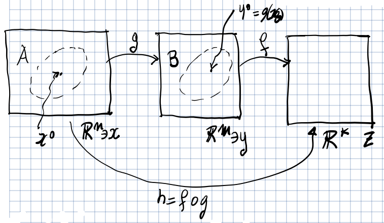

## Teorema del valore medio in $n$ variabili

:::tip[Interpolazione lineare]

$f(t): [0, 1] \to \R^n = t\ \mathbf{q} + (1 - t)\ \mathbf{p}$ è detta
interpolazione lineare tra i punti $\mathbf{p}$ e $\mathbf{q}$. Nei linguaggi di
programmazione, spesso la funzione è chiamata `lerp`.

Il codominio di $f$ è rappresentato dal segmento con estremi $\mathbf{p}$ e
$\mathbf{q}$.

:::

Data $f: A \subseteq \R^n \to \R$ e

- $\exists\ \mathbf{p}, \mathbf{q} \in A \mid [\mathbf{p}, \mathbf{q}] = \Set{t\ \mathbf{q} + (1 - t)\ \mathbf{p}, t \in [0,1]} \subset A$
- $f$ è continua in $[\mathbf{p}, \mathbf{q}]$ e differenziabile in
  $(\mathbf{p}, \mathbf{q})$.

Allora esiste un punto $c \in (\mathbf{p}, \mathbf{q})$ tale che:

$$
f(\mathbf{q}) - f(\mathbf{p}) = \nabla f(\mathbf{c}) \cdot (\mathbf{q} - \mathbf{p})
$$

**Corollario**: se
$\forall\ \mathbf{p} \in B(\mathbf{p}_0, r),\ \nabla f(\mathbf{p}) = \mathbf{0}$,
allora
$\forall\ \mathbf{p} \in B(\mathbf{p}_0, r),\ f(\mathbf{p}) = f(\mathbf{p}_0)$.
Quando il gradiente è nullo, allora $f$ è costante.

## Derivate parziali di una funzione composta di più variabili

:::note[Ripasso]

La regola della catena per una funzione di 1 variabile
$h(x) = (f \circ g)(x) = f(g(x))$ è definita: $h'(x) = f'(g(x))\ g'(x)$

:::

### Matrice Jacobiana

Sia $f: A \subseteq \R^n \to \R^m$,
$f(\mathbf{x}) = (f_1(\mathbf{x}), \ldots, f_m(\mathbf{x}))$, con
$f_i: A \to \R$.

Dato
$\mathbf{x} \mid \forall\ i = 1,\ldots,m,\ \exists\ \nabla f_i(\mathbf{x})$. La
matrice Jacobiana è una matrice $m \times n$ dove la riga $i$-esima coincide con
$\nabla f_i(\mathbf{x})$:

$$
D_f(\mathbf{x}) = \begin{bmatrix}
\pdv{f_1}{x_1}(\mathbf{x}) & \ldots & \pdv{f_1}{x_n}(\mathbf{x}) \\
\vdots & & \vdots \\
\pdv{f_m}{x_1}(\mathbf{x}) & \ldots & \pdv{f_m}{x_n}(\mathbf{x})
\end{bmatrix}
$$

:::note

La nozione di matrice Jacobiana generalizza la nozione di vettore gradiente per
funzioni scalari. Infatti ponendo $m = 1$ si ottiene il vettore del gradiente.

:::

### Regola della catena

Con la regola della catena è possibile trovare tutte le derivate parziali di una
funzione composta. Serve solo trovare le derivate parziali delle funzioni di
partenza.

Siano $g: A \subseteq \R^n \to \R^m$, $f: B \subseteq \R^m \to \R^k$ e
supponiamo che $g(A) \subseteq B$.

Inoltre supponiamo che, dato un punto $\mathbf{x} \in A$:

- $g(\mathbf{x}) = (g_1(\mathbf{x}), \ldots, g_m(\mathbf{x}))$, con
  $g_i: A \to \R$ differenziabili in $\mathbf{x}$.
- $f(\mathbf{y}) = (f_1(\mathbf{y}), \ldots, f_k(\mathbf{y}))$, con
  $f_i: B \to \R$ differenziabili in $\mathbf{y} = g(\mathbf{x})$.

Consideriamo ora la funzione composta $h: \R^n \to \R^k$,
$h(\mathbf{x}) = (f \circ g)(\mathbf{x})$, allora le funzioni $h_1, \ldots, h_k$
sono differenziabili in $\mathbf{x}$ e la matrice Jacobiana di $h$ è data dal
prodotto delle matrici Jacobiane delle funzioni di partenza.

$$
D_h(\mathbf{x}) = D_f(g(\mathbf{x}))\ D_g(\mathbf{x})
$$
