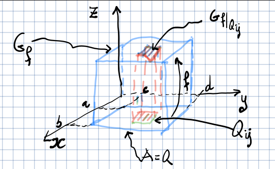

## Integrale per funzioni di più variabili

Tratteremo integrali di funzioni $f: A \subseteq \R^n \to \R$ ($n = 2,3$), detti
anche integrali multipli.

### Caso 1: integrale doppio su un rettangolo

Prendiamo un rettangolo $Q = [a, b] \times [c, d]$ e sia $f: A \to \R$ limitata,
ovvero esiste $\sup_Q f$.

#### Suddivisione di un intervallo

Si chiama suddivisione dell'intervallo $[a, b]$ un insieme finito della retta
reale $\Set{x_0, x_1, \ldots, x_{n - 1}, x_n}$ tale che
$a = x_0 < x_1 < \dots < x_n = b$:

Una suddivisione di un insieme di $\R^2$ è data dalla coppia $(D_1, D_2)$ dove
$D_1$ e $D_2$ sono suddivisioni degli intervalli sui rispettivi assi del piano.

#### Somme superiori e inferiori

Si chiama somma superiore (o rispettivamente inferiore) di $f$ rispetto alla
suddivisione $D$ di $Q$, il numero reale:

$$
S(f,D) = \sum_{i = 1}^m \sum_{j = 1}^n M_{ij}\ area(Q_{ij})
$$

o rispettivamente:

$$
s(f, D) = \sum_{i = 1}^m \sum_{j = 1}^n m_{ij}\ area(Q_{ij})
$$

Essendo $f$ limitata, $M_{ij}$ e $m_{ij}$ sono numeri reali (non infiniti) che
corrispondono rispettivamente all'estremo superiore e inferiore di $f$
all'interno della suddivisione.

##### Proprietà

- Se $f \geq 0$ allora le somme superiori e inferiori rappresentano il volume di
  un parallelepipedo di base $Q_{ij}$ e altezza $M_{ij}$ o $m_{ij}$.
- Per ogni suddivisione $D$ di $Q$:

  $$
  area(Q)\ \inf_Q f \leq s(f,D) \leq S(f,D) \leq area(Q)\ \sup_Q f
  $$

#### Funzione integrabile

Una funzione $f$ si dice integrabile secondo Riemann in $Q$ ($f \in R(Q)$) se:

$$
L = \sup \Set{s(f,D)} = \inf \Set{S(f,D)}
$$

ovvero se le somme superiori e inferiori coincidono.

Il numero reale $L$ si chiama integrale doppio di $f$ e si denota:

$$
L = \iint_Q f(x,y)\ dx dy = \iint_Q f = \int_Q f
$$

#### Condizioni che assicurino $f \in R(Q)$

- se $f \in C^0([a, b])$, allora $f \in R([a, b])$;
- se $f: [a, b] \to \R$ è monotona, allora $f \in R([a, b])$;

:::note

Un esempio di funzione dove l'integrale non esiste è una funzione con un numero
infinito di discontinuità.

:::

#### Proprietà dell'integrale

- **linearità**: $\iint \alpha\ f + \beta\ g = \alpha \iint f + \beta \iint g$;
- **monotonia**: se $g \leq f$ su $Q$, allora $\iint_Q g \leq \iint_Q f$;
- se $|f| \in R(Q)$, allora $|\iint_Q f| \leq \iint_Q |f|$;
- **teorema della media**:
  $\inf_Q f \leq \frac{1}{area(Q)} \iint_Q f \leq \sup_Q f$. Se $f \in C^0(Q)$
  allora esiste $\mathbf{p}_0$ tale che
  $f(\mathbf{p}_0) = \frac{1}{area(Q)} \iint_Q f$;

##### Formula di riduzione sui rettangoli

Siano $Q = [a, b] \times [c, d]$ e $f \in R(Q)$.

Supponiamo che per ogni $y \in [c, d]$, la funzione $[a,b] \to f(x, y)$ sia
integrabile come funzione di 1 variabile. Allora:

$$
\iint_Q f = \int_a^b \left( \int_c^d f(x,y)\ dy \right) dx
$$

In particolare, per funzioni $f \in C^0(Q)$, vale:

$$
\iint_Q f = \int_a^b \left( \int_c^d f(x,y)\ dy \right) dx = \int_c^d \left( \int_a^b f(x,y) dx \right) dy
$$
