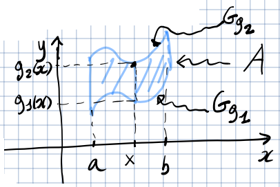

## Integrale doppio su insiemi generali

Sia $A \subseteq \R^2$ limitato e sia $f: A \to \R$ limitata, e sia
$Q = [a,b] \times [c,d] \supset A$. Definiamo $\tilde{f} \in R(Q)$:

$$
\tilde{f}(x,y) = \begin{cases}
(x,y) \in A \implies f(x,y) \\
(x,y) \in Q \setminus A \implies 0
\end{cases}
$$

Si dice che $f$ è integrabile in $A$ se $\tilde{f} \in R(Q)$. In questo caso
$\iint_A f = \iint_Q \tilde{f}$.

Se per l'insieme $A$ non fosse definita una nozione di area, non saremmo in
grado calcolare $\iint_A f$.

### Insiemi misurabili e loro area

Un insieme $A \in \R^2$ si dice misurabile se la funzione
$f(\mathbf{p}) = \begin{cases} \mathbf{p} \in A \implies 1 \\ \mathbf{p} \notin A \implies 0 \end{cases}$
è integrabile su $A$. In questo caso il valore dell'integrale si chiama
**misura** di $A$ e si denota con:

$$
|A|_2 = \iint_A 1\ dx dy
$$

#### Teoremi

- Sia $A$ limitato. Allora esso è misurabile se e solo se $\partial A$ è
  misurabile e $|\partial A|_2 = 0$.
- Sia $g: [a, b] \to \R$ integrabile come funzione di 1 variabile. Allora il suo
  grafico $G_g = \Set{(x, g(x)) \mid x \in [a, b]}$ è misurabile e
  $|G_g|_2 = 0$.

**Corollario**: Se la frontiera di $A$ è data dall'unione dei grafici di
funzioni continue, allora $A$ è misurabile.

##### Misurabilità di insiemi semplici del piano

Siano $g_1, g_2: [a, b] \to \R$ continue e supponiamo che
$\forall\ x \in [a, b],\ g_1(x) \leq g_2(x)$. L'insieme
$A = \Set{(x, y) \in \R^2 \mid a \leq x \leq b,\ g_1(x) \leq y \leq g_2(x)}$ è
detto **insieme semplice** rispetto all'asse $y$.

Per il corollario visto prima, $A$ è misurabile.

##### Esistenza dell'integrale doppio su insiemi misurabili

Sia $f: A \to \R$. Supponiamo che $A$ sia limitato e misurabile e che $f$ sia
limitata e $\in C^0(A)$. Allora $f \in R(A)$.

##### Integrale doppio su insieme di misura nulla

Sia $A \subseteq \R^2$ un insieme limitato e misurabile e sia $f \in R(A)$.
Inoltre supponiamo che $A = B \cup C$, con $B$ e $C$ misurabili e $|C|_2 = 0$.
Allora $\iint_A f = \iint_B f$.

Da questo teorema deriva che:

$$
\iint_A f = \iint_{\dot{A}} f
$$

### Integrali doppi su domini semplici e formule di riduzione

- Un insieme $A \subseteq \R^2$ si dice dominio semplice (o normale) rispetto
  all'asse $y$ se esistono
  $g_1, g_2 \in C^0([a, b]) \mid \forall\ x \in [a, b],\ g_1(x) \leq g_2(x)$ e
  $A = \Set{(x, y) \in \R^2 \mid x \in [a, b],\ g_1(x) \leq y \leq g_2(x)}$.

- Un insieme $A \subseteq \R^2$ si dice dominio semplice (o normale) rispetto
  all'asse $x$ se esistono
  $h_1, h_2 \in C^0([c, d]) \mid \forall\ x \in [c, d],\ h_1(x) \leq h_2(x)$ e
  $A = \Set{(x, y) \in \R^2 \mid y \in [c, d],\ h_1(y) \leq x \leq h_2(y)}$.

Se un insieme è un semplice, allora esso è limitato e misurabile. Quindi se $A$
è semplice e $f \in C^0(A)$, allora $f \in R(A)$.

#### Formula di riduzione su domini semplici

- Se $A$ è semplice rispetto ad $y$, allora:

  $$
  \iint_A f = \int_a^b \left( \int_{g_1(x)}^{g_2(x)} f(x,y)\ dy \right) dx
  $$

  $A$ è misurabile e
  $|A|_2 = \iint_A 1 = \int_a^b \left( g_2(x) - g_1(x) \right) dx$.

- Se $A$ è semplice rispetto ad $x$, allora:

  $$
  \iint_A f = \int_c^d \left( \int_{h_1(x)}^{h_2(x)} f(x,y)\ dx \right) dy
  $$

  $A$ è misurabile e
  $|A|_2 = \iint_A 1 = \int_c^d \left( h_2(y) - h_1(y) \right) dy$.
