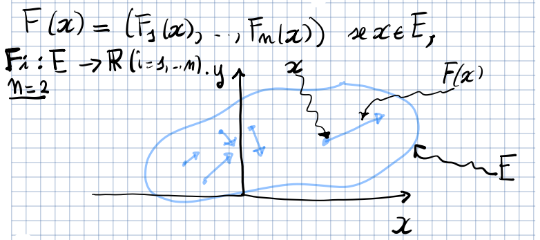

## Lunghezza di una curva

Sia $\gamma: [a, b] \to \R^n$ una curva e sia
$D = \Set{a = t_0 < t_1 < \ldots < t_N = b}$ una suddivisione di $[a, b]$. Di
conseguenza anche il sostegno di $\gamma$ è suddiviso in $N + 1$ punti definiti
da $\gamma(t_0), \ldots, \gamma(t_N)$.

Consideriamo i segmenti $[\gamma(t_{i - 1}), \gamma(t_i)]$. La lunghezza
dell'unione $\cup_{i = 1}^N [\gamma(t_{i - 1}), \gamma(t_i)]$ è data da:

$$
L(\gamma, D) = \sum_{i = 1}^N ||\gamma(t_{i - 1}) - \gamma(t_i)||
$$

Ora denotiamo:

$$
L(\gamma) = \sup_D L(\gamma, D)
$$

Se $L(\gamma) < \infty$, allora la curva si dice rettificabile e $L(\gamma)$ è
detta lunghezza di $\gamma$.

:::note

Si può provare che esistono curve (frattali) che hanno lunghezza infinita anche
se l'intervallo di partenza è limitato.

:::

### Teorema della lunghezza di una curva

Sia $\gamma: [a, b] \to \R^n$ una curva di classe $C^1$. Allora $\gamma$ è
rettificabile e:

$$
L(\gamma) = \int_a^b ||\gamma'(t)||\ dt = \int_a^b \sqrt{\gamma'_1(t) + \ldots + \gamma'_n(t)}\ dt
$$

### Lunghezza di curve piane cartesiane

Sia $\gamma: [a, b] \to \R^2$ una curva piana cartesiana di classe $C^1$,
ovvero:

$$
\gamma(t) = (t, f(t)) \lor \gamma(t) = (f(t), t), \text{ con } f \in C^1([a, b])
$$

Allora $\gamma$ è rettificabile e:

$$
L(\gamma) = \int_a^b \sqrt{1 + f'(t)^2}\ dt
$$

### Indipendenza della lunghezza dalla parametrizzazione

Siano $\gamma: [a, b] \to \R^n$ e $\tilde{\gamma}: [\alpha, \beta] \to \R^n$ 2
curve di classe $C^1$ equivalenti. Allora:

$$
L(\gamma) = L(\tilde{\gamma})
$$

### Lunghezza di una curva $C^1$ a tratti

La lunghezza di una curva $C^1$ a tratti è data dalla somma delle lunghezze dei
vari segmenti che la compongono.

## Integrali curvilinei di I specie

Sia $\gamma: [a, b] \to \R^n$ una curva di classe $C^1$ e sia
$f: \gamma([a, b]) \to \R$ una funzione continua. Si definisce l'integrale
curvilineo di I specie di $f$ su $\gamma$ come:

$$
\int_\gamma f\ ds = \int_a^b f(\gamma(t))\ ||\gamma'(t)||\ dt
$$

Se $\gamma$ è una curva chiusa e semplice, allora si usa anche il simbolo:

$$
\oint_{\gamma} f\ ds
$$

- L'integrale curvilineo di I specie è lineare:
  $\int_\gamma (\alpha\ f + \beta\ g)\ ds = \alpha \int_\gamma f\ ds + \beta \int_\gamma g\ ds$
- L'integrale curvilineo di I specie si estende a curve $C^1$ a tratti.
  $\int_\gamma f\ ds = \sum_{i = 1}^N \int_{\gamma_{\mid [t_{i - 1}, t_i]}} f\ ds$
- Il valore dell'integrale curvilineo non dipende dalla parametrizzazione della
  curva.

## Campi vettoriali

Si chiama campo vettoriale su un insieme $E \subseteq \R^n$ una mappa
$F: E \to \R^n$, dove
$F(\mathbf{x}) = (F_1(\mathbf{x}), \ldots, F_n(\mathbf{x}))$.

In fisica, un campo vettoriale può rappresentare una forza applicata ad un punto
$\mathbf{x} \in E$.

### Forma differenziale

Dato un campo vettoriale $F: E \subseteq \R^n \to \R^n$, si chiama forma
differenziale (lineare) su $E$ l'espressione formale:

$$
\omega = F_1\ dx_1 + \ldots + F_n\ dx_n = \sum_{i = 1}^n F_i\ dx_i
$$

che si scrive anche come il prodotto scalare:

$$
\omega = F \cdot d\mathbf{x}
$$

Dalla definizione si evince che ad ogni campo vettoriale corrisponde
biunivocamente una forma differenziale.

Una forma differenziale $\omega = \sum_{i = 1}^n F_i\ dx_i$ su un insieme
$E \subseteq \R^n$ si dice di classe $C^0$ se
$\forall\ i \in 1,\ldots,n,\ F_i \in C_0(E)$

#### Lavoro compiuto da una forza lungo un percorso

Sia $F: \R^3 \to \R^3$ una forza
$F(x, y, z) = (F_1(x, y, z), F_2(x, y, z), F_3(x, y, z))$, $F \in C^0(\R^3)$.

Il nostro percorso è $\gamma(t) = (\gamma_1(t), \gamma_2(t), \gamma_3(t))$, una
curva di classe $C^1$.

La forma differenziale $w = F \cdot d\mathbf{x}$ rappresenta il lavoro compiuto
dalla forza $F$ su un punto materiale che si muove di uno spostamento
infinitesimo
$(dx,dy,dz) = (\gamma'_1(t)\ dt, \gamma'_2(t)\ dt, \gamma'_3(t)\ dt)$ lungo la
curva $\gamma$.

Il lavoro compiuto dalla forza nell'intervallo di tempo infinitesimo $dt$ è dato
da:

$$
(F(\gamma(t)) \cdot \gamma'(t))\ dt
$$

## Integrali curvilinei di II specie

Sia $\gamma: [a,b] \to E \subseteq \R^n$ una curva di classe $C^1$ e sia
$\omega = F \cdot d\mathbf{x}$ una forma differenziale di classe $C^0$ su $E$.

Si definisce integrale curvilineo di II specie di $\omega$ lungo $\gamma$ il
valore:

$$
\int_\gamma \omega = \int_a^b F(\gamma(t)) \cdot \gamma'(t)\ dt = \int_a^b \sum_{i = 1}^n F_i(\gamma(t))\ \gamma'_i(t)\ dt
$$

Se $\gamma$ è chiusa, si scrive anche:

$$
\oint_\gamma \omega
$$

- L'integrale curvilineo di II specie è lineare.
- L'integrale curvilineo di II specie si estende anche a curve $C^1$ a tratti.
