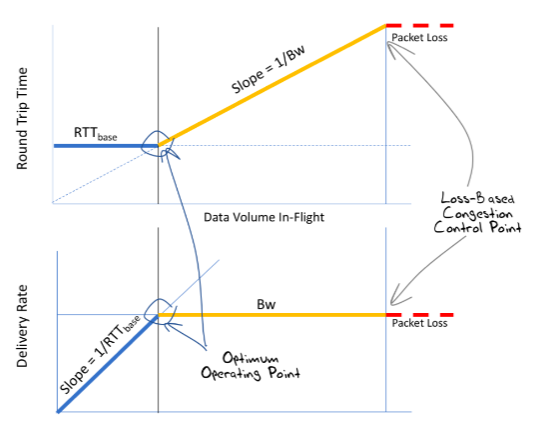
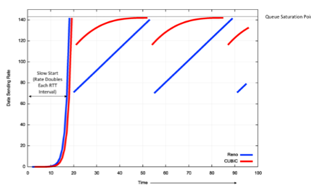

## Throughput teorico di TCP

Una formula approssimata per calcolare il throughput di una connessione TCP è:

$$
Thr(\text{RTT}, p) < \frac{\text{MSS}}{\text{RTT}} \frac{1}{\sqrt{p}}
$$

dove:

- $p$ è la probabilità di perdere un pacchetto;
- $\text{MSS}$ è il maximum segment size;
- $\text{RTT}$ è il round-trip time;

## Problemi di equità e fairness in TCP

Le applicazioni UDP sfruttano sempre il massimo della banda disponibile, quindi
la bitrate viene ripartita equamente dal router.

Il TCP invece si adatta alla banda disponibile. Ci sono 2 conseguenze:

- se una connessione apre più connessioni in una rete esclusivamente TCP, allora
  essa ottiene una frazione maggiore della capacità di rete rispetto ad un'altra
  che usa una singola connessione.
- se una connessione TCP e una UDP coesistono, allora quella TCP manterrà un
  throughput molto basso perchè la rete viene congestionata dall'UDP.

## Versioni più avanzate di TCP

La versione di TCP vista finora (new Reno) è loss-based. Quindi il protocollo si
aspetta una perdita di segmenti prima di reagire con il congestion control.

In realtà negli anni si è scoperto che la connessione TCP funziona meglio quando
non si raggiunge il limite tra portata massima e packet loss ma si resta appena
sopra alla soglia minima di bitrate supportata dal percorso di rete. Quindi i
nuovi algoritmi cercano di mantenere il round-trip time il più basso possibile.

I protocolli di congestion control non hanno bisogno della compatibilità da
parte di entrambi gli host, dato che ogni host gestisce da se come non
congestionare la rete con i propri dati.

### CUBIC

CUBIC è un algoritmo di controllo della congestione in TCP che fa variare la
lunghezza della finestra di congestione secondo una funzione cubica nel tempo.
Questo migliora la scalabilità e la stabilità su reti veloci e a lunga distanza.

A differenza di new Reno, cubic usa la parte concava della funzione cubica nella
fase di slow start e la parte convessa quando invece si trova in congestion
avoidance.

$$
\text{CWND}_\text{cubic}(t) = C(t - K)^3 + \text{CWND}_\text{max}
$$

dove $K = \sqrt[3]{\frac{\text{CWND}_\text{max}(1 - \beta)}{C}}$, $\beta = 0.7$
e $C = 0.4$.

Dopo una congestione, la finestra viene scalata di $\beta$.

### BBR

BBR è un altro algoritmo di controllo della congestione in TCP, sviluppato da
Google nel 2016. Non si basa sulla rilevazione di perdite di pacchetti ma stima
2 parametri:

- la banda minima sul percorso tra i 2 host;
- il round-trip time;

**Pacing**: invece di inviare tutti i pacchetti consentiti dalla rete, li
inserisco al ritmo alla quale può inviarli il nodo più lento (lungo il percorso
di rete), in modo da evitare ritardi dovuti all'accodamento.

Ci sono 4 fasi:

1. STARTUP: cerco il punto in cui la bandwidth è massima sulla rete aumentando
   esponenzialmente i dati trasmessi.
2. DRAIN: quando ho superato il punto massimo, ritorno ad esso per non
   congestionare la rete.
3. PROBE_BW: periodicamente supero di nuovo il punto massimo per vedere se è
   cambiata la rete, altrimenti faccio nuovamente un DRAIN.
4. PROBE_RTT: periodicamente ricomincio da capo per lasciare spazio anche agli
   altri host (meccanismo di fairness) e per riportare il RTT al minimo (riduce
   i ritardi di accodamento).

## QUIC

QUIC è un altro protocollo progettato da Google nel 2012. Esso utilizza UDP per
ridurre i 2 principali problemi di TCP: l'head of line blocking (dovuto
all'handshake iniziale) e la latenza (comprime i messaggi).

Per ora QUIC viene implementato a livello applicativo, anziché nel kernel. Viene
usato soprattutto dai browser moderni dato che esso sta anche alla base di
HTTP/3.

Nel protocollo è stato incorporato lo scambio di chiavi del TLS, riducendo
ulteriormente il numero di messaggi scambiati prima che la connessione sia
utilizzabile.

A differenza di TCP, che fa dipendere la connessione da indirizzo e porta
sorgente, QUIC include un ID di connessione al server, quindi anche cambiando
l'indirizzo IP del trasmettitore (che succede spesso con le reti wireless) non è
necessario re-inizializzare la connessione.
