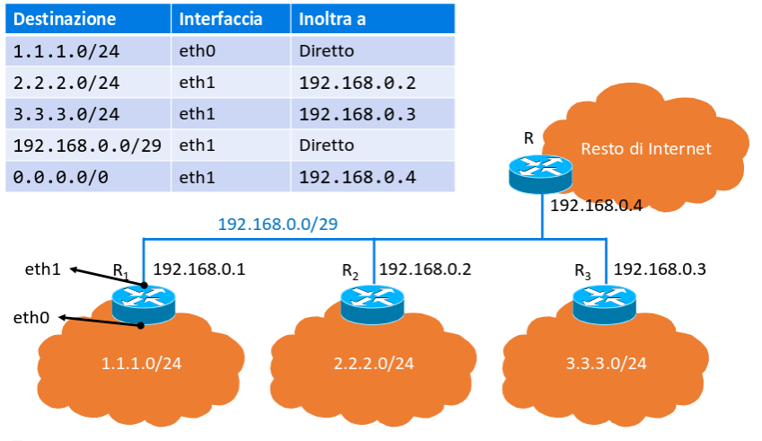

## ICANN

L'Interned Corporation for Assigned Names and Numbers è l'entità creata per
gestire l'assegnazione degli indirizzi IP e per arbitrare eventuali dispute.

L'assegnazione degli indirizzi IP viene eseguita dai registrar che li
suddividono tra ISP, i quali poi li assegnano ai clienti.

## Indirizzamento classless

Con la rimozione delle classi di subnet, la suddivisione tra prefisso e suffisso
diventa completamente arbitraria, quindi diventa possibile partizionare le reti
in maniera molto più efficiente.

In caso un router abbia su un'interfaccia una rete con subnet `m` e su un'altra
lo stesso prefisso con subnet `n > m`, allora esso darà precedenza
all'interfaccia `m` seguendo la regola del prefisso più lungo.

### Maschere di rete

Dato che la dimensione del prefisso non è più indicata dalla classe di
appartenenza della rete, si usano 32 bit dove quelli a 1 indicano i bit del
prefisso.

Questa informazione si chiama maschera di rete (subnet mask) perchè ai router (a
cui non interessa l'hostID) possono eseguire un AND logico per mascherare
l'indirizzo e tenere solo la parte di netID.

### CIDR

La notazione Classless Inter-Domain Routing sintetizza le informazioni di netID
e relativa subnet mask con la notazione `ddd.ddd.ddd.ddd/m`, dove `m` indica il
numero di bit uguali a 1 nella maschera.

### Tabella di routing

La tabella di routing viene usata dai router per capire come indirizzare il
traffico sulle varie interfacce.

**Default gateway**: quando nella tabella di routing l'indirizzo di destinazione
non corrisponde a nessuna interfaccia, si ha una destinazione catch-all
`0.0.0.0/0` che indica dove inviare tutti i pacchetti con CIDR non specificate.

Nella tabella di routing si specifica anche a quale router next-hop si devono
inoltrare i pacchetti. In questo modo un router connesso ad altri può sapere a
quale vanno inviati certi pacchetti a seconda dell'indirizzo di destinazione.

## Indirizzi IP pubblici e privati

La maggioranza dei $2^32$ indirizzi IP è pubblica e può essere assegnata ad host
raggiungibili su internet. Alcuni invece sono riservati e si usano per costruire
reti private (i router su internet li bloccano).

- `10.0.0.0/8`
- `172.16.0.0/12`
- `192.168.0.0/16`

Il NAT si usa per consentire di connettersi ad internet agli host su reti
private.

## Network Address Translation (NAT)

Il NAT è un computer che ha un indirizzo IP pubblico e uno privato e che fa da
proxy per gli altri sulla rete privata.

Quando un host privato invia un pacchetto:

1. Il NAT cambia l'IP con il suo e la porta sorgente con una libera su di esso,
   poi la memorizza in una tabella.
2. Invia il datagramma verso l'esterno.
3. L'altra parte risponde al NAT con il suo IP e la porta di destinazione
   cambiata.
4. Il NAT consulta la tabella e sovrascrive l'IP di destinazione con quello
   privato e la porta con quella iniziale.

Il numero massimo di connessioni simultanee è limitato quindi dal numero di
porte aperte sull'host pubblico ($2^16$).

Inoltre il NAT viola l'architettura a strati perchè va a modificare i segmenti
di livello 4.

Per connettersi ad un host dietro a NAT, si usa il port forwarding, dove si dice
all'host pubblico di inviare tutti i segmenti ricevuti ad una certa porta su una
porta dell'host privato.
