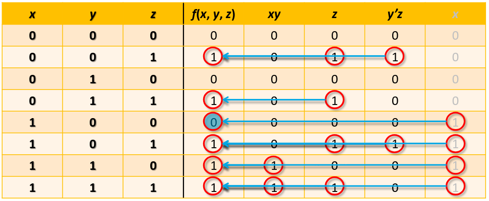
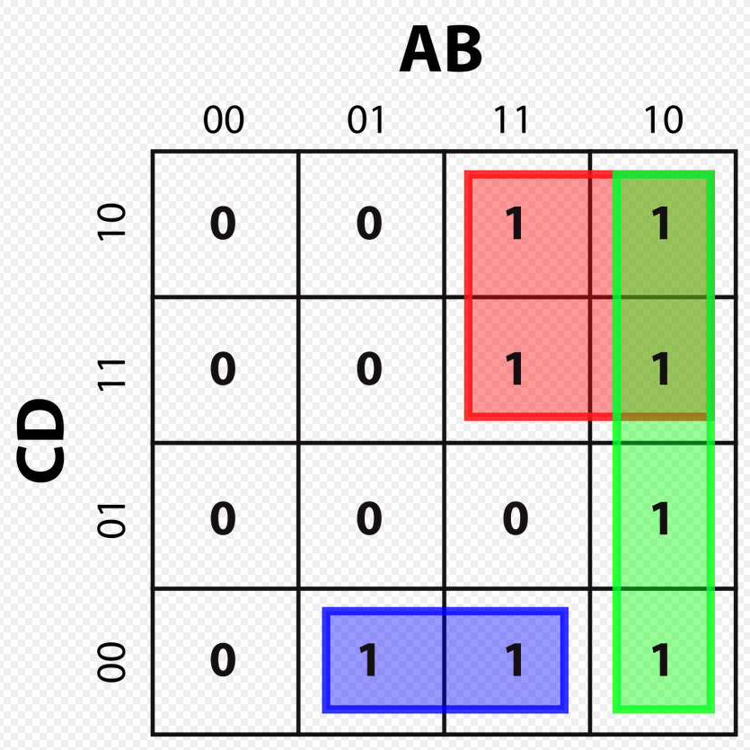
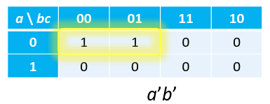
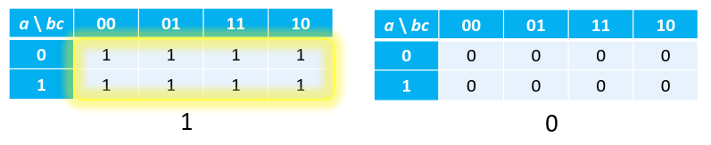

## Sintesi a 2 livelli

Prima che ogni porta logica abbia un output stabile, i suoi ingressi devono dare
un output stabile. Più è lunga la sequenza di porte che un segnale deve
attraversare, minori saranno le prestazioni del circuito.

Chiamiamo **livello** il numero massimo di porte logiche attraversate
dall'ingresso all'uscita di un circuito. Di solito non si contano le porte
$\text{NOT}$ perché nei circuiti reali si ottengono quasi sempre sia l'output da
definizione, sia la sua forma negata.

In questo corso ci concentreremo su espressioni a 2 livelli. Un'espressione a 2
livelli deve essere per forza o una somma di prodotti o un prodotto di somme
(altrimenti si potrebbe unificare tutto in un solo livello).

**Letterale**: un letterale è una variabile in forma affermata o negata, quindi
la funzione $f(a, b, c) = a'b' + a'c' + ac$ ha 3 variabili e 6 letterali.

La complessità di un'espressione si misura dal suo numero di letterali. Ogni
letterale diventa l'ingresso di una porta logica, quindi si può avere un'idea
della dimensione del circuito.

- **Prodotto fondamentale (minterm)**: prodotto in cui ogni variabile appare una
  ed una sola volta come letterale;
- **Somma fondamentale (maxterm)**: somma in cui ogni variabile appare una ed
  una sola volta come letterale;

Nella tabella della verità ogni riga corrisponde and un letterale che può essere
espresso come minterm o maxterm. Le forme canoniche di una funzione si esprimono
attraverso minterm e maxterm:

- la SOP è la somma dei minterm presi nelle righe dove $f(\mathbf{x}) = 1$;
- il POS è il prodotto dei maxterm presi nelle righe dove $f(\mathbf{x}) = 0$;

:::note

Minterm e maxterm possono fornire risultati rindondanti. Quindi semplificare un
circuito significa trovare un modo di esprimere la funzione usando espressioni
che contengono meno letterali.

:::

## Implicante

Siano $f$ e $g$ funzioni di $n$ variabili. Si definisce $g$ un implicante di $f$
se per qualunque assegnamento $(\mathbf{x})$:

- se $g(\mathbf{x}) = 1$ allora $f(\mathbf{x}) = 1$;
- se $g(\mathbf{x}) = 0$ allora il valore di $f$ è indifferentemente $0$ o $1$;

Un implicante rappresenta una parte (o talvolta tutti) degli $1$ di una
funzione. Se una funzione ha output $1$, allora deve esserci un implicante che
dà quell'output. Diversi implicanti possono anche sovrapporsi, il risultato non
cambia.

In una SOP, la funzione può essere sempre riscritta come somma di appropriati
implicanti (lo stesso vale per la POS ma bisogna prendere un tipo di implicanti
diverso, che rendono $f(\mathbf{x}) = 0$).

### Come trovare gli implicanti di una funzione

1. Partiamo dai minterm: i minterm sono implicanti che coprono soltanto un $1$
   della funzione.
2. Usando le proprietà dell'algebra booleana, mettiamo assieme dei minterm in
   modo da formare termini più 'grossi' (ma con meno letterali).

**Esempio**: il multiplexer è un circuito che restituisce il valore della
variabile $a$ o $b$ a seconda del valore della variabile $s$.

Si noti come la forma canonica è stata semplificata usando la proprietà
dell'adiacenza.

:::note

Dato che il multiplexer viene usato molto spesso, gli viene dedicato un simbolo
apposito (il trapezio in basso a destra).

:::

## Mappa di Karnaugh

:::note[Codice Gray]

Il codice Gray è un metodo di disporre le righe di una tabella logica che non
segue il normale ordine crescente dei numeri binari, ma dispone le righe in modo
che tra una e la successiva cambi solo il valore di una variabile.

:::

La mappa di Karnaugh è un diagramma che può essere usato per semplificare le
espressioni booleane sfruttando la capacità del cervello umano di riconoscere
pattern.

Essa consiste in una griglia di risultati della funzione. I risultati sono dati
dai minterm determinati dal prodotto di letterali posti su una certa riga e
colonna.

Le celle sono ordinate in codice Gray, quindi spostandosi in orizzontale e
verticale di una cella, si cambia il valore di una sola variabile.

Inoltre, la mappa andrebbe considerata come un toroide, ovvero una superficie
dove i lati del rettangolo sono collegati tra loro:

### Come trovare gli implicanti con la mappa di Karnaugh

Lo scopo principale della mappa di Karnaugh è quello di trovare l'espressione
più semplice possibile per rappresentare una certa funzione.

Per fare ciò bisogna trovare il minor numero possibile di implicanti che a loro
volta usano il minor numero possibile di letterali.

Procedimento:

1. Cerco tutti gli implicanti: scelgo un 1 nella mappa e provo a muovermi
   orizzontalmente o verticalmente verso altri minterm adiacenti. Devo sempre
   ottenere un rettangolo/quadrato di 1 dove il loro numero è una potenza di 2
   (per esempio rettangoli 3x1 non sono validi).

   Man mano che mi muovo posso eliminare dal minterm tutte le variabili dove il
   valore dell'uscita rimane $1$ irrispettivamente del loro valore.

   Quindi più grandi (graficamente) sono gli implicanti che trovo, minore sarà
   il numero di variabili da cui essi dipendono.

2. Trovati tutti i possibili implicanti (rettangoli), elimino quelli non
   essenziali, ovvero quelli che sono completamente racchiusi in un altro
   implicante più grande.

3. Ora restano solo gli **implicanti primi**, in poche parole basta tenere solo
   gli implicanti che non sono interamente contenuti in altri implicanti.

   Tra questi alcuni potrebbero essere **ridondanti**, ovvero gli 1 che coprono
   sono coperti anche da una combinazione di altri implicanti, quindi li posso
   scartare.

4. Ora sono rimasti solo gli **implicanti essenziali** ovvero quelli che coprono
   1 che non sono coperti da nessun altro implicante.

L'espressione semplificata sarà data dalla somma di questi implicanti, quindi
alla fine dovrei ottenere una somma di prodotti.

**Esempi**: implicanti per una funzione di 3 variabili $a$, $b$ e $c$.

:::note

Se cambio la disposizione delle variabili (sempre rispettando il codice Gray),
cambierà la disposizione degli 1 ma gli implicanti primi rimangono gli stessi.

:::
