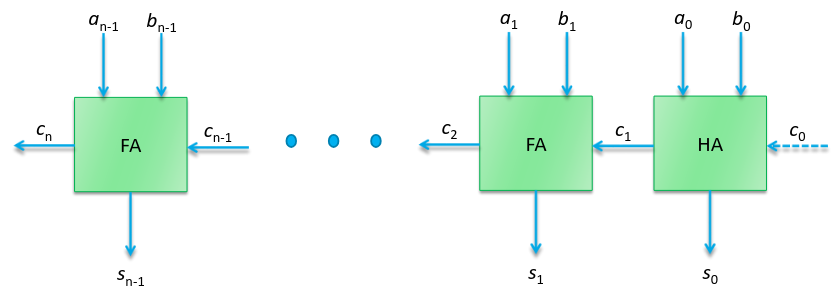
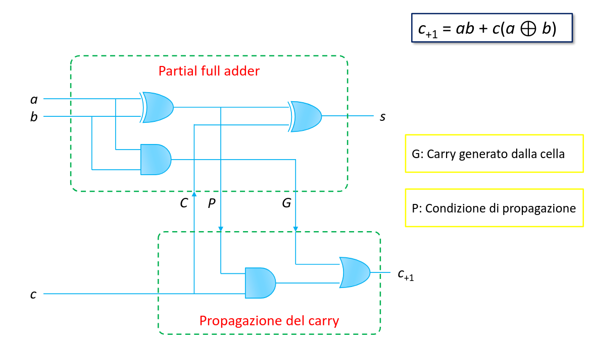
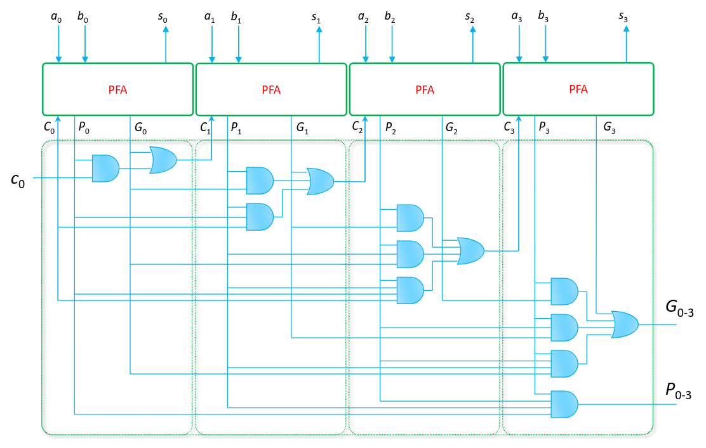

## Alee (glitch)

Sono brevi cambiamenti del valore in uscita che si manifestano solo durante la
fase transitoria (quella mentre cambia un ingresso e l'uscita si deve ancora
stabilizzare).

Una alea si verifica solo se gli ingressi cambiano un modo da passare da un
implicante all'altro. Inoltre i ritardi devono essere tali da disattivare il
primo, prima di attivare il secondo.

Per prevenire le alee è sufficiente aggiungere degli implicanti di collegamento,
non è più un'espressione minima, ma è necessaria per far funzionare i circuiti
asincroni.

## Circuiti aritmetici

I circuiti visti finora realizzano funzioni logiche. È possibile creare funzioni
che dati numeri binari in input, restituiscono un altro numero binario in
output.

Il numero di variabili in ingresso diventa ben presto ingestibile (ogni cifra è
una variabile, quindi per numeri grandi vengono grandi circuiti). Per mantenere
dimensioni ridotte si lavora con una cifra alla volta (metodo iterativo).

### Struttura iterativa generica

Ogni cella esegue il conto per la cifra corrispondente, il risultato finale è
dato dai contributi di ogni cella.

### Mezzo sommatore

La somma di 2 numeri a 1 bit richiede 2 bit per la rappresentazione del
risultato:

- il primo bit sarà il nuovo valore della cifra corrispondente nel numero
  finale;
- il secondo sarà il riporto (carry) che può essere collegato alla cella
  successiva;

### Ripple-carry adder

Il sommatore completo ha bisogno di un terzo ingresso per collegare il carry bit
della cella precedente.

Bastano ancora 2 uscite, perché i risultati vanno da 0 a 3.

Il circuito corrisponde esattamente a quello del conta-uni a 3 ingressi.

Per creare sommatori più grandi basta mettere assieme 2 sommatori più piccoli.
Ad esempio per farne uno da 8 bit ne bastano 2 da 4 bit dove il carry out del
primo è collegato al carry in del secondo. L'ultimo carry può essere usato per
indicare una condizione di overflow.

#### Prestazioni

Il sommatore è un circuito di dimensioni abbastanza ridotte. La sua dimensione
cresce linearmente con il numero di bit.

Dato che la mappa di Karnaugh è a scacchiera, gli implicanti sono tutti i
minterm.

A livello di tempo, i carry bit formano una catena che crea una dipendenza del
valore di una cella da quello della precedente. Quindi il circuito diventa più
lento al crescere del numero di bit. In genere il ritardo è $2n + 2$, dove $n$ è
il numero di bit del sommatore.

Ci sono anche alee impossibili da eliminare.

### Carry-lookahead adder

Il carry-lookahead adder è un sommatore più complesso che però è in grado di
ottenere una maggiore velocità a parità di numero di bit rispetto al
ripple-carry.

L'idea è quella di separare il calcolo della somma da quello del riporto. In
questo modo il calcolo del carry diventa un'operazione a 2 livelli.

Se affianchiamo queste celle, il calcolo del carry diventa una serie di
operazioni AND e OR affiancate. Diventa quindi possibile ottimizzarle come
operazioni di 2 livelli per ogni uscita $c_n$.

Per un sommatore a 4 bit abbiamo ridotto i livelli di logica da 10 a 6.
