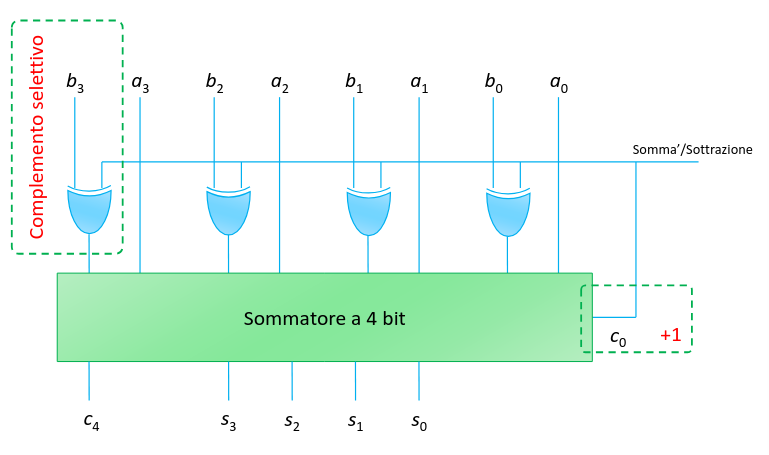

## Sottrazione

La sottrazione funziona circa come la somma, l'unico problema è quello di
rappresentare i numeri negativi. Poi si può realizzare una cella sottrattore a 1
bit con un input di prestito.

### Codifica in complemento a 2

Il complemento a 2 di un numero $n$ è dato da $2^b - n$, dove $b$ è il numero di
bit usati per rappresentare il numero.

Vantaggi della codifica in complemento a 2:

- se sommo 2 numeri positivi ottengo il risultato di prima;
- se sommo un positivo con un negativo ottengo la differenza;
- se sommo 2 negativi ottengo di nuovo il risultato corretto;
- c'è una sola rappresentazione per lo zero (niente zero positivo e zero
  negativo).

Per fare il complemento a 2 di un numero $m$ basterebbe fare $2^n - m$.

Però ci troviamo a dover eseguire un'altra sottrazione. Possiamo raggirare il
problema calcolando il complemento a 1: $2^n - 1 - m$. Notiamo che $2^n - 1$ è
un numero con tutti $1$, quindi il risultato della sottrazione con $m$ è
semplicemente $m'$.

Per ottenere il complemento a 2 basta poi sommare $1$ al complemento a 1.

### Realizzazione

Posso semplicemente usare un sommatore che prende in input il complemento a 2
del sottraendo.



Quindi posso aggiungere un XOR ai bit in entrata del sommatore che si attiverà
quando immetto un numero negativo. Inoltre per aggiungere 1 basta dare un
segnale 1 al primo input del carry.

## Moltiplicazione

Il moltiplicatore a 1 bit funziona esattamente come una AND.


Per avere una moltiplicazione tra 2 moltiplicandi, uno da $n$ bit e l'altro da
$m$ bit:

1. Prendo il moltiplicando con $n$ bit.
2. Per ogni suo $k$-esimo bit faccio un AND tra quel bit e l'altro
   moltiplicando. Quindi ottengo o tutti 0 o il valore del moltiplicando.
3. Sommo tutti gli $n$ risultati di ogni bit, traslati di $k$ bit a seconda del
   bit preso.

Quindi per fare la moltiplicazione di 2 numeri con $n$ bit servono fino a $2 n$
bit per il risultato.

## Altre operazioni

- divisione;
- radice quadrata;
- comparatori;
- rotazioni e traslazioni (di bit);
- funzioni trigonometriche;

Possono tutte essere realizzate con porte logiche (almeno in maniera
approssimata).

## Linguaggi di descrizione dell'hardware

Non c'è bisogno di ottimizzare il codice (come farebbe ad esempio gcc), bisogna
ottimizzare il numero di porte utilizzate.

### Concetti base di VHDL

L'**entità** è l'oggetto base del VHDL, corrisponde ad un blocco del circuito.
Ogni entità è identificata da un nome e dispone di un certo numero di ingressi
ed uscite.

```vhdl
-- entity entity_name is
--   [port (interface_signal_declaration);]
-- end [entity] entity_name;

entity full_adder is
   port (
      a, b, cin : in bit;
      s, cout : out bit
   );
end;
```

Un **architettura** definisce cosa fa un blocco. Ne descrive il funzionamento
tramite equazioni, connessioni di altri blocchi o tramite un algoritmo.

Ogni entità può avere più architetture diverse.

```vhdl
-- architecture architecture_name of entity_name is
--    [declarations]
-- begin
--    [architecture body]
-- end [architecture] [architecture_name];

architecture componenti of full_adder is
   -- dichiarazioni di variabili, etc...
begin
   -- descrizione dell'architettura
end;
```

Se vogliamo fare un paragone con il C, l'entità è la dichiarazione di una
funzione, mentre l'architettura ne è la definizione.

### Stili di descrizione

- data flow o equazioni: descrivono il funzionamento tramite equazioni booleane
  - esprimono dipendenza della uscite in funzione degli ingressi;
  - vengono messe a sistema;
- strutturale: collegamento di componenti in una gerarchia;
- behavioral o comportamentale: descrive il funzionamento tramite un algoritmo;

**Esempio**: porta AND a 2 ingressi:

```vhdl
entity And2 is
   port (
      x,y : in bit;
      z : out bit;
   );
end;

architecture ex1 of And2 is
begin
   z <= x and y;
end;
```

### Operatori

`<=` è l'operatore di assegnazione.

VHDL dispone di tutti gli operatori dell'algebra booleana:

- `not`
- `and`
- `or`
- `nand`
- `nor`
- `xor`
- `xnor`

`not` ha la precedenza su tutti, mentre gli altri vengono applicati da sinistra
verso destra.

### Identificatori

Vengono utilizzati per nomi di entità, architetture e segnali. VHDL è case
insensitive quindi `x` e `X` sono la stessa cosa.

### Testbench

Il testbench è una tipologia di blocchi che si usa per testare il funzionamento
di altri blocchi. Con il testbench si decide il valore da dare agli ingressi del
blocco da testare.

```vhdl
entity TestAnd2 is
end;

architecture simple of TestAnd2 is
    -- Segnali interni al componente.
    signal a, b, c : bit;
begin
    -- Istanza del modulo da testare.
    g1: And2 port map (x => a, y => b, z => c);
    -- Definizione degli stimoli sugli ingressi.
    a <= '0', '1' after 100ns, '0' after 200ns;
    b <= '0', '1' after 150ns, '0' after 200ns;
end;
```
