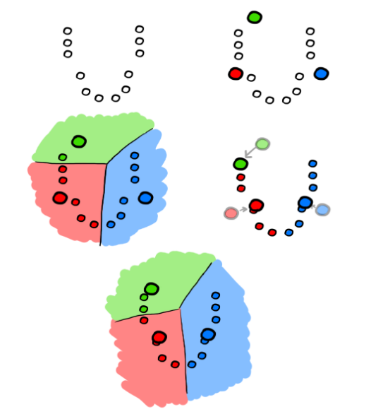

## Rappresentazioni in clustering

- rappresentazione esterna: per ogni entità, l'informazione è data dalla
  relazione tra essa e un'altra.
- rappresentazione interna: ogni entità è identificata da un vettore di numeri.

Raggruppare vettori simili conoscendo la rappresentazione interna è molto
facile, basta calcolare la distanza euclidea. Eccetto in alcuni casi in cui
l'input non può essere normalizzato.

Alcuni esempi di distanza:

- Distanza euclidea:

  $$
  \delta_E(x,y) = ||y - x|| = \sqrt{\sum_{i = 1}^n (x_i - y_i)^2}
  $$

- Norma di Manhattan: distanza misurata solo muovendosi in verticale o in
  orizzontale:

  $$
  d_{ij}^\text{Manhattan} = ||x_i - x_j||_1 = \sum_{k = 1}^n |x_{ik} - x_{jk}|
  $$

- Angolo del prodotto scalare:

  $$
  \fCos{\theta} = \frac{x \cdot y}{||x||\ ||y||}
  $$

Può essere utile normalizzare le componenti dei vettori quando si calcola la
distanza euclidea:

$$
\delta_\text{norm}(x,y) = \sqrt{\sum_{i = 1}^n} (\frac{x_i - y_i}{\max{i} - \min{i}})^2
$$

Queste misure di distanza sono invece una rappresentazione esterna.

## Hard e soft clustering

- Hard clustering: gli insiemi di partizione sono disgiunti, l'obiettivo è
  quello di minimizzare le dissimilarità tra elementi dello stesso sottoinsieme
  e di massimizzare la distanza tra elementi di insiemi diversi.
- Soft clustering: l'appartenenza ad una certa classe è espressa da un numero,
  quindi i confini tra i sottoinsiemi si sovrappongono parzialmente.

### K-means

L'algoritmo di k-means è un algoritmo divisivo: inizia con l'intero insieme e lo
suddivide man mano in sottoinsiemi sempre più piccoli.

Per ogni cluster, il prototipo (la media delle componenti di solito) è calcolata
minimizzando l'errore di quantizzazione.

$$
E = \sum_d ||x_d - p_{c(d)}||^2
$$

1. Scelgo il numero di clusters ($k$);
2. Genero in maniera casuale $k$ prototipi;
3. Ripeto fino a quanto un certo criterio viene raggiunto:
   - Assegno ogni punto al centroide del cluster più vicino;
   - Muovo il centroide del prototipo nel punto dato dalla media di quelli che
     gli appartengono;

### Soft clustering

In alcuni casi, l'assegnamento di un'entità ad un cluster non è netto ma dipende
da una probabilità:

Il valore di appartenenza ad un certo cluster può essere dato da:

$$
\text{membership}(x, c) = \frac{e^{- \delta(x, p_c)}}{\sum_c e^{- \delta(x, p_c)}}
$$

L'aggiornamento dei centroidi può essere eseguito leggermente diversa. Il
centroide viene 'tirato' da ogni entità di una distanza proporzionale al grado
di membership.

$$
\Delta p_c = n\ \text{membership}(x,c)\ (x - p_c)
p_{c_\text{next}} = p_c + \Delta p_c
$$

Ci sono 2 versioni leggermente differenti:

- online update: ogni volta che testo un'entità, sposto immediatamente il
  centroide;
- batch update: prima trovo tutte le entità appartenenti al gruppo, poi sposto
  il centroide con la somma di tutti i contributi;
