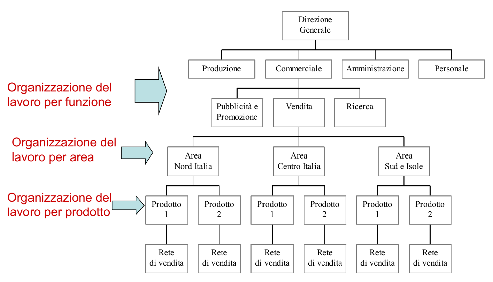
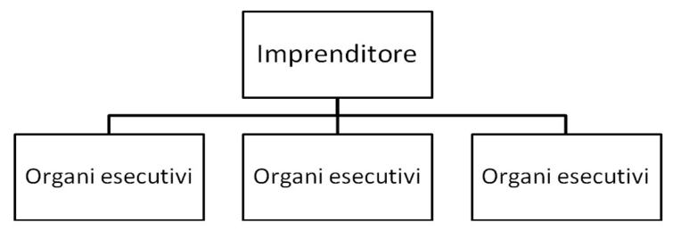
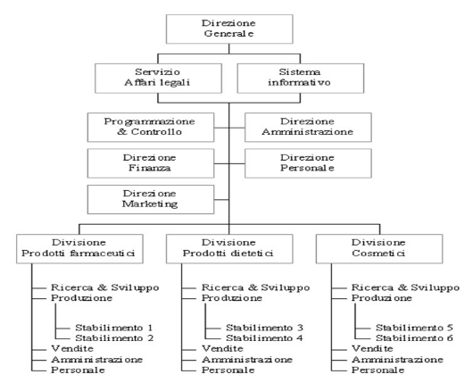

## Struttura organizzativa

Definisce gli organi dell'impresa, le loro funzioni e le relazioni
interorganizzative.

La struttura di un organizzazione può essere rappresentata graficamente
attraverso gli **organigrammi**, che hanno la funzione di chiarire quali sono
gli organi, delimitare i loro compiti e aree di lavoro e di precisare le
relazioni gerarchiche e funzionali.

### Gestione delle risorse umane

La gestione delle risorse umane di un'azienda può essere caratterizzata in 2
modi:

- dimensione verticale: stabilisce la gerarchia tra gli organi;
- dimensione orizzontale: definisce la ripartizione del lavoro in base alla
  specializzazione;

#### Divisione orizzontale

Definisce i compiti e le aree di intervento delle unità organizzative ed
operative.

La classificazione può avvenire secondo diversi criteri:

- per input: dividendo per funzione o processo produttivo si ottiene una
  struttura di tipo **plurifunzionale**;
- per output: dividendo per famiglia di prodotti, area geografica o clientela si
  ottiene una struttura **multidivisionale**;

Applicando entrambi i criteri si ottiene una suddivisione **a matrice**.

#### Divisione verticale

Il grado di decentralizzazione del potere influenza l'intensità con cui vengono
applicate le decisioni.

### Modelli di struttura organizzativa

Esistono diverse tipologie di strutture organizzative:

#### Struttura semplice

Adatta ad aziende di piccole dimensioni, dove le funzioni direttive ed operative
sono tutte incentrate sull'imprenditore.

A livello esecutivo presenta bassa specializzazione dei compiti e notevole
intercambiabilità dei ruoli, facilitando decisioni rapide e flessibilità
operativa.

#### Struttura plurifunzionale

Il lavoro dell'azienda è suddiviso in senso orizzontale per aree funzionali.

Essa presenta una gerarchia ben definita e un decentramento del potere limitato.

Il top-management esegue le decisioni strategiche, mentre gli organi intermedi
si occupano di quelle direzionali ed operative.

I vantaggi di questo modello sono:

- efficienza del sistema: ogni reparto può specializzarsi intensivamente nella
  propria funzione;
- la maggior competenza di ogni reparto, che aumenta la produttività e la
  qualità;
- una maggior flessibilità operativa;
- una maggior rapidità nell'assunzione delle decisioni e nella trasmissione
  delle informazioni;

Gli svantaggi sono:

- problemi di coordinamento: ogni reparto deve gestire l'intero portafoglio
  prodotti, riducendo il tempo dedicato a ciascuno;
- poca collaborazione tra gli organi: ognuno persegue obiettivi diversi;
- sviluppa poco le capacità professionali dei dirigenti e le motivazioni del
  personale;

#### Struttura multidivisionale

Le attività vengono raggruppate per divisioni basate su linee di prodotto, aree
geografiche, categorie di clienti, canali distributivi.

Ciascuna divisione è organizzata per aree funzionali e gode di una buona
autonomia decisionale.

Vantaggi:

- efficacia del sistema: ogni divisione può concentrarsi interamente sul suo
  scopo;
- facilità di gestione e coordinamento delle attività per prodotti e mercati
  diversi;
- possibilità di crescita e competitività: motivazione per i dirigenti a
  lavorare meglio;
- si sviluppano comunque competenze specialistiche all'interno delle divisioni;

Svantaggi:

- minor efficienza globale: avere più centri direttivi e unità esecutive implica
  maggiori costi;
- possibili conflitti tra divisioni per l'attribuzione delle risorse o tra
  divisioni e management per il potere decisionale;
- richiede maggiori meccanismi di coordinamento e controllo;

#### Struttura a matrice

La struttura a matrice è tipica delle aziende che producono per progetto o per
commessa.

La direzione si articola sia in reparti funzionali, sia per i settori definiti
in una struttura multidivisionale. Entrambe le strutture supervisionano i
reparti esecutivi, garantendo così un'alta flessibilità.

Vantaggi:

- combina l'efficienza del modello plurifunzionale con l'efficacia di quello
  multidivisionale;
- flessibilità organizzativa ed operativa;
- diffusione del potere su 2 linee di comando;

Svantaggi:

- il personale sviluppa un senso di precarietà e insicurezza;
- la duplice linea di comando richiede tempi più lunghi per prendere decisioni.

#### Business process re-engineering

Il modello 'a processi' raggruppa le attività in processi interfunzionali,
permettendo di valutare il contributo di ciascuna fase al prodotto finale
offerto al cliente.

Un processo è definito come la sequenza di attività collegate tra loro e svolte
in aree e centri di responsabilità differenti, coordinate da un responsabile di
processo.

Vantaggi:

- orientamento al cliente e focalizzazione sulle attività rilevanti;
- visione d'insieme degli obiettivi aziendali;
- lavoro di squadra: non ci sono più confini intra-organizzativi;
- maggiore flessibilità: delega del potere decisionale al team supervisore del
  processo;

Svantaggi:

- difficoltà nell'identificare quali sono gli obiettivi dell'intera
  organizzazione;
- necessità di cambiamenti nella cultura organizzativa vista finora;
- bassa specializzazione delle competenze tecniche;

## Meccanismi di coordinamento del lavoro

- obiettivi;
- piani e programmi;
- mansionari;
- norme procedurali;
- stili di leadership;

## Azienda, impresa, società

- L'azienda rappresenta l'aspetto materiale dell'organizzazione, includendo
  edifici, macchinari, risorse umane, ecc.
- L'impresa riguarda l'attività imprenditoriale.
- La società incarna giuridicamente le due definizioni precedenti.

Le società si suddividono in 2 tipologie:

- società di persone: la responsabilità per le obbligazioni sociali ricade su
  persone fisiche ed è quindi illimitata, estendendosi anche al patrimonio
  personale;
- società di capitali: la responsabilità è limitata esclusivamente al capitale
  sociale investito, a fronte di oneri e obblighi più ampi;

A livello di governance si trovano:

- assemblea dei soci;
- consiglio di amministrazione;
- collegio sindacale: si occupa della revisione dei conti, a tutela degli soci;
- amministratore delegato: finalizza l'investimento dei soci;
- direttore generale: coordina le aree funzionali;

## Ambienti, mercati, settori

- L'ambiente è il contesto in cui opera l'azienda, importante per capire come si
  evolverà e prevedere variazioni nei contratti.
- I mercati sono relativi allo scambio di risorse (risorse umane, capitali,
  marketing (mercato delle vendite), approvvigionamento (fornitori)).
- I settori sono raggruppamenti strategici relativi a business specifici. Sono
  un'area più specifica dell'ambiente.

## Performance di un'azienda

- $\text{utile} = \text{ricavi} - \text{costi}$
- $\text{redditività} = \frac{\text{utile}}{\text{investimento}}$

Sono determinati da:

- gestione aziendale caratteristica: attività operative tipiche del settore;
- gestione aziendale extra-caratteristica: attività di natura finanziaria per
  reperire capitali;
- congiuntura economica: fattori di contesto, istituzionali e di mercato. Non
  controllabili dall'azienda;

La gestione aziendale è determinata dal modo in cui l'azienda utilizza leve
operative tecnologiche, organizzative e gestionali, le quali possono migliorare
le prestazioni interne (es. riduzione dei costi, aumento della produttività) ed
esterne (es. miglioramento della qualità, soddisfazione del cliente).
