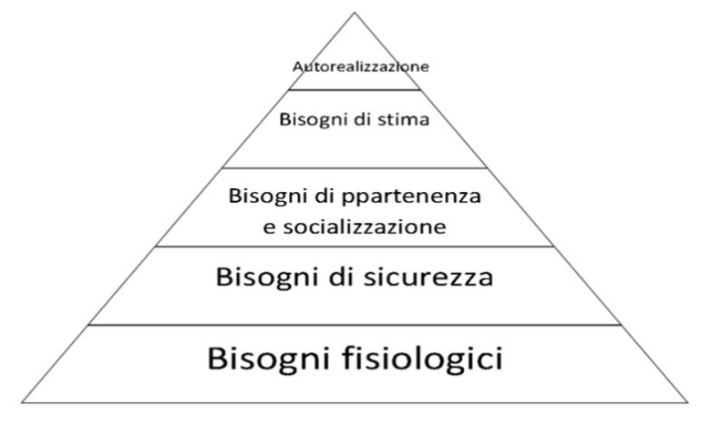
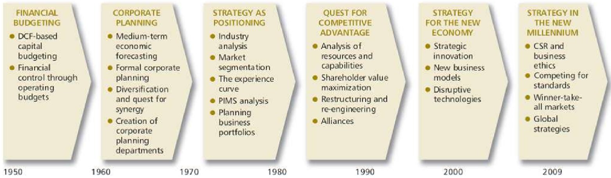

## Teorie organizzative

Le teorie organizzative nacquero per analizzare i soggetti dell'organizzazione e
il loro operare all'interno di strutture.

Ci si può focalizzare su:

- **soggetto/individuo**;
- **sistemi**: entità che si formano dall'interazione tra i soggetti;

Con diversi approci:

- **deterministico**: scientifico e legato ad una visione
  economica/burocratica/amministrativa;
- **possibilistico**: introduce aspetti individuali e comportamentali degli
  individui;

### Scuola classica

All'interno della scuola classica ritroviamo 3 teorie:

#### Scientific management di Taylor

Teoria sviluppatasi nel Nord America (catena di montaggio Ford), propone un
sistema di gestione e direzione dell'organizzazione basato su 4 principi:

- sviluppo di conoscenze su basi scientifiche: formalizzazione dell'insieme di
  azioni che sono il contenuto della mansione;
- selezione scientifica della manodopera: conoscere le sue conoscenze e il suo
  rendimento, per prevedere limiti e possibilità di sviluppo;
- preparazione e perfezionamento dei lavoratori su basi scientifiche;
- collaborazione tra dirigenti e manodopera: la manodopera deve accettare le
  regole precedentemente stabilite e i dirigenti devono valutare equamente il
  lavoro altrui;

Il punto è quello di **migliorare scientificamente l'efficienza della
manodopera**. La teoria non considera l'aspetto delle risorse umane.

#### Teoria amministrativa di Fayol

Fayol mirava a **rendere più scientifica l'attività direttiva**, ovvero le
attività di previsione, organizzazione, comando, coordinamento e controllo.

Ha individuato diverse funzioni all'interno di un'organizzazione:

- tecnica: produzione e trasformazione;
- commerciale: acquisti e vendite;
- sicurezza: protezione dei beni e delle persone;
- amministrativa: contabilità, bilanci, inventari, costi, statistiche;
- finanziaria: ricerca e gestione dei capitali;
- direttiva: programmazione, organizzazione, comando, coordinamento e controllo;

E ha voluto dare enfasi ai principi di:

- centralizzazione;
- ordine e gerarchia;
- equità;
- stabilità e coesione del personale;
- iniziativa;

#### Teoria burocratica di Weber

Weber definisce la **burocrazia come l'apparato amministrativo** per l'esercizio
dell'autorità legale.

Quindi:

- La suddivisione del lavoro viene disciplinata tramite regole.
- Bisogna uniformare i comportamenti e rendere impersonali le relazioni interne
  ed esterne.
- Importante stabilire una gerarchia negli uffici.

### Scuola delle relazioni umane

Con i dati ottenuti dalle ricerche in grandi fabbriche, si nota che gli operai
non aumentavano la produttività per il miglioramento delle loro condizioni di
lavoro (illuminazione, durata delle pause, retribuzione, ecc.), ma per fattori
di ordine psicologico.

Le teorie motivazionali **prestano attenzione al soggetto**, considerando le sue
motivazioni, percezioni, aspirazioni, aspettative, ecc.

Piramide di Maslow:

#### Teoria di Likert

Liker osservò che le aziende potevano essere divise in **4 tipologie in base
allo stile di direzione**:

- autoritario: il manager fa tutte le scelte e le impone ai subordinati;
- paternalistico: il manager fa le scelte più importanti, e delega le altre ai
  suoi subordinati;
- consultativo: il manager fa le scelte più importanti ma incoraggia i
  subordinati a proporre idee e soluzioni;
- partecipativo: il manager supervisiona i subordinati, che compiono scelte in
  modo democratico;

#### Teoria della contingenza

La teoria enuncia che non esiste un unico tipo di leadership o di organizzazione
che sia più efficiente. **Il modello da assumere dipende da una serie di
fattori** contingenti:

- **Contingenza ambientale**:
  - In ambienti instabili le aziende sono più produttive se usano una struttura
    poco formalizzata e maggiormente decentralizzata.
  - In ambienti stabili le aziende sono più produttive se hanno una struttura
    più rigida e centralizzata.
- **Contingenza strategica**: secondo Chandler, le organizzazioni si devono
  organizzare in base alla strategia che scelgono, basata a sua volta sui
  fattori ambientali e tecnologici.
- **Contingenza tecnologica**: ci sono diversi stili di produzione abilitati da
  diverse tecnologie:
  - piccola produzione di singoli prodotti;
  - produzione di prodotti di massa;
  - produzione per processo;
- **Contingenza dimensionale**: la configurazione della struttura dipende dalle
  dimensioni dell'organizzazione. Quelle più grandi presentano solitamente
  maggiore specializzazione del personale, ampio utilizzo di pianificazione e
  programmazione, alta formalizzazione, forte decentramento del potere.

### Teoria dei costi di transazione

Una **transazione** è lo scambio di beni/servizi tra 2 aziende, ma anche la
parte non tangibile come il tempo impiegato per trovare il fornitore e per la
negoziazione.

Secondo questa teoria, sviluppata da Williamson, i costi di transazione non sono
determinati dal mercato ma dall'organizzazione, infatti un imprenditore può
scegliere tra il maggior costo e il minor controllo di comprare da un fornitore
vs la maggior complessità di produrre da sè.

L'obiettivo dell'impresa è quello di **ottimizzare i costi di transazione**
agendo su alcune variabili:

- razionalità limitata;
- opportunismo;
- frequenza delle transazioni;

### Total quality management / Lean management

Il lean management nasce in Giappone negli anni 80, e si basa sullo snellire le
strutture organizzative, incentrando gli investimenti sul core business e
strutturando l'organizzazione attorno ai processi.

I principali pilastri sono:

- learning e kaizen: apprendimento e miglioramento continui;
- policy deployment: utilizzare gli strumenti e le norme più appropriati per
  gestire la qualità;
- standardization: la gestione dei processi in modo standardizzato aumenta
  l'efficienza;
- total employee involvement: tutti devono sentirsi responsabili della qualità
  del prodotto finale;

## Analisi strategica

La strategia rappresenta lo schema d'azione di medio-lungo termine di
un'azienda, finalizzata a farla crescere. Si può formulare come il raccordo tra
le opportunità che essa percepisce nell'ambiente esterno e le risorse di cui
dispone o di cui intende dotarsi.

La tattica è la serie di azioni che l'azienda intraprende per cercare di mettere
in atto la strategia.

### Livelli di strategia

- **strategia di corporate**: si preoccupa di decidere in quali settori operare
  e di come distribuire le risorse aziendali tra essi;
- **strategia di business**: definisce il modo di competere all'interno di uno
  specifico settore;
- **strategia funzionale**: riguarda l'implementazione della strategia di
  business attraverso le funzioni operative dell'organizzazione;

### Evoluzione del pensiero strategico

