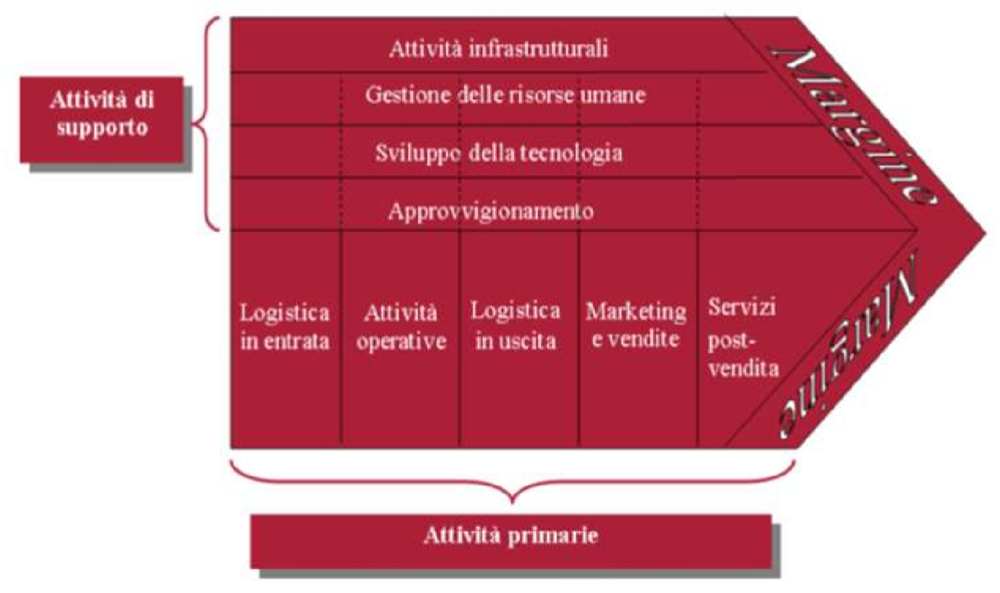

---
description:
  Analisi del settore industriale con SCP, forze di Porter, raggruppamenti
  strategici, vatena del Valore e RBV.
lang: it
title: Lezione (2026-03-09)
---

## Settore industriale

L'ambiente operativo di un'impresa è composto da variabili esterne che
influenzano le sue decisioni e i suoi risultati. Tali variabili sono influenzate
dalla macroeconomia, ma soprattutto dall'ambiente settoriale.

Il settore industriale di un'azienda è l'insieme di imprese che producono beni o
servizi che sono in concorrenza diretta tra loro, ovvero percepiti dalla domanda
come sostituti per l'uso che se ne fa.

### Strategia competitiva

La strategia competitiva dell'impresa tiene conto di 2 fattori principali:

- Attrattività del settore: dipende dall'intensità dei fattori competitivi
  (concentrazione dei concorrenti, economie di scala, barriere di
  ingresso/uscita, ecc.).
- Posizione competitiva: la posizione in cui l'impresa si colloca all'interno
  del settore, che determina se la sua redditività è superiore o inferiore
  rispetto alla media.

## Paradigma SCP

La **struttura del settore industriale influenza direttamente il comportamento
dell'impresa**, determinandone conseguentemente la performance.

### Struttura di settore

Diversi fattori determinano la struttura del settore, che può variare da
situazioni di concorrenza perfetta fino al monopolio.

- concentrazione: grado di influenza che un'impresa esercita sulla domanda e
  offerta del settore;
- economie di scala: riduzione dei costi medi al crescere della capacità
  produttiva;
- barriere di entrata e uscita: costi addizionali che un potenziale concorrente
  dovrebbe sostenere rispetto alle imprese esistenti;
- differenziazione di prodotto: differenze che orientano i consumatori a
  comprare un prodotto piuttosto che un altro;
- informazione: distribuzione delle informazioni tra venditori e acquirenti;

## Scuola del valore

La Scuola del Valore cerca di migliorare l'approccio SCP enfatizzando
maggiormente il ruolo che le imprese svolgono nella struttura del settore.

La struttura del settore serve ad avere un riferimento per la redditività
potenziale dell'impresa. L'**analisi del comportamento aziendale serve a
raggiungere la redditività effettiva**.

Il comportamento delle imprese deve essere guidato dal principio della creazione
di valore per il cliente, inteso come il prezzo che il cliente è disposto a
pagare per acquisire i prodotti/servizi dell'impresa.

Pertanto, l'impresa deve generare un valore distintivo rispetto a quello offerto
dai propri concorrenti.

### Analisi esterna: Modello Porter

Secondo Porter la strategia competitiva dell'azienda può influenzare la
struttura del settore. L'obiettivo è quello di stabilire una posizione
redditizia e sostenibile contro le forze che determinano la concorrenza.

La **strategia dell'impresa può influenzare** l'attrattività del settore nel
lungo periodo e la sua posizione competitiva all'interno dello stesso.

Le 5 forze che l'azienda deve gestire sono:

##### Concorrenza interna al settore

Più è intensa la concorrenza, maggiore è la pressione sui prezzi e quindi sui
margini di profitto.

I fattori che implicano un'alta concorrenza sono:

- un gran numero di aziende di dimensioni simili;
- crescita lenta del mercato;
- bassa differenziazione tra i prodotti;
- barriere di uscita elevate;

##### Potere contrattuale dei fornitori

I fornitori hanno maggiore potere contrattuale se:

- ce ne sono pochi e di grandi dimensioni;
- cambiare fornitore comporta costi significativi;
- non ci sono materie prime sostitutive;
- esiste il pericolo di lobbying tra i fornitori;

##### Potere contrattuale dei clienti

I clienti hanno maggiore potere contrattuale se:

- sono pochi e di grandi dimensioni;
- l'azienda ha elevati costi fissi (deve mantenere alta la quantità di
  prodotti);
- cambiare fornitore è semplice e poco costoso per loro;
- i clienti potrebbero acquisire il fornitore;

##### Minaccia di nuovi concorrenti

Nuovi concorrenti possono essere dissuasi dall'entrare nel mercato se:

- i brevetti e le patenti limitano l'ingresso;
- le economie di scala impongono la produzione di alti volumi per raggiungere un
  buon margine di profitto;
- l'industria presenta elevati costi fissi o investimenti iniziali;
- vi è scarsità di risorse importanti;
- i soggetti presenti controllano anche i fornitori e quindi l'accesso alle
  materie prime;

##### Minaccia di prodotti sostitutivi

Fattori che scoraggiano i clienti a passare a prodotti sostitutivi sono:

- miglior rapporto prestazioni/prezzo del prodotto corrente;
- fedeltà al marchio;
- costi legati al cambiamento;

#### Vantaggio competitivo

Il vantaggio competitivo nasce dal valore che un'azienda crea per i propri
clienti. Un valore superiore deriva dall'offrire:

- lo stesso prodotto della concorrenza ad un prezzo più basso;
- vantaggi unici rispetto ai prodotti della concorrenza;

#### Strategie di base di Porter

Ci sono 4 tipologie di strategia:

- **Leadership di costo**: basata su una struttura aziendale più efficiente;
- **Focalizzazione sui costi**: basata sull'accesso ad una fonte esclusiva;
- **Differenziazione**: basata su una caratteristica generica (es. brand);
- **Focalizzazione sulla differenziazione**: basata su elemento non imitabile;

Un'impresa deve scegliere una sola strategia di base, a meno che non sia
condizionata da forze esterne altamente influenti.

I rischi per ogni strategia sono:

- leadership di costo:
  - i concorrenti imitano il prodotto senza costi di ricerca e sviluppo;
  - la tecnologia si evolve;
  - i fornitori vantaggiosi non sono più esclusivi;
- differenziazione:
  - i concorrenti imitano l'elemento differenziante;
  - i clienti non danno valore all'elemento differenziante;
- focalizzazione:
  - il segmento diventa poco richiesto (si abbassa la domanda);
  - concorrenti meno focalizzati entrano nel settore;

### Analisi della concorrenza: Raggruppamenti strategici

Il raggruppamento strategico delle aziende consiste nella rappresentazione delle
imprese in insiemi omogenei basandosi su specifiche variabili di aggregazione.

La costruzione di queste mappe permette di visualizzare la concorrenza. Questo
permette di identificare quali imprese sono in concorrenza diretta e quali
operano in segmenti distinti.

Le variabili più importanti sono quelle che esprimono barriere alla mobilità,
cioè che rendono difficile spostarsi da un gruppo strategico ad un altro:

- ampiezza della gamma di prodotti/servizi: specializzazione vs
  diversificazione;
- qualità percepita;
- canali di distribuzione;
- localizzazione geografica;
- strategie di prezzo: alto margine vs basso costo;
- brand reputation;

### Analisi interna: Catena del valore

La catena del valore fornisce una rappresentazione schematica delle attività
svolte dall'impresa, evidenziandone il valore creato ed i costi sopportati per
crearlo.

- Le attività primarie sono quelle necessarie per la creazione fisica del
  prodotto, il suo trasferimento al cliente e l'assistenza post-vendita.
- Le attività di supporto sostengono le primarie e allo stesso tempo generano
  anch'esse valore (es. ricerca fornitori, sviluppo di nuove tecnologie,
  gestione delle risorse umane, attività infrastrutturali).

## Resource Based View (RBV)

La RBV è una prospettiva che vede l'impresa come un insieme di risorse che
rapresentano la base per la realizzazione di un vantaggio competitivo.

Le risorse possono essere:

- **Tangibili**: risorse finanziarie e beni materiali. Queste sono sempre meno
  centrali per l'acquisizione e il mantenimento del vantaggio competitivo.
- **Intangibili**: rappresentate dalle conoscenze detenute dall'impresa, sia
  tecnologiche, sia legate a marchi affermati e alla sua reputazione.
- **Umane**: rappresentate dalle competenze, conoscenze e capacità di analisi e
  collaborazione dei collaboratori dell'impresa.
