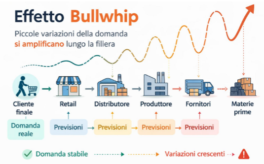

---
description:
  Analisi del ruolo degli acquisti nel mercato, indicatori finanziari aziendali,
  processi B2B/B2C e le 6 fasi del processo di acquisto.
lang: it
title: Lezione (2026-03-12)
---

## Ruolo degli acquisti

Il mercato è composto da:

- fornitori;
- noi (l'impresa);
- concorrenti;
- intermediari;
- consumatori;

I fornitori sono importanti perché permettono di abbassare il costo base dei
prezzi e hanno inoltre un grande impatto sulla qualità del prodotto finale.

Il ruolo degli acquisti presso i fornitori varia a seconda del settore, ma
generalmente comprende:

- materie prime;
- capex: investimenti su immobili (acquisto di strutture (capannoni) o
  macchinari);
- articoli commerciali: utilizzati per mansioni secondarie;
- servizi;
- admin;
- ricambi;

Dal bilancio di un'azienda si ottengono i seguenti indicatori:

- **ROS** (margine operativo (utile generato dalla gestione, ricavi - costi
  operativi) / fatturato): Indica quanta redditività l'azienda genera per ogni
  euro di vendite.
- **indice di rotazione** (fatturato / attività totali): Indica quanto
  velocemente il capitale investito si trasforma in vendite.
- **ROA** (ROS x indice di rotazione): Redditività complessiva del capitale
  investito, ovvero quanto rendono le attività dell'impresa.

Un costo degli acquisti più elevato rispetto al fatturato (rispetto al prezzo
finale) avrà un impatto maggiore sulla redditività, in relazione alla riduzione
di tale costo.

I fornitori influiscono su diversi fattori:

- prezzo finale;
- qualità del prodotto;
- livello di servizio offerto ai clienti (affidabilità, tempistiche);
- abilità nello sviluppare certi prodotti;

:::note

Nel modello Porter il processo d'acquisto è considerato un'attività di supporto.

:::

Ci sono 2 tipologie di acquisto:

- **B2B**: la transazione avviene tra entità organizzate.
- **B2C**: l'acquirente è il consumatore finale.

## Processo d'acquisto

Il processo d'acquisto B2B presenta una maggior complessità di quello B2C, con
maggiore formalità e tempi più lunghi.

:::note

Domanda derivata: più è primitiva la materia fornita da una certa azienda, più
essa deve essere abile nel prevedere quanto produrre nell'immediato futuro.

:::

Altre caratteristiche sono:

- domanda non elastica: il prezzo è meno elastico nel breve termine;
- grossi ordinativi, con ingenti somme di denaro;
- conoscenza elevata del prodotto: si assume che l'acquirente conosca bene cosa
  vuole acquistare;
- clienti limitati e concentrati geograficamente: creazione di distretti
  industriali;
- numero di intermediari inferiore;
- commercio elettronico: acquisti direttamente da software gestionale;
- varietà di forme contrattuali;
- forme di finanziamento complesse;

Il mercato è inteso come una rete di relazioni tra organizzazioni, dove diventa
cruciale gestire i rapporti a lungo termine.

### Fasi del processo d'acquisto

1. definizione delle specifiche del prodotto da acquistare;
2. identificazione dei fornitori potenziali;
3. selezione dei fornitori e negoziazione;
4. emissione degli ordini ai fornitori;
5. monitoraggio e controllo degli ordini di acquisto;
6. post-acquisto e valutazione dei fornitori;

La qualità dell'output di ogni step influenza la qualità del successivo. Le
prime 3 fasi sono considerate strategiche, le ultime 3 operative.

#### Definizione delle specifiche

Vengono determinate le caratteristiche di ciascun prodotto, specialmente per
quelli personalizzati, non quelli standard.

Bisogna stimare i fabbisogni di medio-lungo termine.

#### Identificazione dei fornitori

Si predispone una lista di fornitori preselezionati in base a:

- informazioni interne (acquisti passati, contatto con l'azienda);
- informazioni esterne (ricerche su internet, fiere);

Si effettuano poi visite presso i fornitori (audit) o indagini attraverso
questionari.

#### Selezione dei fornitori

Richiesta dei preventivi in base alle specifiche.

Sulla base delle offerte ricevute, si valuta la soluzione migliore.

#### Contrattazione

In questo contesto vengono formalizzati i dettagli relativi ai vari aspetti
dell'acquisto:

- costo;
- tempi di consegna;
- penali;

#### Emissione degli ordini

I fornitori decidono se accettare gli ordini, in tal caso il cliente riceve le
informazioni sulla data di consegna ed eventuali modifiche di tempo/quantità.

#### Monitoraggio e controllo degli ordini

- expediting: monitoraggio dell'avanzamento dell'ordine ed eventuale sollecito;
- ispezione: visite periodiche per monitorare lo stato di avanzamento
  dell'ordine;
- order tracking: invio da parte del fornitore di informazioni sull'avanzamento;

#### Post acquisto e valutazione dei fornitori

Gestione di reclami ai fornitori, richieste di assistenza, aggiornamento degli
archivi delle informazioni sul fornitore.

## Buygrid Model

Non sempre è necessario svolgere tutte e 6 le fasi quando si fa un acquisto.

Ci sono 3 tipologie di acquisti (in ordine di incertezza crescente):

- nuovo acquisto;
- riacquisto modificato;
- riacquisto diretto;
