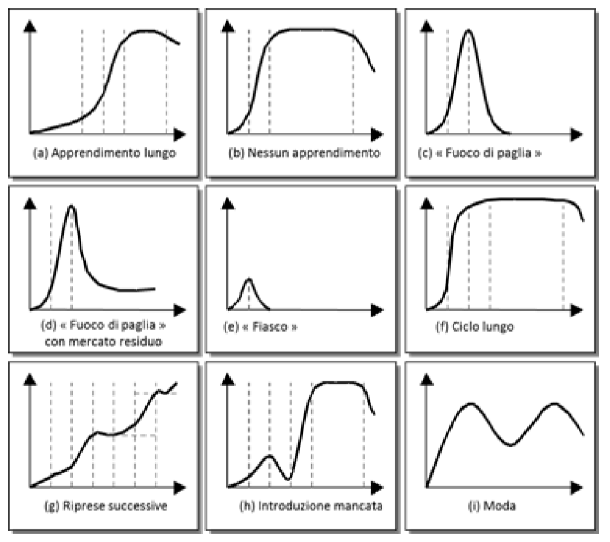
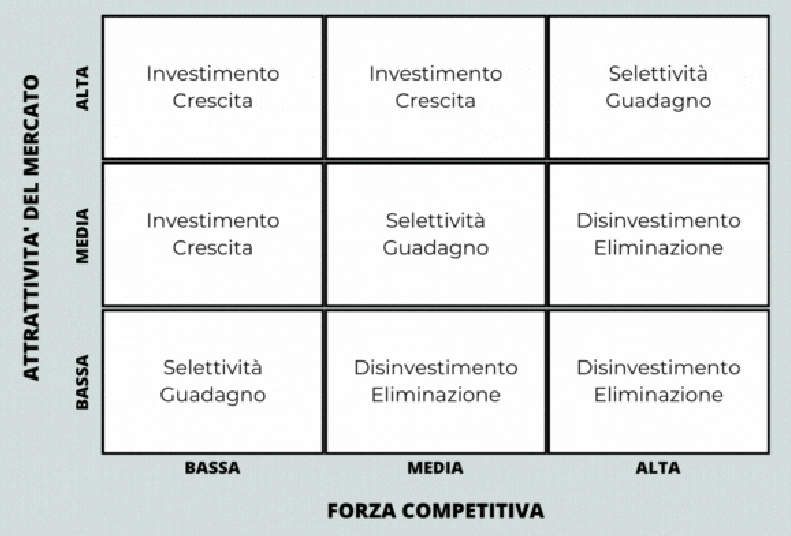
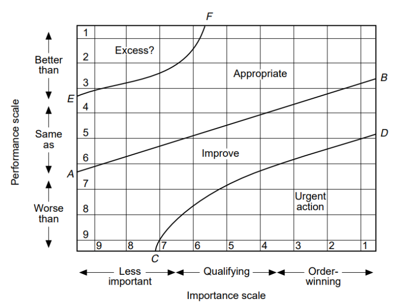
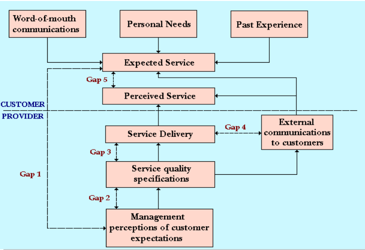

## Targeting

Il targeting è il processo di valutazione dell'attrattività di ciascun segmento
di mercato e la selezione dei segmenti a cui rivolgere i propri prodotti.

L'analisi SWOT (Strengths, Weaknesses, Opportunities, Threats) serve a valutare
su quali mercati è utile concentrarsi. Essa fonde due prospettive:

- contesto interno: punti di forza e debolezza dell'azienda (catena del valore);
- contesto esterno: opportunità e minacce del mercato (modello porter, analisi
  della domanda, analisi PESTLE);

### Analisi della domanda

L'analisi della domanda è lo studio delle quantità acquistate da un dato gruppo
di clienti in un determinato segmento in un periodo specifico.

### Analisi PESTLE

L'analisi PESTLE analizza diversi fattori del macroambiente esterno all'azienda:

- Politici: regime fiscale, commercio con l'estero, leggi sui monopoli;
- Economici: inflazione, tassi di interesse, tassi di cambio;
- Sociali: livello di educazione, diritti, demografia;
- Tecnologici: spesa pubblica per la ricerca, protezione della proprietà
  intellettuale, livello di innovazione e digitalizzazione;
- Legali: leggi sull'occupazione e sul lavoro, tutela e sicurezza dei
  consumatori;
- Ecologici: legati al clima, luogo geografico, limiti ambientali;

### Matrice GE-McKinsey

La matrice GE-McKinsey, insieme alla matrice BCG, viene usata per stabilire la
strategia che l'azienda deve adottare per ogni settore del mercato.

Nella matrice, attrattività e competitività del settore sono i 2 assi. Ci sono 9
caselle, dove a ciascuna è assegnato un comportamento strategico ottimale.

## Positioning

Il positioning consiste nelle attività che permetteranno al prodotto di occupare
una posizione chiara, distintiva e desiderabile nella mente dei consumatori
rispetto ai concorrenti.

### Mappe delle percezioni

Le mappe delle percezioni permettono di individuare graficamente il
posizionamento del prodotto agli occhi del cliente in base a coppie di attributi
rilevanti ai fini della decisione di acquisto.

È importante rilevare attributi significativi in relazione al prodotto offerto e
a quelli della concorrenza.

### Matrice Importance-Performance

La matrice Importance-Performance utilizza due variabili:

- posizionamento rispetto ai concorrenti in termini di performance;
- importanza oggettiva della prestazione nel segmento di mercato;

Con questo strumento è possibile identificare quali fattori di un prodotto o
servizio risultano sottodimensionati o sovrastimati rispetto all'importanza
percepita. Ciò consente di definire le priorità di intervento nelle aree da
migliorare.

### Analisi degli scostamenti nelle percezioni (Gap)

Usa strumenti formali (come il SERVQUAL) per analizzare gli scostamenti delle
percezioni dei clienti tra livelli desiderati di performance e performance
offerta.

L'obiettivo è quello di ridurre la deformazione delle percezioni all'interno
della filiera ed evitare bias o tunneling mentali del management.

#### SERVQUAL

SERVQUAL è uno strumento progettato per catturare le aspettative dei consumatori
e le percezioni di un servizio lungo cinque dimensioni.

