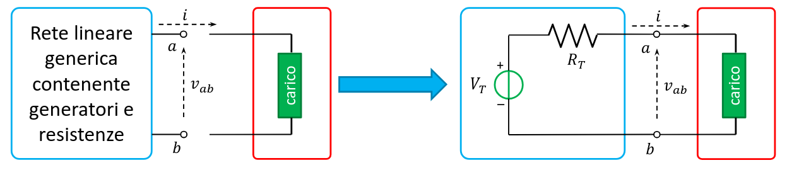
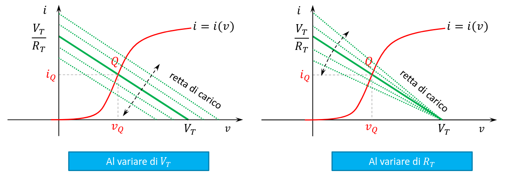

## Teorema di Thévenin

Il teorema di Thévenin enuncia che una qualsiasi rete di contenente resistenze e
generatori di tensione e di corrente può essere sostituita da un singolo
generatore di tensione seguito da un resistore.

- $v_T$ sarà la tensione a circuito aperto tra i 2 terminali $a$ e $b$ della
  rete di partenza.
- $R_T$ sarà la resistenza tra $a$ e $b$, che si ottiene spegnendo tutti i
  generatori nella rete di partenza.

### Retta di carico

La retta di carico di un circuito è la retta
$i(v) = - \frac{v}{R_T} + \frac{V_T}{R_T}$. Essa può essere usata per risolvere
sistemi con componenti non lineari (ad esempio transistors) attivati da circuiti
lineari.

## Condensatore

Il condensatore è un elemento del circuito che immagazina carica. Le sue
caratteristiche sono:

- $q(t) = C\ v_C(t)$
- $i(t) = \dv{q}{t}(t) = C \dv{v_C}{t}(t)$
- $v_C(t) = \frac{1}{C} \int_{-\infty}^t i(t)\ dt$

La corrente è data dalla variazione della carica nel tempo, infatti il
condensatore influisce soprattutto nelle fasi transitorie. Quando il circuito è
a regime, esso diventa un circuito chiuso.

- condensatori in serie: $C_{eq} = \frac{1}{\sum_i \frac{1}{C_i}}$
- condensatori in parallelo: $C_{eq} = \sum_i C_i$

### Energia immagazzinata

L'energia immagazzinata si ottiene facendo un integrale della potenza assorbita:

$$
w_C(t) = \int p\ dt = \int v_C(t)\ i(t)\ dt = \int C v_C\ dV_C = \frac{1}{2} C (v_C(t))^2
$$

L'energia immagazinata non può modificarsi istantaneamente (altrimenti la
potenza diventerebbe infinita in quell'istante). Questo implica che anche la
tensione deve cambiare gradualmente nel tempo.

### Risposta al gradino

Quando si applica un cambio di tensione ad un circuito contente un condensatore,
la risposta immediata non è quella finale.

Si parte da una situazione di regime, si passa per una fase transitoria (dove il
condensatore si carica o si scarica) e poi si arriva ad una nuova situazione di
regime.

:::note

Per regime si intende una situazione in cui la tensione non cambia, non un
regime sinusoidale come in Fisica 2.

:::
