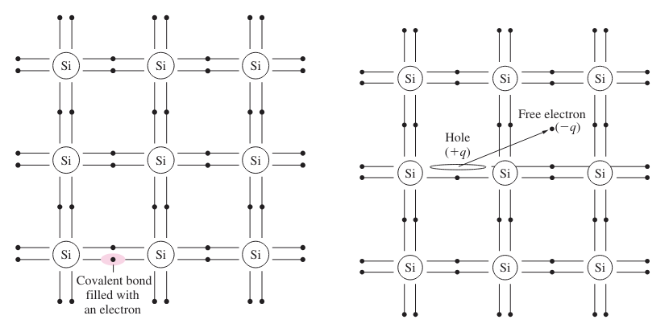
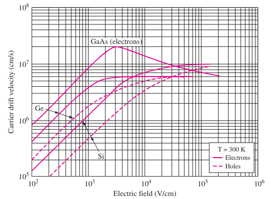
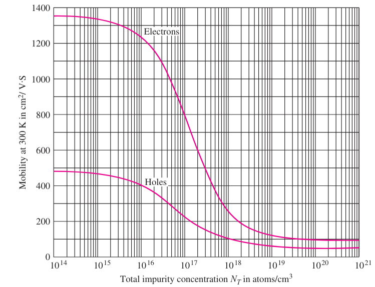

---
description:
  Materiali conduttori, isolanti e semiconduttori. Resistività, bandgap,
  corrente di drift e il principio di drogaggio nel silicio.
lang: it
title: Lezione (2026-03-02)
---

## Materiali conduttori, isolanti e semiconduttori

I materiali isolanti, conduttori e semiconduttori si distinguono in base alla
loro struttura elettronica e al modo in cui reagiscono agli stimoli esterni.

Ecco alcuni parametri da considerare:

- resistività: alta per gli isolanti, bassa per i conduttori;
- bandgap: è l'energia minima necessaria per promuovere gli elettroni a uno
  stato eccitato:
  - per i metalli è molto basso e conducono anche a basse temperature;
  - per i semiconduttori è moderato, quindi ne basta una piccola quantità;
  - per gli isolanti è molto alto;
- coefficiente di temperatura: i metalli diventano più resistivi con il calore,
  i semiconduttori più conduttivi;

I semiconduttori si ottengono dalla quarta colonna della tavola periodica
(prevalentemente silicio), oppure da combinazioni della terza e la quinta.

### Resistenza di un filo

Preso un filo qualsiasi, la sua resistenza è data dalla resistività del
materiale ($\rho$), dalla sua lunghezza e dalla sua ampiezza.

$$
R = \rho\ \frac{L}{A}
$$

### Struttura del silicio

Il silicio è l'elemento 14 della tavola periodica (quindi il nucleo è composto
da 14 protoni e 14 neutroni).

Gli elettroni si dispongono lungo dei gusci che hanno delle bande di energia ben
definite. Per spostare un elettrone da un guscio ad un altro bisogna fornire una
certa quantità di energia (il **bandgap**).

Più atomi di silicio si legano tramite legami covalenti (elettroni condivisi tra
2 atomi). A temperatura $0\ K$, gli elettroni sono fissi nei legami e non
possono muoversi, rendendo il materiale isolante.

A temperature più alte (anche 'solo' a $293\ K$), alcuni legami si rompono e gli
elettroni sono liberi di scorrere rendendo il silicio un conduttore.

La rottura di un legame provoca 2 effetti: la liberazione di un elettrone e la
creazione di una lacuna, che può essere riempita da altri elettroni disponibili.

La propagazione degli elettroni genera uno spostamento di cariche negative,
mentre quella delle lacune uno di cariche positive.

#### Concentrazione di particelle di carica

$$
n_i^2 = B\ T^3\ e^{- \frac{E_G}{k\ T}}
$$

- $n_i$: concentrazione di portatori di carica intrinseci per $cm^3$;
- $E_G$: bandgap in $eV$;
- $k$: costante di Boltzman;
- $T$: temperatura in Kelvin;
- $B$: parametro del materiale. Per il silicio intrinseco (puro) è
  $1.08\ 10^{31}\ \frac{1}{K^3\ cm^6}$;

La densità del silicio è $5\ 10^{22}\ \frac{\text{atomi}}{cm^3}$ e
$n_i = 6.73\ 10^9\ \frac{\text{elettroni}}{cm^3}$ a temperatura ambiente
($300\ K$).

Nel silicio puro e in condizioni stabili, la concentrazione degli elettroni $n$
e quella delle lacune $p$ sono uguali, quindi $n_i = n = p$.

#### Legge dell'azione di massa

In chimica, la legge dell'azione di massa dice che la velocità di una reazione è
proporzionale al prodotto delle concentrazioni dei reagenti.

I semiconduttori si comportano come una reazione reversibile tra legame intatto
e coppia elettrone-lacuna. In uno stato di equilibrio, il numero di coppie che
si creano deve essere uguale a quello delle coppie che si dividono.

$$
n_i^2 = p\ n
$$

Essa rimane valida anche per il silicio non puro (estrinseco), dove $p$ e $n$
non sono più uguali.

## Corrente di drift

La corrente è la quantità netta di carica che attraversa una sezione del
materiale in una certa quantità di tempo.

In equilibrio, le cariche si muovono casualmente in tutte le direzioni, quindi
la velocità media è nulla e la corrente totale è 0.

**Applicando un campo elettrico, le cariche tendono a muoversi nella sua
direzione** (drift), sempre con una certa casualità dovuta alle collisioni con
le altre particelle.

- Legge di Coulomb: $F = q\ E$;
- Seconda legge di Newton: $F = m\ a$;

Quindi $a = \frac{q}{m}\ E$.

### Velocità delle cariche

La velocità risulta proporzionale al campo elettrico:

- $v_n = -\mu_n\ E$;
- $v_p = \mu_p\ E$;

$\mu_n$ è la mobilità degli elettroni, con valore di $1350\ \frac{cm^2}{V\ s}$
nel silicio intrinseco, $\mu_p$ è la mobilità delle lacune, con valore di
$500\ \frac{cm^2}{V\ s}$.

:::note

Le lacune si 'muovono' più lentamente, perchè il processo di creazione di una
lacuna è più complesso.

:::

Non si può aumentare il voltaggio indefinitamente per ottenere una maggior
velocità della corrente. Ad un certo punto si arriva ad un limite detto
**velocità di saturazione**.

Ad un certo punto la velocità di elettroni e lacune raggiunge un plateau. Questo
pone dei limiti sulla velocità di trasferimento di dati dei circuiti
elettronici.

### Densità di corrente

Indica la quantità di carica che attraversa un'unità di superficie in un
intervallo di tempo e si misura in $\frac{\text{A}}{cm^2}$.

$$
J = Q\ v, \quad i = \int_A J \cdot dA
$$

Dove $Q$ è la densità di carica in $\frac{C}{cm^3}$ e $v$ è la velocità dei
portatori.

La densità di corrente totale si calcola:

- $j_n^\text{drift} = Q_n\ v_n = (-q\ n) (-\mu_n\ E) = q\ n\ \mu_n\ E$
- $j_p^\text{drift} = Q_p\ v_p = (+q\ p) (+\mu_p\ E) = q\ p\ \mu_p\ E$
- $j^\text{drift} = q\ (n\ \mu_n + p\ \mu_p)\ E = \sigma\ E$

La conduttività del silicio è $\sigma = q\ (n\ \mu_n + p\ \mu_p)$. Facendo il
reciproco troviamo la resistività, che ha valore $3.38\ 10^5\ \Omega\ cm$. Il
silicio intrinseco è sostanzialmente un isolante e quindi non sarebbe
utilizzabile da solo per costruire circuiti.

:::note

In confronto, il rame presenta una resistività di
$\rho = 1.68\ 10^{-10}\ \Omega\ \text{cm}$ e una concentrazione di portatori
$n = 8.46\ 10^{22}\ \text{cm}^{-3}$.

:::

## Impurità (drogaggio)

L'aggiunta di impurità al silicio permette di cambiare la sua resistività.

Di solito si usano atomi pentavalenti (fosforo, arsenico, antimonio) che
contribuiscono un elettrone in più, chiamati **donatori**, oppure atomi
trivalenti (boro) che hanno un elettrone in meno e contribuiscono una lacuna,
chiamati **accettori**.

Le impurità modificano le concentrazioni di portatori:

- se $n > p$ si parla di silicio di **tipo $n$**, dove gli elettroni sono i
  portatori maggioritari;
- se $n < p$ si parla di silicio di **tipo $p$**, dove le lacune sono i
  portatori di maggioranza;

Le concentrazioni di impurità sono dell'ordine di $10^{14}$ fino a $10^{21}$
atomi per $cm^3$. Quella intrinseca dei portatori è dell'ordine di $10^{10}$.
Quindi la concentrazione di impurità e quella dei portatori sono praticamente
uguali per fini pratici.

L'introduzione di impurità rende anche il silicio più insensibile alla
temperatura, dato che i portarori vengono introdotti forzatamente e non dalla
rottura dei legami.

### Concentrazione di portatori

La carica totale del conduttore deve essere globalmente nulla:

- $N_D$: concentrazione di donatori (ioni positivi);
- $N_A$: concentrazione di accettori (ioni negativi);

$$
q\ (N_D + p - N_A - n) = 0
$$

Continua a valere la legge dell'azione di massa $n_i^2 = p\ n$.

Quindi per semiconduttori di tipo $n$:

$$
n^2 - (N_D - N_A)\ n - n_i^2 = 0
$$

Se $N_D - N_A \gg 2\ n_i$, allora si può approssimare:

- $n = N_D - N_A$
- $p = \frac{n_i^2}{n}$

La concentrazione dei portatori maggioritari (forniti dal drogaggio) è costante
e indipendente dalla temperatura. Quella dei minoritari (particelle intrinseche)
è proporzionale a $n_i^2$ e dipendente dalla temperatura.

La mobilità diminuisce all'aumentare del drogaggio perché un maggiore numero di
atomi aggiunti aumenta anche la probabilità di collisioni tra gli elettroni.

