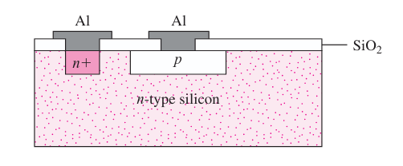
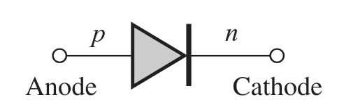
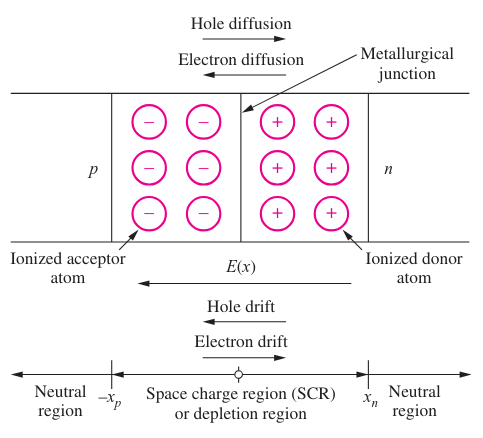
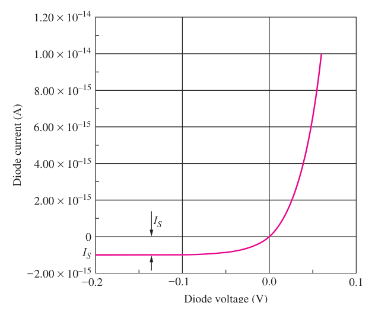

## Corrente di diffusione

Se il **drogaggio del silicio non è uniforme**, le concentrazioni dei portatori
variano lungo il cristallo.

Dentro al semi-conduttore si generano **correnti di diffusione** proporzionali
al gradiente di concentrazione di portatori, i quali vanno da regioni a maggiore
concentrazione a quelle di minore concentrazione.

- $j_p^\text{diff} = (+q)\ D_p\ (- \pdv{p}{x})$
- $j_n^\text{diff} = (-q)\ D_n\ (- \pdv{n}{x})$

$D_p$ e $D_n$ sono le **diffusività** di lacune ed elettroni.

## Corrente totale

I fenomeni di mobilità e diffusività sono legati dalla **relazione di Einstein**
che definisce la **tensione termica** ($V_T$) attraverso la temperatura:

$$
V_T = \frac{D_n}{\mu_n} = \frac{k\ T}{q} = \frac{D_p}{\mu_p} = 0.0258\ V\ (\text{a}\ 300\ K)
$$

La corrente totale, che si ottiene applicando un campo elettrico e sommando la
corrente di drift e di diffusione è:

- $j_n^T = q\ \mu_n\ n\ E + q\ D_n\ \pdv{n}{x} = q\ \mu_n\ n\ (E + V_T\ \frac{1}{n}\ \pdv{n}{x})$
- $j_p^T = q\ \mu_p\ p\ E + q\ D_p\ \pdv{p}{x} = q\ \mu_p\ p\ (E + V_T\ \frac{1}{p}\ \pdv{p}{x})$

## Legame tra campo elettrico e cariche

Ricordiamo che il campo elettrico $E$ in un semi-conduttore con permettività
$\varepsilon$ varia nello spazio in risposta alla distribuzione di carica $Q$:

$$
\nabla \cdot (\varepsilon\ \vec{E}) = Q
$$

## Processo di costruzione dei circuiti

Un substrato di silicio drogato funge da supporto e aree drogate diversamente
vengono create sulla superficie.

Queste aree sono collegate tramite piste in alluminio, disposte su diversi
strati separati tramite un isolante.

## Diodo

Un diodo è composto dalla giunzione di un blocco di silicio di tipo $p$
(**anodo**) e un blocco di tipo $n$ (**catodo**).

Il suo simbolo circuitale è:

La presenza di un forte gradiente di concentrazione di cariche, genera una
corrente di diffusione di elettroni e lacune. La corrente totale deve essere
nulla, quindi si genera un campo elettrico dato che la corrente di drift deve
bilanciare quella di diffusione.

### Tensione di built-in

Il campo elettrico che si genera all'interno del diodo viene solitamente
chiamato **tensione di built-in** ($\phi_j$).

Per calcolare il suo valore si pone la corrente totale uguale a $0$. Quindi
$j_p^T = q\ \mu_p\ p\ (E - V_T\ \frac{1}{p} \pdv{p}{x}) = 0$, da cui:

$$
\begin{darray}{l}
E = V_T\ \frac{1}{p} \pdv{p}{x} \\
\iff - \pdv{V}{x} = V_T\ \frac{1}{p} \pdv{p}{x} \\
\iff dV = - V_T \frac{dp}{p} \\
\iff V_2 - V_1 = V_T\ \fLn{\frac{p1}{p2}}
\end{darray}
$$

$$
\phi_j = V_T\ \fLn{\frac{N_A\ N_D}{n_i^2}}
$$

### Potenziale esterno

Applicando un potenziale esterno al diodo, se ne altera l'equilibrio.

Un potenziale positivo restringe la regione di carica spaziale e lascia scorrere
una corrente di portatori maggioritari dato che la corrente di drift non è più
in grado di bilanciare quella di diffusione a causa del campo elettrico.

Un potenziale negativo la amplie, quindi la corrente diminuisce perchè formata
solo dai portatori minoritari dato che la corrente di diffusione viene
ostacolata.

### Modello del diodo

$$
i_D = I_S\ \left(e^{\frac{q v_D}{n\ k\ T}} - 1\right) = I_S\ \left(e^{\frac{v_D}{n\ V_T}} - 1\right)
$$

Dove:

- $i_D$: corrente che scorre sul diodo;
- $v_D$: tensione ai capi del diodo;
- $q$: carica dell'elettrone;
- $k$: costante di Boltzman;
- $T$: temperatura in Kelvin;
- $n$: fattore di non idealità (di solito è 1);
- $V_T$: tensione termica;
