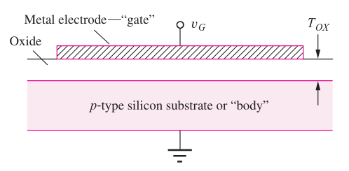
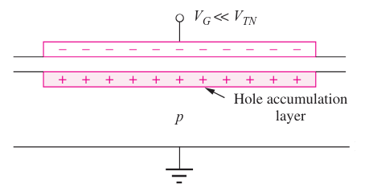
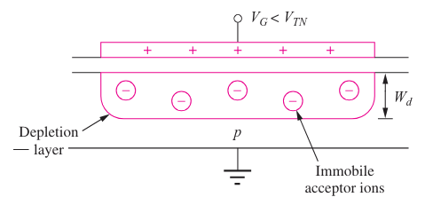
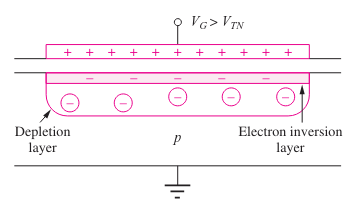
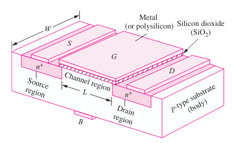
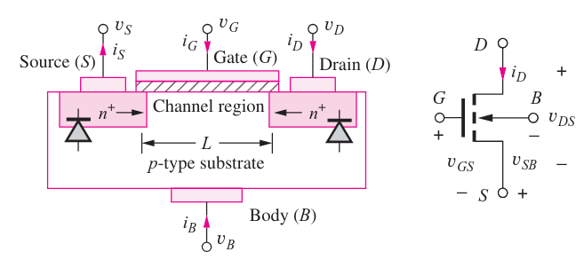
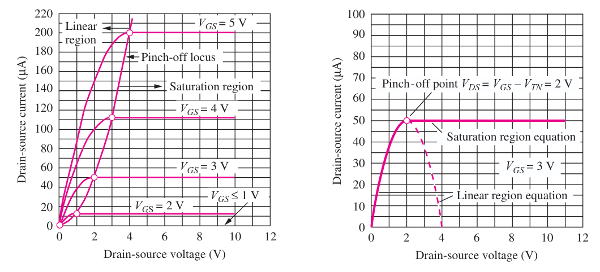

---
description:
  Analisi delle regioni di accumulazione, svuotamento e inversione del
  condensatore MOS, seguita dall'esame del funzionamento del transistore nMOS.
lang: it
title: Lezione (2026-03-09)
---

## Condensatore MOS

La struttura di base dei circuiti MOSFET è composta da strati:

- layer conduttore detto **gate**;
- strato isolante di biossido di silicio ($Si O_2$);
- substrato di silicio drogato (di tipo P on N a seconda del fornitore);

Al confine tra il substrato e l'isolante si forma una zona in grado di
immagazzinare carica, come in un condensatore.

### Regione di accumulazione

Quando non viene applicata nessuna tensione sul gate, la carica negativa sta sul
conduttore e le lacune nel substrato formano una carica positiva.

La superficie del semiconduttore è in condizione di accumulo.

### Regione di svuotamento

Se il potenziale del gate viene incrementato, le lacune vengono respinte dal
substrato verso il conduttore.

Il substrato si svuota di portatori maggioritari, come in un diodo.

La carica positiva sul gate è bilanciata dalle cariche negative degli ioni
accettori presenti nella zona di svuotamento.

### Regione di inversione

Se il potenziale del gate viene ulteriormente incrementato, gli elettroni
generati nella regione di svuotamento vengono attratti verso la superficie e
quando la loro densità supera quella delle lacune si verifica l'inversione.

La carica positiva sul gate è bilanciata sia dagli ioni accettori che dagli
elettroni.

La tensione alla quale si forma lo strato di inversione è chiamata tensione di
soglia ($V_T$).

## Transistore nMOS

Il transistore si ottiene aggiungendo 2 terminali, con regioni di tipo $n+$ ai
lati del gate, dette **source** e **drain**.

Il canale del condensatore è caratterizzato da una lunghezza $L$ e una larghezza
$W$.

Le regioni $n+$ forniscono elettroni per lo strato di inversione e formano anche
2 diodi con il substrato. Normalmente questi 2 sono polarizzati inversamente e
non conducono.

### Funzionamento

- $V_{GS} \ll V_T$: diodi polarizzati a zero o inversamente, quindi scorre una
  corrente molto debole tra di essi;
- $V_{GS} < V_T$: si forma la regione di svuotamento sotto il gate, che si
  unisce a quelle dovute alle giunzioni $pn$, ma non scorre corrente perché essa
  è costituita da ioni fissi;
- $V_{GS} > V_T$: il canale tra le 2 regioni $n+$ è costituito da elettroni
  liberi, quindi se $V_{DS} \neq 0$ può scorrere corrente tra S e D;

Quindi, se $V_{GS}$ è inferiore alla tensione di soglia ($V_T$), lo switch è
aperto; altrimenti, è chiuso.

### Regione lineare (triodo)

Se la tensione sull'ossido è superiore a quella di soglia in ogni suo punto
($V_{GS}  \geq V_{DS} + V_T$), con $V_{DS}$ molto piccola, all'interno del
canale scorre una corrente di drift che si calcola con:

$$
I_D = \mu_n\ C''_{ox}\ \frac{W}{L}\ (V_{GS} - V_T - \frac{V_{DS}}{2})\ V_{DS}
$$

Dove $C''_{ox} = \frac{\varepsilon_{ox}}{T_{ox}}$ e $T_{ox}$ è lo spessore dello
strato di biossido di silicio ($Si O_2$).

In questa configurazione, il transistore si comporta come una resistenza, il cui
valore può essere controllato da $V_{GS}$.

$$
R_{on} = \frac{1}{K_n\ (V_{GS} - V_T)}
$$

Dove $K_n$ è la transconduttanza $\mu_n\ C''_{ox}\ \frac{W}{L}$.

### Regione di saturazione

Con l'aumento di $V_{DS}$ il canale si assottiglia verso il drain fino a
scomparire quando $V_{GS} = V_{DS} + V_T$. Ulteriori aumenti di $V_{DS}$ non
fanno scorrere più corrente.

La corrente è data da:

$$
\frac{K_n}{2}\ (V_GS - V_T)^2
$$

