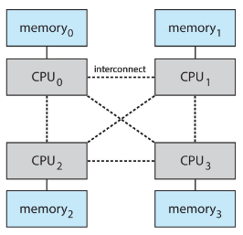

---
description:
  OS fundamentals like processes, kernel, dual-mode operation, interrupt
  handling, I/O subsystems, storage management, and modern multiprocessor
  systems.
lang: en
prev: false
title: Lesson (2026-02-23)
---

## What is an operating system?

An operating system (OS) is specialized software that acts as an intermediary
layer between the computer's hardware and the applications that run on it.

A computer system can be divided into three components:

- hardware:
  - CPU;
  - memory, both RAM and storage;
  - I/O devices;
- operating system: the program that controls and coordinates the use of
  hardware among applications;
- applications: everything that runs on top of the OS;

The OS functions as a **resource allocator**. It manages all hardware resources
and resolves conflicts between requests to ensure efficient and fair resource
utilization. It also provides **isolation for all processes**, preventing
malicious applications from causing damage to other running software.

The core of every operating system is the **kernel**. Everything else is either
a system program (that ships with the OS) or an application.

## Computer startup

At startup, a predefined bootstrap program (for example the BIOS or UEFI) starts
running from a specific memory address. It initializes all the essential
hardware components (registers, memory and device controllers) and puts the
operating system kernel code into main memory.

After that, the startup firmware passes control to the kernel, which begins its
execution.

## Process

A process is a program that is executed.

The kernel initiates a process by:

1. reading the executable file from the disk into memory;
2. allocating address space and setting up registers and PID;
3. adds the process to the ready (to be executed) queue;

For single threaded processes, the Program Counter (PC) register specifies the
location of the next instruction to execute.

Key OS concerns regarding processes include:

- creating and deleting them;
- suspending and resuming them (to allow concurrency);
- providing mechanisms for process communication and synchronization;
- preventing deadlocks and improper resource usage;

### Multiprogramming and time sharing

Since a single user cannot keep the CPU and I/O devices busy continuously,
multiprogramming allows the OS to organize multiple jobs such that the CPU
always has one to execute.

When a process is waiting for an I/O operation to complete, the CPU can run
other apps, thus maximizing resource usage.

Time sharing (TS) is an extension of multiprogramming. In a TS system, the CPU
switches between jobs so rapidly that the user perceives multiple programs
executing concurrently.

:::note

Time sharing is a requirement for windows-like system with an UI that can show
multiple apps together.

:::

## Dual mode operation

Since the operating system must execute diverse code, some benign, some
potentially malicious, it must guard against threats. A malicious process, for
instance, could attempt to modify the kernel to allocate excessive resources to
itself.

To implement a barrier of security against that, the OS uses some hardware
support. The CPU can switch between user and kernel modes:

- **kernel mode**: is when the kernel runs of course. This mode allows the
  control of all the aspects of the CPU and can be used to switch to user mode.
- **user mode**: is the mode applications code runs in. It is more restrictive
  on the set of instructions allowed and doesn't allow a process to switch to
  kernel mode.

:::note

Modern CPUs support multiple modes of execution, to allow even the kernel to
protect itself from untrusted modules.

:::

How does the OS regain control of the CPU? Since it cannot trust a running
process to yield control, CPUs support timers that generate interrupts. The
kernel handles this interrupt and, based on its logic, can decide to allow the
current process to continue or to switch to another one.

### Other interrupts

I/O devices and the CPU run on different clocks and can execute concurrently.
Each device controller oversees a particular device and has a local buffer.

There are two primary modes used to signal to the CPU that the requested data
has been loaded from a device:

- polling: The CPU periodically checks if the operation has finished; this
  method is computationally expensive.
- interrupts: The controller triggers an interrupt on the CPU, allowing the
  kernel to manage the subsequent action. These are known as **hardware
  interrupts**;

Software can also trigger interrupts (for example when dividing by zero or when
making system calls). These are known as **traps** or **exceptions**.

### Interrupt handling

An interrupt triggers a common set of operations whenever it happens:

1. the CPU saves the current PC value to memory;
2. it jumps to the first instruction of the routine that handles the interrupt;
3. it executes the routine;
4. and it jumps back to where the PC of the previous process was;

An operating system is predominantly interrupt-driven (with the exception of the
initial boot sequence).

### Maskable vs non-maskable interrupts

Not all interrupts have the same importance. During critical operations, some of
them can be ignored:

- maskable: can be ignored while important code is being run;
- non-maskable: cannot be ignored and have to be handled right as they arrive;

## IO subsystem

The storage in a computer system is tiered to benefit from the different
tradeoffs between speed and capacity.

- **main memory**: stores data that the CPU can access directly; this memory is
  typically volatile (it resets upon reboot).
- **secondary storage**: provides larger, non-volatile storage capacity,
  typically implemented using hard disks or solid-state drives (SSDs).

The disadvantage of reading from slower storage systems can be reduced by
implementing **caching**:

1. The CPU needs to read data.
2. It checks its local cache first.
3. If it doesn't find the data it checks the RAM.
4. If it doesn't find the data again, it reads it from the disk.

## Persistent storage management

The OS must provide a uniform, logical view of information storage.

The abstraction of the physical data into a single logical unit is called a
**file**.

File system management commonly provides:

- organization of files into directories;
- access control;
- OS operations like creating and deleting files and directories, mapping of
  files between memory and secondary storage, ...;

Performance of various levels of storage:

| Name             | Typical size | Implementation                | Access time | Bandwidth   | Managed by       |
| ---------------- | ------------ | ----------------------------- | ----------- | ----------- | ---------------- |
| registers        | < 1 KB       | multiple CMOS ports           | 0.25-0.5 ns | 20-100 Gb/s | compiler         |
| cache            | < 16 MB      | on-chip or off-chip CMOS SRAM | 0.5-25 ns   | 5-10 GB/s   | hardware         |
| main memory      | < 64 GB      | CMOS SRAM                     | 80-250 ns   | 1-5 GB/s    | operating system |
| solid state disk | < 1 TB       | flash memory                  | 25-50 μs    | 500 MB/s    | operating system |
| magnetic disk    | < 10 TB      | magnetic disk                 | 5 ms        | 20-150 MB/s | operating system |

## How modern computers work

Most systems of the past used a single core, general-purpose processor.
Multiprocessor systems are the standard in many applications today, providing:

- true parallel execution;
- increased throughput;
- increased reliability;

In asymmetric multiprocessing, each processor executes a specific set of tasks,
whereas in symmetric multiprocessing systems, all processors can execute any of
the available tasks.

:::note[NUMA systems]

Non-uniform memory access systems are systems where the time that it takes to
access RAM can be very different depending on the location of the data.

The specific timings depend on the physical topology of the system.

:::

## Protection and security

The OS has to protect the system against internal and external attacks, in
particular it has to provide:

- **confidentiality**: absence of unauthorized disclosure of information;
- **availability**: readiness of the service;
- **integrity**: protection against improper system alterations;
