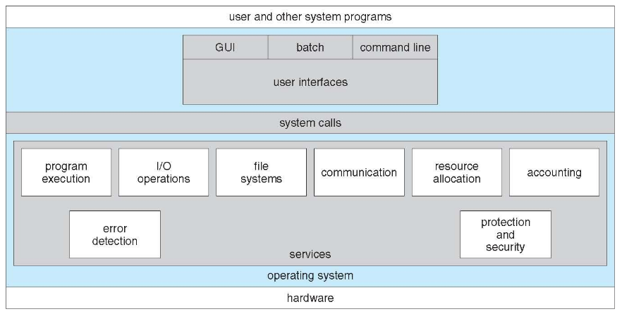

## Kernel data structures

Kernel data structures are similar to those used in standard programming:

- Array: it's the simplest structure, the main memory is physically an array of
  bytes. It's disadvantages are the fixed size and the difficulty in removing
  and adding items in the middle.
- List: it's most commonly implemented as a linked list and it allows to change
  its size and to insert and remove items in the middle.
- Stack: it's a sequentially ordered data structure using LIFO for adding and
  removing items. It's used in the memory to store local variables when a
  function is called.
- Queue: sequentially ordered data structure using FIFO. It's often used for
  buffers.
- Tree: Represents data hierarchically through parent-child relationships.
  - Binary search tree: it's a tree with at most 2 children per parent, usually
    the left one < right one.
- Hashmap: associates key-value pairs using hash functions.
- Bitmap: string of $n$ binary digits. Useful to pack booleans in a space
  efficient way.

## Overview of operating system services



## OS programming

### System calls

System calls are the interface between kernel mode and user mode. In programming
they are almost never called directly. Instead there are API wrappers around
them like:

- Win32 for Windows;
- POSIX API for POSIX systems;
- Java API for the JVM;

Usually there are 3 layers of decoupling between applications and hardware:

- API: definitions of functions used by the programmer writing the source code;
- ABI: definitions of syscall parameters and number, they must correspond
  between the kernel and the app;
- ISA: set of instructions that the compiler can use, it depends on the
  processor (commonly x86-64 or arm);

### Linkers and loaders

When code is compiled, the following happens:

- the code is compiled into object files, designed to be loaded into any memory
  location;
- the linker combines these objects into a single binary executable;
- the program is saved to disk;

When the user requires execution of the program:

- the **loader** reads the executable from the disk;
- it determines if it has to load other dynamic libraries (.dll on Windows, .so
  on UNIX);
- once everything is loaded, the loader updates pointer locations to point to
  the memory address where the program is loaded;

### System call implementation

Apps compiled on one system typically don't work on another. Each OS provides
its own set of syscalls, equivalently one could say that each OS defines its own
ABI.

In assembly, a number is assigned to each syscall, then a special instruction
executes it with the given parameters:

```asm
section .data
    msg db "Hello, World!", 0xA
    len equ $ - msg;

section .text
    global _start

_start:
    mov rax, 1    ; set sys_write number
    mov rdi, 1    ; file descriptor for stdout
    mov rsi, msg  ; message address
    mov rdx, len  ; message length
    syscall

    mov rax, 60   ; set sys_exit number
    xor rdi, rdi  ; set exit code to 0
    syscall
```

The status of the system call and any return values are stored in specific
registers.

#### Parameter passing

There are 3 methods to pass parameters to the OS:

- parameters in registers;
- parameters stored in a block of memory;
- parameters pushed to the stack and popped by the kernel;

### Registers

Registers are small and in limited number but extremely fast memory locations.

- General purpose registers: they are used to store temporary values,
  intermediate calculations or function arguments. Examples are RAX, RBX, RSI,
  RDI, SP.
- Special purpose registers: have a predefined usage:
  - instruction pointer: points to the location in memory of the next
    instruction to execute;
  - control registers: used to configure CPU behavior (memory protection,
    paging);

### Mechanism to manage system calls

Legacy systems used to have a mechanism called Direct Execution. In DE the OS
sets up the process, calls main and then leaves it on its own until it returns
from `main`. Syscalls were implemented simply as function calls, so the program
could do anything it wanted.

The OS couldn't ensure that the program didn't do anything that could be
harmful. With the introduction of some hardware support, the OS can now define a
set of instruction that the user is not allowed to execute in a trap table. This
is how **Limited Direct Execution (LDE)** is implemented.

Each entry in the table points to a trap handler, that is called when the
program calls an instruction that is not allowed.

In modern Linux, the table is referred to as **Interrupt Descriptor Table
(IDT)**. The IDT doesn't only store syscall handlers, it also defines handles
for exceptions like division by zero or page faults and handlers for hardware
interrupts.

Now a program uses the `syscall` instruction, on that moment, the CPU fires the
syscall interrupt and switches to kernel mode. The kernel can allow or reject
the syscall in a protected environment, then it returns and the CPU switches
back to user mode and continues to execute the process.

#### Timer interrupt for stopping process execution

LDE can also be used to allow the OS to retake control of the CPU to prevent
processes from running indefinitely.

The mechanism is quite simple:

- the OS defines a timer that triggers an interrupt every $n$ fractions of a
  second;
- the process executes;
- when the interrupt fires, the kernel regains control and can decide to let the
  process continue executing or to do a context switch to another one;
