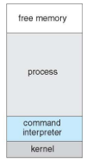
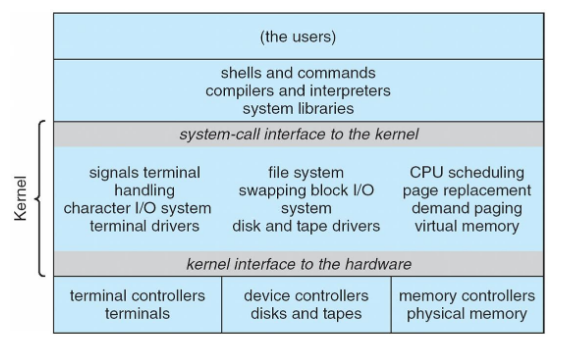
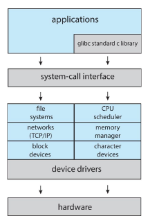
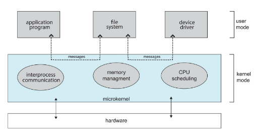
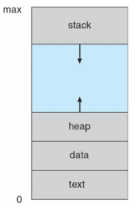

## Operating system structure

For a simple example, let's see the architecture of MS-DOS.

The OS was single-task oriented. After boot, a shell was loaded and running a
program was very simple. There were no processes, programs were loaded into
memory, overwriting anything but the kernel.

### Monolithic

The original UNIX had a monolithic kernel structure. There were system programs
and the kernel that provided the FS, scheduling and memory management.

A monolithic kernel had the advantage of being fast and energy efficient, but
its non-modularity required a recompile from scratch every time an update was
available.

More recent versions of Linux managed to split the kernel into subsystems,
separated by function and by closeness with the hardware.

### Microkernel

The microkernel tries to move away as much as possible from the kernel.
Everything else is implemented in userspace.

The advantages are that it's easier to extend, to port to new architectures and
it's also more secure since there is less code running in privileged mode. The
problem lies in the performance overhead associated with increased
kernel-to-userspace communication.

### Modular OS

Modern OSes implement **loadable kernel modules**. This is similar to a
microkernel where the core implements only the basic message passing and process
management functions, but modules run in kernel mode instead of in userspace,
making the performance disadvantage less severe.

With LKMs the kernel behavior can be changed even at runtime.

## OS booting

When power is initialized on the system, the CPU starts execution at a fixed
memory address, that usually points to a small piece of code stored in a ROM.

This code, the BIOS on legacy systems and UEFI on more modern ones can read
disks and load another piece of software called the **bootloader**.

The bootloader then can find the kernel image in the disk, usually reading from
a configuration file, and loads it.

## Processes

An OS executes a variety of programs. Batch systems execute jobs as fast as they
can, and time-shared systems execute user programs or tasks.

A program is a passive entity stored on the disk (the executable file), the
process is the active one. The execution of a program can be started by the user
or automatically.

One program can become several processes (multiple windows open or multiple
users running it).

The memory used by a process is subdivided in specific areas:

- **text section**: contains the program code, loaded at process start, but
  dynamic libraries could be loaded later;
- **data section**: contains global variables and data initialized at compile
  time, values can be pre-initialized in the executable file or initialized just
  after startup (BSS segment);
- **stack**: holds temporary data, like local variables and function parameters,
  dynamically allocated as memory requirements change;
- **heap**: holds data put into RAM with `malloc` and friends, dynamically
  allocated;

