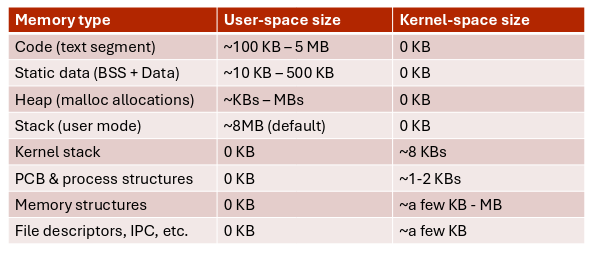

## Process state

As a process executes, it changes state:

- **new**: process has been created;
- **ready**: process is waiting to be assigned to a processor;
- **running**: instructions are being executed;
- **waiting**: process is waiting for some event to occur;
- **terminated**: process has finished execution;

### Process control block

The PCB is an in memory data structure that stores all the essential information
about a process, so the OS can manage and switch it.

Information typically stored is:

- process ID (PID);
- parent process id (PPID);
- user and group id;
- state;
- program counter;
- register values;
- stack pointer;
- scheduling information (priority, CPU usage, execution time);
- memory management information (page table pointer, heap and stack info for
  dynamic allocations);
- file management information (open files, sockets, pipes, working directory);

### Other process information

There are other structures kept in memory by the kernel:

- kernel stack: used when system calls or interrupts require execution in kernel
  mode;
- memory management structures: page tables, VMA records, ...;
- file descriptors, IPC structures, scheduling data and networking information
  referred by the PCB;

## Context switch

When the CPU switches to another process, the system must save the state of the
old process and load the one saved for the new process.

The context of a process is represented in the PCB.

Context switching is time that is 'wasted' since everything is blocked from
executing except for the kernel. The more complicated the kernel and the PCB
are, the more time it takes to switch context.

## Threads

So far we have considered processes with only a single 'script' of execution.

To execute more tasks in parallel in a single program, we need to create
multiple **threads**.

Each thread has an independent PC, stack and set of registers assigned, so a
process must be able to support storing all this data in the PCB. The extension
of the PCB used to store thread specific info is called Thread Control Block
(TCB).

## Scheduling

Objectives:

- maximize CPU use, quickly switching processes for time sharing;
- minimize CPU idle time, deferring execution of processes still waiting for I/O
  or other blocking tasks to complete;

The OS maintains scheduling queues of processes:

- job queue (unused in modern OSes): set of all processes in the system;
- ready queue: set of all processes ready and waiting to execute;
- device queues: set of processes waiting for an I/O device;

The queue is usually implemented as a linked list, where the PCB itself stores
the `next` pointer for the process that runs after the current.

The OS stores only pointers to the head and tail of the queue.

## Process creation and termination

A process is always **created by a parent**, forming a tree. Parent and child
processes can choose to share or not some resources.

When the parent wants to execute something, it must first call `fork()`. This
function creates a new process that is an identical copy of the parent. To start
another program, then the child process must call `exec()` with the executable
name and arguments to execute.

Processes can exit autonomously by calling the `exit()` system call. That
signals to the kernel that it can clean up resources.

The parent can call `wait()` to wait for the child process to terminate, the
result of the function is the return code of the child. If the parent doesn't
call `wait()`, then the OS keeps the PCB in memory, in that case the child is
called a **zombie process**.

If the parent terminates before calling `wait()`, then the child becomes an
**orphan process**. On Linux, systemd periodically calls `wait()` on orphans to
allow them to terminate and clean up.

A parent can forcefully terminate children processes using the `abort()`
syscall.

UNIX-like OSes terminate all the child processes when the parent terminates.
