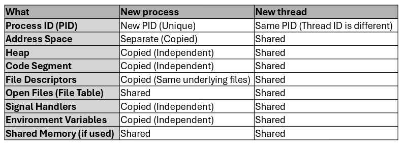

---
description:
  Synchronization (sync/async), buffering, sockets, RPC, threads, multicore
  models (data/task parallelism), and multithreading mappings.
lang: en
title: Lesson (2026-03-09)
---

## Synchronization

Message passing can be either blocking or non-blocking (if the `IPC_NOWAIT` flag
is used).

- **blocking** is considered **synchronous**: the sender is blocked until the
  message is fully received, and the receiver is blocked until a message is
  fully available;
- **non-blocking** is considered **asynchronous**: the sender sends the message
  and continues, and the receiver attempts to read, receiving either a message
  or `NULL`;

## Buffering

Whether the communication is direct or indirect, messages exchanged between
processes reside in a temporary queue.

If the buffer has capacity 0 or is full, the communication becomes synchronous
for the sender.

## Sockets

A socket defines the endpoint of a communication channel. Message exchange
typically occurs through protocols such as TCP or UDP.

It is identified by a concatenation of an IP address and a port number.

### RPC

Remote Procedure Call is a family of protocols used to execute a procedure on a
remote server as if it were a local function.

RPC libraries should abstract the network communication, allowing a distributed
system to interact seamlessly.

These protocols rely on sockets as the communication channel between parties.

## Thread

A thread represents the smallest schedulable unit of execution within a process.
It can also be defined as an execution instance of a program, managed through
the PCB.

Thread Control Blocks (TCB) comprise a thread ID, Program Counter (PC), a
register set, and a stack. However, they share heap data, the code (text)
section, and OS resources with other threads belonging to the same process.

There are some differences between creating a new process and a new thread, the
last one is usually lighter and more scalable:

### Multicore programming

We must distinguish between 2 types of systems:

- **parallel system**: can perform multiple tasks simultaneously, though not
  necessarily at the exact same time;
- **concurrent system**: can make progress on multiple tasks at the same time;

Applications can also take advantage of multicore systems in 2 different ways:

- **data parallelism**: the process spawns multiple threads that perform the
  same operation on different data sets;
- **task parallelism**: the process spawns threads, each with a specific role;

#### Amdahl's Law

$$
S(N) = \frac{1}{(1 - P) + \frac{P}{N}}
$$

- $S(N)$: maximum speedup achieved by using N processing cores;
- $P$: the parallelizable portion of the task;
- $1 - P$: the serial portion of the task (non-parallelizable);

### User threads and kernel threads

User threads serve as the management interface for applications. They are
created and controlled via thread libraries such as POSIX, Windows threads, and
OpenMP.

Kernel threads are kernel managed and scheduled by the OS kernel. They are
visible to the operating system and only some of them execute internal OS tasks
(system kernel threads).

Some examples of system kernel threads are:

- kthreadd: parent of all kernel threads;
- kswapd: manages memory management syscalls;
- ksoftirq: manages soft interrupt calls;
- watchdog: monitors CPU performance;

Applications that wish to use user threads must require at least one kernel
thread (execution context). Then, the user-side library is free to schedule the
lighter user threads atop the kernel thread.

### Multithreading models

A multithreading model defines how user and kernel threads are mapped.

- many to one: this is an older model where the process utilizes only one kernel
  thread to run all its threads. A block in a single thread causes the entire
  process to block because a single kernel thread does not offer concurrency.
- one to one: each user thread maps to a kernel thread. This model allows
  concurrency but has a high overhead.
- many to many: $N$ user threads are distributed into $M (\leq N)$ kernel
  threads. It offers the best performance but it's very complex to implement.
