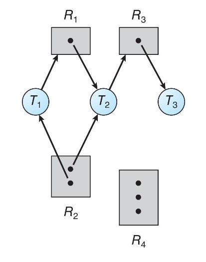
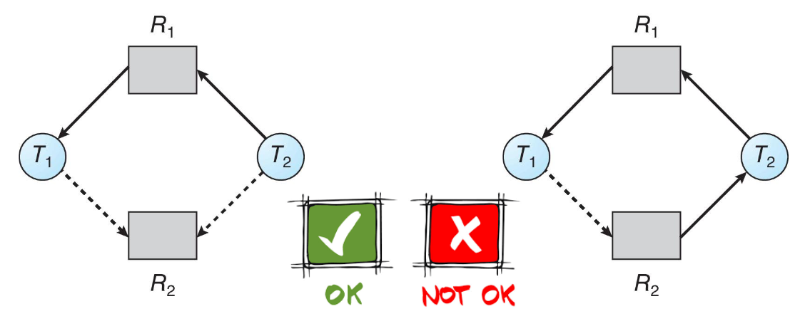

## Deadlocks

A set of threads is in a deadlocked state when each one is waiting for an event
that can be caused only by another thread in the set.

Deadlocks can arise if four conditions hold simultaneously:

- mutual exclusion: only one thread at a time can use a resource;
- hold and wait: a thread holding at least one resource is waiting to acquire
  additional resources;
- no preemption: a resource can be released only voluntarily by the thread
  holding it;
- circular wait: in a set of threads $\Set{ T_0, \ldots, T_n }$ of waiting
  threads, $T_0$ is waiting for a resource held by $T_1$, $T_1$ is waiting for
  $T_2$ and so on until $T_n$ is waiting for $T_0$.

## Resource-allocation graph

Deadlocks can be described in terms of a graph called 'resource-allocation
graph'.

The graph is composed of a set of vertices $V$ and a set of edges $E$. $V$ is
partitioned into $T$, the set of all threads in the system, and $R$, the set of
all resource types in the system.

A request edge is a directed edge that indicates that $T_i$ has requested an
instance of $R_j$. An assignment edge is a directed edge that indicates that an
instance of $R_j$ has been allocated to $T_i$.

Once the request is fulfilled, the request edge is immediately transformed into
an assignment edge.

If there are cycles in the graph, then there is the possibility that deadlocks
could manifest. If there is only one instance per resource type in the cycle,
then the deadlock is guaranteed.

## Deadlock handling

Allowing the system to enter into a deadlock state and then recovering is
difficult, mainly because deadlock detection is a tricky subject.

The easier method is to ensure that the system never enters the deadlock state.

### Deadlock prevention

To prevent deadlocks we must invalidate one of the four conditions defined
before:

- Mutual exclusion: avoid exclusive access to resources, making them shareable
  when possible (read only threads can run concurrently).
- Hold and wait: try to acquire all resources at once or immediately free the
  subset that was successfully taken.
- No preemption: while the thread is not running, it must release all the
  resources that it's holding. Often impractical to implement.
- Circular wait: assign a global order to resources. Threads must acquire them
  in that order, preventing request cycles.

### Deadlock avoidance

Deadlock avoidance works when the programmer is collaborative and limits itself
to satisfying the conditions required to avoid at least one of the four
conditions.

If we could require additional a priori information about how resources are
requested, then the OS can step in and help with avoiding deadlocks.

A deadlock-avoidance algorithm dynamically examines the resource-allocation
state to ensure that there can never be a circular wait condition. The
resource-allocation state is defined by the number of available and allocated
resources, and by the maximum demands of the processes.

#### Thread-safe state

When a thread requests an available resource, the system must decide if
immediate allocation leaves the system in a safe state.

The system is in a safe state if there exists a sequence $T_0, \ldots, T_n$ of
all the threads in the system such that for each $T_i$, the resources that $T_i$
can request can be satisfied by the available resources or the resources held by
all the $T_{j < i}$.

- If $T_i$'s resource needs are not immediately available, $T_i$ can wait until
  all $T_j$ finish.
- When all $T_j$ are finished, $T_i$ can obtain the needed resources, execute,
  return those resources, and terminate.

If a system is in a safe state, then it is guaranteed that deadlocks will not
occur. Otherwise, they may or may not occur.

##### Claim edges

In the resource-allocation graph scheme, claim edges from $T_i$ to $R_j$
indicate that the thread may request an instance of the resource during its
execution.

The claim edge converts to a request edge when the thread actually requests the
resource.

The request can be granted safely only if converting the request edge to an
assignment edge does not result in a cycle.

#### Banker's algorithm

- Threads are seen as customers who can request credit from the bank (up to a
  priori declared limit).
- Resources are money. The bank cannot lend them all at the same time or it
  would fail.

Data structures ($n$: number of processes, $m$: number of resource types):

- `available`: vector of length $m$. If `available[j] = k` there are $k$
  instances of $R_j$ available.
- `max`: $n \times m$ matrix. If `max[i, j] = k`, then $T_i$ may request at most
  $k$ instances of $R_j$.
- `allocation`: $n \times m$ matrix. If `allocation[i, j] = k`, then $T_i$ is
  currently allocated $k$ instances of $R_j$.
- `need`: $n \times m$ matrix. `need[i, j] = max[i, j] - allocation[i, j]`. If
  `need[i, j] = k`, then $T_i$ may need $k$ more instances of $R_j$ to complete
  its task.

### Deadlock detection

Deadlock detection allows the system to enter a deadlocked state. Then the OS
uses a detection algorithm and a recovery scheme.

#### Single instance of each resource type

In a system where there is a single instance of each resource type, we can keep
an additional "waiting-for" graph.

Periodically we invoke an algorithm that searches for cycles in the graph. The
presence of a cycle implies that the system is deadlocked. This algorithm
requires $O(n^2)$ operations, where $n$ is the number of vertices in the graph.

#### Multiple instances of each resource type

We need 3 structures:

- `available`: a vector of length $m$ that indicates the number of available
  resources of each type;
- `allocation`: an $n \times m$ matrix that defines the number of resources of
  each type that are currently allocated to each thread;
- `request`: an $n \times m$ matrix that indicates the number of resources being
  requested by each thread;

The algorithm for detection is the following:

1. Let `work` and `finish` be vectors of length $m$ and $n$ respectively.

   They are initialized as:
   - `work = available`
   - `finish[i] = allocation[i] != 0`

2. Find an index `i` such that both:
   - `finish[i] == false`
   - `request[i] <= work`

   If not found go to step 4.

3. `work += allocation[i]` and `finish[i] = true`. Then return to step 2.

4. If any `finish[i] == false`, then the system is in a deadlock state. If
   `finish[i] == false`, then $T_i$ is a deadlocked thread.

#### Recovery

The first kind of strategy that could be used to exit from a deadlock state is
the termination of the deadlocked threads. We could choose to abort all of them
or only some until the cycle is eliminated.

**Problems**: aborting could leave the system in an inconsistent state, and it
is difficult to choose the right order in which threads should be aborted.

Another strategy is resource preemption. If we can successfully preempt some
resources and give them to other processes, then the deadlock cycle could be
broken.

**Problems**: it is still difficult to choose the thread whose resources should
be preempted, as well as the risk of starvation, since a thread may always be
chosen as the victim.
