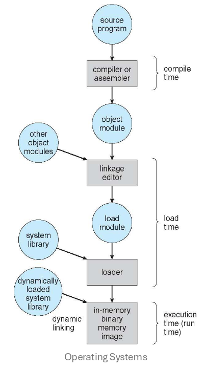
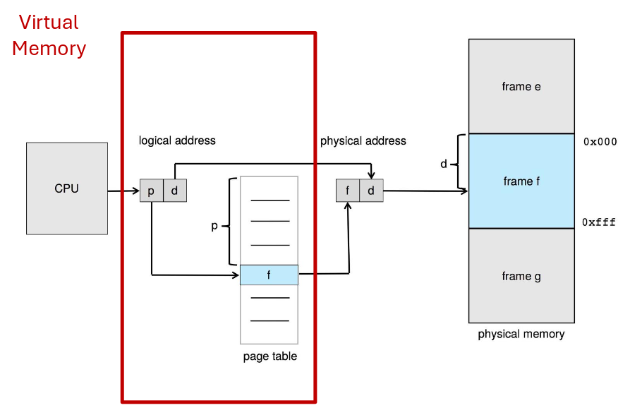

## Memory

Computer memory can be seen as a large array of bytes. Every byte has its own
address, allowing specific locations to be accessed directly.

The CPU drives computation by fetching instructions sequentially from memory.
The Program Counter holds the address of the next instruction to be fetched.
Occasionally, fetched instructions indicate that more interaction with memory is
needed:

1. **Fetch**: retrieve the instruction bytes from the memory address pointed to
   by the PC;
2. **Decode**: determine the operation to be performed and its operands;
3. **Fetch operands**: optionally, there may be a requirement to load more data
   from memory;
4. **Execute**: perform the specified operation on the operands;
5. **Store result**: optionally, the result may need to be stored back to
   memory;

The memory peripheral does not distinguish between data and operations. It
supports only load and store operations.

### Address binding

Address binding is the process of transforming program addresses into actual
memory addresses.

It can happen at three different stages:

- **Compile time**: the memory location of the program is known before
  execution. The compiler generates absolute addresses. This is often used in
  bare-metal embedded systems.
- **Load time**: the memory location is chosen when the program is loaded into
  memory. The loader fixes the addresses, and the process cannot be moved.
- **Execution time**: the memory location can change during the execution of the
  program. Addresses are virtual and the hardware translates them to physical
  addresses.

### Memory protection

The most basic form of memory protection uses a pair of `base` and `limit`
registers to define the logical address space of a process.

For every memory access (in user mode), the CPU must check that the requested
address falls within the `[base, base + limit)` range.

### MMU

The memory management unit (MMU) is a hardware device that maps virtual to
physical addresses.

- **Virtual (or logical) addresses**: seen by the program;
- **Physical addresses**: seen by the memory hardware;

In the protection example above, the MMU converts the offset from the base
register into a full physical address. On every context switch, the CPU must
update the base register with the address of the program allowed to execute.

## Memory allocation strategies

### Contiguous allocation

In contiguous allocation, the OS reserves a part of the memory for itself
(usually low or high address numbers) and leaves the rest for programs.

When a process requires memory, the OS allocates a partition of the required
size. This creates holes in memory once processes are released.

Allocating a partition from the list of free holes can be done in various ways:

- **First fit**: allocates the first hole that is big enough.
- **Best fit**: allocates the smallest hole that is big enough.
- **Worst fit**: allocates a portion of the largest hole.

#### Fragmentation

There are two categories of problems generated by the contiguous allocation
strategy:

- **external fragmentation**: total free memory exists to satisfy a request, but
  it is not contiguous;
- **internal fragmentation**: occurs when the allocated memory is slightly
  larger than requested (e.g., two partitions allocated, but the second is
  mostly unused);

### Paging

Paging is the subdivision of physical memory into fixed-size blocks called
**frames**. Logical memory is divided into blocks of the same size called
**pages**.

A per-process page table is set up to translate logical to physical addresses.

Paging eliminates external fragmentation, but internal fragmentation can still
occur.

#### Virtual addresses

A virtual address is made up of 2 parts:

- **Page number**: used as an index into the page table, which contains the base
  address of each page in physical memory.
- **Page offset**: added to the base address to identify the specific byte
  requested in physical memory.

#### Page table

The page table is stored in the main memory. The CPU has a special register,
called Page-Table Base Register (PTBR) that holds the physical address of the
page table.

Modifying the register or the page table is a privileged operation. Processes
must request address space changes via system calls such as `mmap`.

Each page table entry typically includes:

- the physical frame number;
- protection bits: read, write and execute permissions;
- valid/invalid bit: indicates whether the page can be accessed by the process
  (triggers a segmentation fault if invalid);
- present/absent bit: indicates whether the page is in RAM (triggers a page
  fault if absent);
- dirty bit: indicates whether the page has been modified;
- reference bit: indicates whether the page has been accessed recently;
