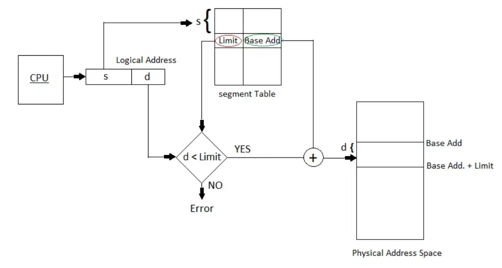

## Segmentation

Segmentation is an approach to memory allocation that assigns exactly the memory
that a process needs. The compiler or linker decides which segments to create
and how big they are.

Segments typically correspond to functional parts of a program: code, data,
stack, heap.

The program sees logical addresses. The OS maintains a segment table for each
process, where each entry contains a base address and a limit (segment size).

The TLB can still be used in the same way as with paging.

## Virtual memory management

Instructions to be executed must be loaded into memory. But do we always need to
load the entire program? For example, error conditions are met only
occasionally.

With virtual memory, we can abstract physical memory and implement the following
features:

- on demand loading from disk (memory mapped files, swap, etc.);
- page sharing: files and memory can be shared between processes even if their
  address spaces are different (shared libraries, IPC, etc.);

### Swapping

Swapping is a mechanism that allows process memory to be written temporarily
back to disk (to free up resources) and then brought back to continue execution.

The ideal backing store is a fast disk, large enough to accommodate copies of
all the memory used by all users. The slowest part of swapping is the transfer
between the RAM and the disk.

### Demand paging

With demand paging, pages are only loaded when they are accessed. Whenever a
page is accessed, the OS tries to read the corresponding entry in the page
table.

If the page is invalid, then the OS throws a segmentation fault. If the page is
not in memory, then a page fault is thrown and the OS proceeds to load it from
disk.

The **pager** is the component of the OS that decides which pages to load from
the disk and which ones to evict from memory.

### Frame replacement

When a page fault occurs, the OS must bring the desired page from disk to
memory. To keep track of the free frames, most OSes maintain a free-frame list
(typically a linked list).

When this list is empty, we need to manage over-allocation. The OS can decide to
terminate a process, swap out some frames or remove unused pages.

The `dirty` bit is used to reduce the overhead of page transfers. A page is
rewritten back to the disk only if it was modified; otherwise it's simply
discarded.

## Algorithms

### Frame allocation

For frame allocation there are 2 major schemes:

- **Fixed allocation**: each process receives a predetermined share of the
  system memory that could be divided equally or proportionally to process size.
- **Dynamic allocation**: the OS maintains a target page fault rate for each
  process. If this rate is too high, the process needs more memory; otherwise,
  some frames can be given to other processes.

### Page replacement

- **First In First Out (FIFO)**: The FIFO algorithm is the simplest and fastest.
  The general rule is that the higher the number of frames, the lower the number
  of page faults.

  Belady's Anomaly is an edge case where in some situations a larger number of
  frames will generate more page faults.

- **Least Recently Used (LRU)**: The optimal algorithm would be the one that
  replaces the page that will not be used for the longest period of time. Of
  course, this is impossible to implement since it relies on knowledge of the
  future.

  LRU is the closest practical alternative, relying on past behavior instead.

  Implementation could be based on:
  - a counter for each page, where the value of the clock is stored each time
    the page is referenced. When a page needs to be evicted, we look at the
    counter to find the one with the smallest (oldest) value.
  - a doubly linked list that keeps page numbers in insertion order. When a page
    is referenced, it is moved to the top (most recently used). Each update is
    more expensive (need to change multiple pointers), but it avoids searching
    the entire list at eviction time.

  LRU requires a hardware clock (accessed at every memory reference) and incurs
  overhead on every memory access.

- **Reference bit**: An approximation of LRU can be implemented with a reference
  bit. For each page, a bit is initialized to 0. At reference time, the bit is
  set to 1. At eviction time, pages with the bit set to 0 are replaced first.

- **Second chance**: Another approximation of LRU that combines the reference
  bit with FIFO.

  At eviction time, the first page of the FIFO queue is selected. If the
  reference bit is 0, it is replaced; otherwise, the bit is cleared and the next
  page is examined.

  A page given a second chance is not replaced again until all other pages have
  been examined at least once.
