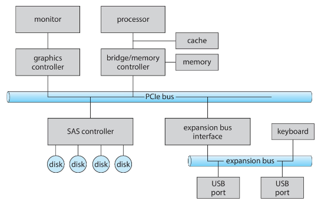

---
description:
  HDD and SSD storage architecture, LBA addressing, filesystems, I/O scheduling,
  buses, device drivers, and block vs character I/O
lang: en
title: Mass Storage and I/O Systems
---

## Mass storage

The bulk of secondary storage on modern computers is **hard disk drives** (HDD)
and **non-volatile memory** (NVM) devices.

Host-attached storage is accessed through I/O ports, connected via I/O buses
such as:

- Advanced Technology Attachment (ATA), Serial ATA (SATA) and eSATA;
- Serial Attached SCSI (SAS);
- Universal Serial Bus (USB);
- Fibre Channel (FC);
- Non-Volatile Memory Express (NVMe);

### Storage stack

A physical disk stores data in **sectors**. This is the smallest unit the
hardware can read/write (usually 4 KB).

Each sector contains data, metadata, and error correction code (ECC).

Modern disks don't expose their physical layout directly; instead, they provide
a linear address space using Logical Block Addressing (LBA).

Before storing files, the OS divides the disk into partitions defined in a table
(MBR (legacy) or GPT). Each partition is a contiguous range of LBAs.

Each partition acts like an independent disk that can hold a separate
filesystem. The filesystem (FS) turns raw storage into usable files and
directories.

### Scheduling

The OS is responsible for using the hardware efficiently. It must minimize delay
and maximize bandwidth.

In HDDs, it is essential to prevent fragmentation, due to the large amount of
time needed to move the magnetic head. In SSDs this problem has become less
relevant.

Many sources (OS, system processes, user processes) generate I/O requests. Each
one specifies the operation (read/write), disk address (logical), memory
address, and the number of sectors to transfer.

I/O requests are not always executed in the order they arrive. Reordering them
can improve performance and reduce latency. Both the OS and the device's
firmware may perform reordering.

## I/O systems

The vast majority of I/O devices share two common characteristics:

- a physical **port** that connects the device to the computer;
- a communication infrastructure, called **bus**;

Some typically used communication protocols are:

- PCI (Peripheral Component Interconnect): common parallel expansion bus
  (legacy);
- SCSI (Small Computer System Interface): common parallel disk interface (legacy
  and enterprise);
- PCIe (PCI Express): high-speed serial expansion bus;
- SATA (Serial Advanced Technology Attachment): modern interface for storage
  devices;
- USB (Universal Serial Bus): versatile serial bus interface;

I/O devices can be grouped by the OS into:

- block I/O:
  - typically disk drives;
  - syscalls are `read`, `write`, `seek`;
  - support memory mapping and direct memory access;
- character I/O:
  - syscalls are `get`, `put`;
  - libraries layered on top allow line editing;
- memory-mapped file access;
- network sockets;

The controller (or host adapter) is the hardware component that manages
communication between the CPU and the I/O device. It acts as the interface that
connects the I/O device to the system bus.

The device driver is the software layer in the OS kernel that interacts with the
controller. It translates high-level OS commands into low-level device-specific
commands. It also handles interrupts, buffering and device-specific
optimizations.

To keep track of all the devices and their concurrent requests, the OS keeps a
device-status table that stores:

- device type;
- device address;
- device state (not functioning, idle, busy);
- request type and parameters;
- wait queue;
