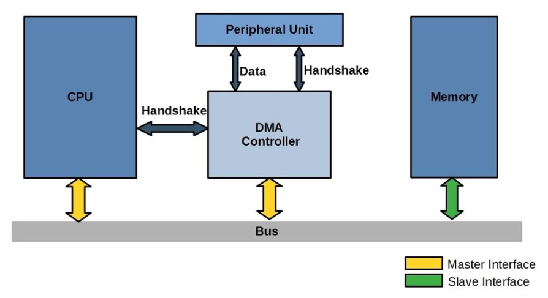

## I/O management

Devices are controlled via addresses. Device registers are registers inside the
I/O controller that the CPU can read or write to control the device.

- control register: CPU writes commands;
- status register: CPU reads device status;
- data register: used to transfer the data;

These registers can be mapped in two different ways:

- **Port-Mapped I/O** (PMIO): devices have a separate I/O address space and the
  CPU communicates with device registers through this space. They are accessed
  via special instructions (IN, OUT on x86) and were used in legacy systems.
- **Memory-Mapped I/O** (MMIO): device registers are mapped into the main memory
  address space. The CPU accesses devices using regular memory instructions
  (LOAD, STORE).

  When the CPU issues an address, the address decoder hardware routes the access
  to RAM or to the device register.

## I/O strategies

User processes may accidentally or purposefully attempt to disrupt normal
operation via illegal I/O instructions. For this reason, I/O operations must be
performed via a system call.

- **Polling**: for each I/O operation:
  1. The CPU reads the busy bit from the status register until it is 0;
  2. It sets the read or write bit (if writing, it copies data into the data
     register);
  3. The CPU sets the command-ready bit;
  4. The controller sets the busy bit and executes the transfer;
  5. The controller clears the busy, error and command-ready bits when done;

  The busy-wait cycle is reasonable if the device is fast; inefficient
  otherwise.

- **Interrupts**: the I/O device triggers the CPU interrupt-request lines.

  A physical signal mapped to an IRQ number triggers the CPU. The interrupt
  controller collects and prioritizes requests, and the CPU checks for pending
  interrupts between instructions.

  If a device is transferring data, it typically generates an interrupt for
  every small unit of data (byte or word). This can lead to a high interrupt
  overhead, reducing performance.

Depending on whether the calling thread waits for the I/O operation to complete:

- **Blocking**: the thread waits until the I/O operation is finished.
- **Nonblocking**: the CPU initiates the I/O operation but does not wait for it
  to complete. The OS may return immediately with a partial result or an
  indication that the data is not ready.

Depending on how the I/O completion operation is handled:

- **Synchronous**: the program waits for completion, blocking the thread or via
  polling.
- **Asynchronous**: the CPU initiates the I/O operation and continues execution.
  The OS notifies the program via an interrupt or callback when the operation is
  complete.

## Direct Memory Access (DMA)

DMA is used to avoid having the CPU manage the interaction with devices and
memory, especially for large data movement. This feature requires a dedicated
controller that is usually placed on the motherboard of the computer.

With DMA, the CPU controls the creation of a buffer in RAM. Then it tells the
controller the address of the buffer, the amount of data to transfer and the
direction of the transfer.

## Vectored I/O

Vectored I/O allows one system call to perform multiple I/O operations. It is
better than individual I/O calls because it decreases context switching and
system call overhead.
