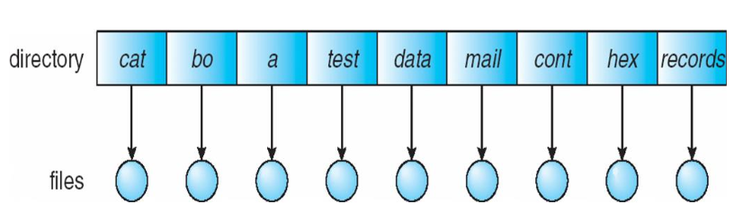
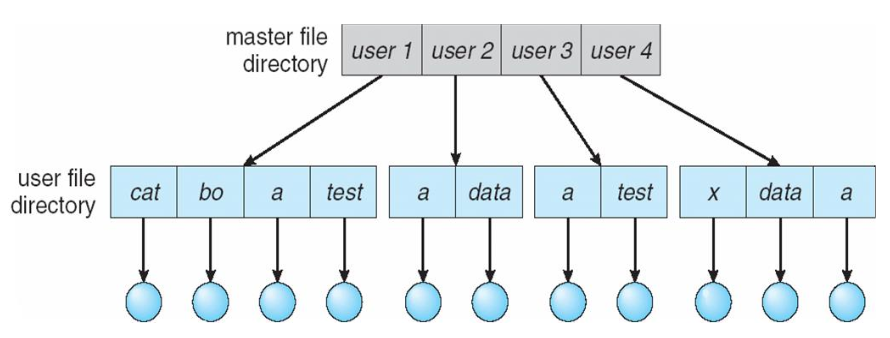
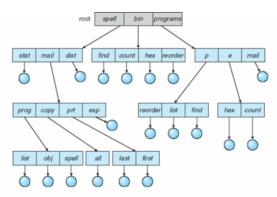
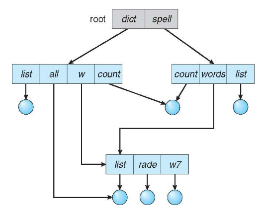
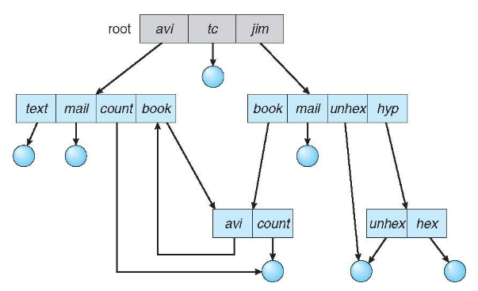

---
description:
  File attributes, operations, directory structures, access control, and
  memory-mapped files in operating systems.
lang: en
title: File Systems, Directory Organization, and Memory-Mapped Files
---

## Files

A file can be seen as a contiguous logical address space. To the user it appears
as a linear array of bytes, while the OS abstracts the physical properties of
the underlying storage.

A file is the smallest unit of allotment of logical secondary storage. Data
cannot be written to disk unless it is stored in a file.

Each file has a name known to the user, but also a low-level name that for
historical reasons is referred to as inode.

File name extensions (the part after '.') are conventionally used to influence
the OS behaviour when operating on the file. There is no enforcement that the
data contained in a file with a particular extension is actually valid data for
that file type.

:::note[Directories]

A directory is a list of user-readable names to inode pairs. Each entry refers
either to files or to other directories.

Directories, like files, also have an inode number.

:::

### File attributes

The OS must store the following information about files:

- name: only human readable information;
- identifier: like the inode number;
- type: for UNIX systems a file could be a data file, a socket or also a device;
- location: pointer to the location on device;
- size: size of the file;
- protection: read, write, execute bits;
- timestamps: created at, updated at, etc.;
- user identification: owner and group information;

This metadata is stored in the directory structure on the disk.

### File operations

- **Create**: the OS must find space in the filesystem and a new entry for the
  file is made in the directory.
- **Open**: all operations except create and delete require a file to be opened
  first. The OS must search the directory structure for the inode and return a
  handle that can be used as an argument in other calls.
- **Write**: the user must specify the file handle and data to write. The OS
  keeps a pointer to the location where the next write shall take place.
- **Read**: the user must specify the file handle and the location in memory
  where to put the read data. The OS keeps a pointer (the same as the write one)
  to the location where the next read shall take place.
- **Seek**: reposition the read/write pointer within the file. No I/O is
  involved.
- **Truncate**: erase the contents of the file but keep its attributes.
- **Close**: move the content of the file entry from memory to disk.
- **Delete**: the directory entry is removed.

### Open files

File operations involve searching the directory for an entry associated with the
named file. The open-file table is used to replace the expensive search with a
simple index operation.

The implementation of the open-file table is more complex in scenarios where
multiple apps can open files simultaneously. Typically, there are two levels of
internal tables:

- Per-process table: tracks all the files a process has open and the position of
  the read/write pointer.
- System-wide table: tracks file location, size, access dates, etc. It's pointed
  to by the entries of the per-process table.

### File locking

Some OSes provide locking functionality for file access. The lock can be shared
(multiple processes can acquire it concurrently) or exclusive (one process at a
time).

The lock can also be **mandatory**, where access is denied if locked, or
**advisory**, where the other processes can obtain the status of the lock and
decide what to do.

### Reading and writing files

- **Sequential access**: this is the simplest method. The supported operations
  are `read next`, `write next` and `reset` (the pointer to the beginning of the
  file). There is no seek operation.
- **Direct access**: this gives the ability to access any part of a file
  independently. Supported operations are `read at n`, `write at n`, or
  `seek n + read/write next`.
- **Indexed access**: at the application level, we may want to create index maps
  where the key leads to known locations in the file. This avoids the need to
  search for the required offset.

## Directories

Directories are a collection of inodes. Operations commonly supported are
`search file`, `create file`, `delete file`, `list contents`, `rename file`,
`traverse the file system to parent or sub-directories`.

### Directory organization

The directory must be organized logically for performance (efficiency in
locating files), usability (repeatable names, special characters, etc.) and
access control.

- **Single level directory**: all files are contained in the same directory.
  There are issues when a large number of files is present or there is more than
  one user.

  

- **Two-level directory**: the system is divided into separate directories for
  each user (User File Directory) and the underlying Master File Directory.

  File names can be repeated across users but they still can't be logically
  grouped. The UFDs are managed by the sysadmin who also manages the users.

  

- **Tree-structured directory**: this is a generalization of the 2-level tree to
  arbitrary heights. Users can create subdirectories and organise files
  accordingly.

  Every file has a unique path name. A file can be referenced with an absolute
  or relative path. File operations with relative paths are resolved starting
  from the current working directory.

  The OS assumes that the current directory contains most of the files of
  interest for the process, so when a file is referenced the current directory
  is searched first. Searching for arbitrary files requires accessing the
  filesystem multiple times, making the operation inefficient.

  To delete a directory it is necessary to empty it first.

  

- **Acyclic-graph directory**: this structure allows to have shared
  subdirectories and files with different path names.

  A shared file is not the same as two copies. Changes made through one
  reference are also visible through the other.
  - Hard link: it's another name for the same inode. Deleting one name doesn't
    delete the file until all references are gone. It cannot span across
    filesystems. Cannot point to directories or it could create cycles in the
    graph.
  - Symbolic link: it's a separate file (inode) that stores a path to another
    file. This works across filesystems, can point to directories and even to
    non-existent targets.

  

- **General-graph directory**: this is a generalization of acyclic graphs. Care
  must be taken when creating links since cycles in the filesystem could lead to
  infinite loops when traversing it.

  

## Protection

It shouldn't be possible to modify, read, or write other users' files without
their consent.

The owner of a file should be able to control who can operate on the file and
the operations they can perform (read, write, execute, append, delete, list).

Access control lists (ACL): per-user ACLs allow setting specific rules for who
can access each file/directory. Their flexibility allows implementing complex
access methodologies, but their storage means that directory entries must be of
variable length.

A simpler access system found on UNIX systems is composed of owner permissions,
group permissions, and other users' permissions.

## Memory-mapped files

Instead of accessing files via read/write syscalls, files can be mapped into a
process's virtual address space.

This allows for transparent access and reduced system call overhead, especially
for files larger than RAM.

Writes are made to memory pages and written back to disk lazily.

- Shared mapping (MAP_SHARED): makes changes visible to other processes and
  writes them back to the file.
- Private mapping (MAP_PRIVATE): enables copy-on-write, syncing changes only
  when the process closes the file descriptor.
