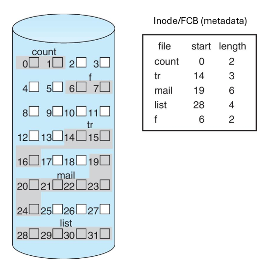
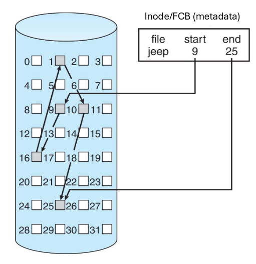
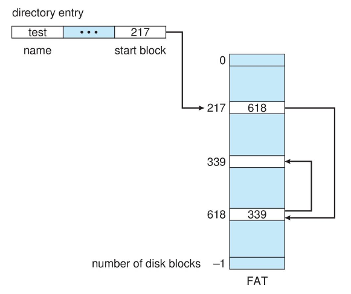
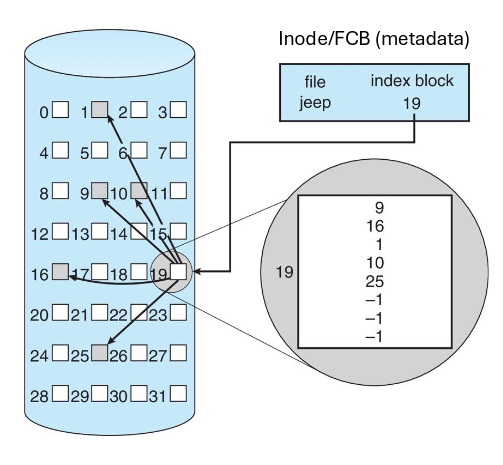
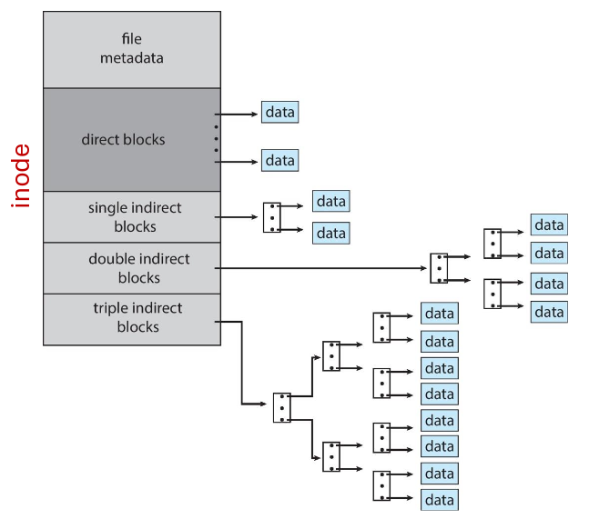

---
description:
  Disk block allocation strategies, free space tracking, journaling crash
  recovery, mount procedures, and VFS abstraction.
lang: en
title: File System Allocation, Recovery, and Virtual File Systems
---

## Allocation methods

There are various strategies for deciding how blocks are allocated to store
files.

- **Contiguous allocation**: each file occupies a set of contiguous blocks on
  the device. This has some performance benefits on HDDs, where sequential reads
  are much faster than random ones.

  The metadata is simple: it stores only the start location and length of the
  block.

  This method has some problems:
  - finding free space on the disk (same as finding a free hole in memory: first
    fit or best fit?);
  - external fragmentation: there is a periodic need for compaction (offline) or
    defragmentation (online);
  - determining the space needed for a file: it could grow and require
    reallocation, or it could shrink and waste storage space;

  

  **Extents** are a mechanism used to minimize issues with space. The file is
  split into multiple contiguous regions (extents) that may be in different
  parts of the disk.

  The inode stores a list or array of extents, each with their start and length
  metadata.

- **Linked allocation**: in linked allocation, each file is a linked list of
  data blocks. Each block contains a pointer to the location of the successive
  one.

  Each inode entry has a pointer to the first block of the file. If the pointer
  is null, then the file is empty.

  The problems with this method are:
  - read performance: it must read all preceding blocks to reach the desired
    one. This can be solved by grouping all the blocks into contiguous clusters;
  - internal fragmentation: pointers occupy space, so we can't utilize the full
    capacity of the block;
  - reliability: if a pointer is corrupted, the entire chain is broken;

  

- **File Allocation Table (FAT) allocation**: the beginning of the volume has a
  FAT that contains one entry per block with a pointer to the next block in the
  file.

  To allocate a new block, we must find the first 0-valued table entry and
  update the last block in the file to point to the new block.

  This method is similar to linked allocation, but pointers are stored in a
  table to improve access locality and caching.

  

- **Indexed allocation**: this method stores pointers to data blocks in an index
  block. Each file has an index block, and the i-th entry of the block points to
  the i-th data block of the file.

  File metadata contains a pointer to the index block.

  This method supports direct access and avoids external fragmentation. But:
  - there's pointer overhead: if a file is short we waste an entire index block
    worth of space;
  - the index block size limits the maximum file size. This can be solved by
    linking several index blocks (the last pointer of the block points to the
    extension block), or by adding more levels of indexing (similar to a
    multi-level page table).

  

- **Combined scheme**: An inode contains a fixed number of pointers. Some point
  to file data blocks; the rest point to indirect blocks (with an increasing
  level of indirection for each pointer).

  Index blocks can be cached in memory, avoiding the need to read from disk
  multiple times.

  

## Free space management

To keep track of free space we can use a variety of data structures:

- **Bit vector**: each block is represented by one bit. A value of 1 means the
  block is free, 0 means it is occupied. This structure occupies disk space.

  To find free space, we just need to scan the whole vector. This works well for
  contiguous allocation, since finding contiguous zero bits is fast.

- **Linked free space list**: each free block has a pointer to the next free
  block.

  It is efficient when the number of free blocks is known, but it is difficult
  to locate contiguous space easily. This can be partially solved with:
  - **Grouping**: each list entry holds a group of pointers to free blocks.
  - **Counting**: since free space is often found in contiguous blocks, we keep
    a count of them and a pointer to the next cluster, stored only on the first
    block of the group.

## Recovery

Inconsistencies in an FS might be generated by:

- changes interrupted by crashes;
- cached changes never reaching storage;
- corruption due to bugs in the file system implementation;

**Consistency checking** (`fsck` on UNIX) compares data in the directory
structure with data blocks on disk and attempts to fix inconsistencies. This
method is slow and can sometimes fail, so it is used only as a last resort.

### Journaling

File system updates are first written to a log file (the _journal_) and then
applied to the actual file system. Writes to the journal are atomic, so if a
crash occurs, the system uses it as the source of truth.

## Mounting

File systems must be mounted before they become accessible to processes.
Mounting makes the contents of a file system appear under a directory in the
existing tree.

At boot time, the OS must mount the root file system (`/`).

1. The firmware loads the bootloader.
2. The bootloader loads the kernel and a temporary filesystem (initramfs).
3. The kernel runs the `/init` program inside the initramfs.
4. `/init` loads the drivers and locates the real root filesystem on disk.
5. It mounts it, switches to it, and starts systemd.

Mounted file systems are kept in an in-memory table (`/proc/mounts` on Linux).
During path traversal, the OS switches file systems when reaching a mount point.

- On macOS, external or newly discovered volumes are typically mounted under
  `/Volumes`.
- On Windows, drives are assigned a letter. Windows can also mount filesystems
  into directories, similar to Unix systems.

## Virtual file systems

The Virtual File System (VFS) is an abstraction layer to support multiple
filesystems with the same set of syscalls. All file systems must implement the
VFS interface.

VFS uses in-memory objects to represent files in a generic way. Linux has four
types: inode, file, superblock, and dentry.

### Remote file systems

VFS allows transparent access to remote file systems, where the server is the
computer that provides the physical storage and the client is the one that
accesses it.
