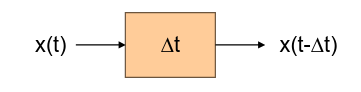
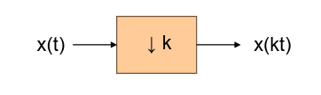
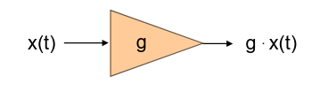
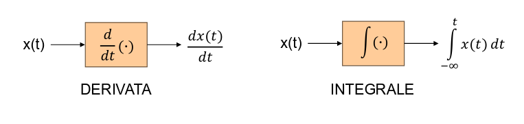

## Manipolazione dei segnali

### Traslazione temporale

Introduzione di un anticipo o un ritardo del segnale agendo sull'asse temporale.

- $\Delta t > 0$: introduco un ritardo;
- $\Delta t < 0$: introduco un anticipo;

### Riscalamento temporale

Introduzione di una compressione o espansione del segnale agendo sull'asse
temporale.

- $0 < k < 1$: espando il segnale;
- $k > 1$: comprimo il segnale;

Se $k$ diventa negativo, allora il segnale viene anche invertito.

### Fattore di guadagno

Amplificazione o attenuazione agendo sull'ampiezza del segnale.

- $g > 1$: amplifico il segnale;
- $0 < g < 1$: attenuo il segnale;

Se $g$ diventa negativo il segnale viene ribaltato.

### Integrazione e derivazione

Dato che i segnali sono descrivibili come funzioni, possiamo integrarli e
derivarli:

Per le funzioni generalizzate:

- l'integrale di un impulso è un gradino e derivando un gradino si ottiene un
  impulso;
- derivando un impulso si ottiene un doppietto, ovvero una coppia di impulsi,
  uno positivo e uno negativo, centrati nell'origine;

:::note

Il doppietto è definito come:

$$
\int_{-\infty}^{+\infty} \delta'(t)\ f(t)\ dt = - \int_{-\infty}^{+\infty} \fDelta{t}\ f'(t)\ dt = - f'(0)
$$

:::

## Statistiche dei segnali

Solitamente si usa la statistica su segnali di natura aleatoria, tuttavia è
possibile calcolare alcuni valori interessanti anche per segnali deterministici.

### Valor medio

Il valor medio di un segnale deterministico in un dato intervallo temporale
$[t_1, t_2]$ è dato da:

$$
\langle x(t) \rangle_{[t_1, t_2]} = \frac{1}{|t_2 - t_1|} \int_{t_1}^{t_2} x(t)\ dt
$$

o su tutto il dominio:

$$
\overline{x} = \langle x(t) \rangle = \lim_{T \to \infty} \frac{1}{T} \int_{-\frac{T}{2}}^{\frac{T}{2}} x(t)\ dt
$$

Tipicamente un valor medio $\neq 0$ indica che è presente un offset costante nel
segnale. In questo caso viene sottratto per ottenere solamente le variazioni.

### Valore quadratico medio e varianza

Il valore quadratico medio è definito:

$$
\overline{x^2} = \langle x(t)^2 \rangle = \lim_{T \to \infty} \frac{1}{T} \int_{-\frac{T}{2}}^{\frac{T}{2}} (x(t))^2\ dt
$$

da cui possiamo ricavare la varianza:

$$
\sigma_x^2 = \overline{x^2} - \overline{x}^2 = \lim_{T \to \infty} \frac{1}{T} \int_{-\frac{T}{2}}^{\frac{T}{2}} (x(t) - \overline{x})^2\ dt
$$

Una varianza elevata indica variazioni significative nel segnale, tipicamente
associate ad un più elevato contenuto informativo.

### Energia di un segnale

L'energia di un segnale è definita come:

$$
E_x = \int_{-\infty}^{+\infty} (x(t))^2\ dt
$$

:::caution

Per i segnali periodici non ha senso calcolarla, dato $E_x$ assume un valore
infinito.

:::

I segnali per cui $E_x$ ha valore finito sono detti **segnali di energia**.

### Potenza di un segnale

La potenza $P_x$ di un segnale è la misura della sua energia sul tempo. La
formula coincide con quella del valore quadratico medio.

La potenza di un segnale di energia sarà sempre nulla, i segnali per cui $P_x$
non è nulla sono detti **segnali di potenza**.

Un segnale può essere o di energia o di potenza, mai entrambi.

### Cross-correlazione

La cross-correlazione è utile per capire quanto 2 segnali siano simili tra loro.

Dobbiamo distinguere tra segnali di energia e di potenza:

- per 2 segnali di energia $x(t)$ e $y(t)$:

  $$
  \mathcal{R}_{x, y}(t) = \int_{-\infty}^{+\infty} x(\tau)\ y(t + \tau)\ d\tau
  $$

- per 2 segnali di potenza $x(t)$ e $y(t)$ (su un intervallo lungo $T$):

  $$
  \mathcal{R}_{x, y}(t) = \lim_{T \to \infty} \frac{1}{T} \int_{- \frac{T}{2}}^{\frac{T}{2}} x(\tau)\ y(t + \tau)\ d\tau
  $$

In entrambi i casi lascio $x$ fermo e faccio scorrere $y$ di un fattore $\tau$.

Si usa per verificare la somiglianza perché se i segnali sono allineati, il
valore dell'integrale sarà alto e positivo (i picchi e le valli hanno lo stesso
segno quindi la moltiplicazione da sempre valori positivi).

**Autocorrelazione**: si usa per misurare quanto un segnale è uguale a se stesso
in altri punti. Ha senso solo per $\tau \neq 0$.

Si dice che un segnale ha meno 'memoria' quando la sua auto-correlazione decade
più rapidamente man mano che ci si sposta da $\tau = 0$.
