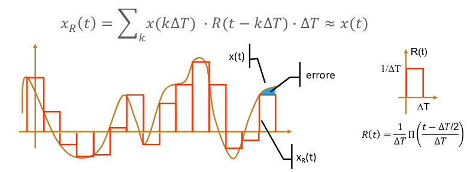
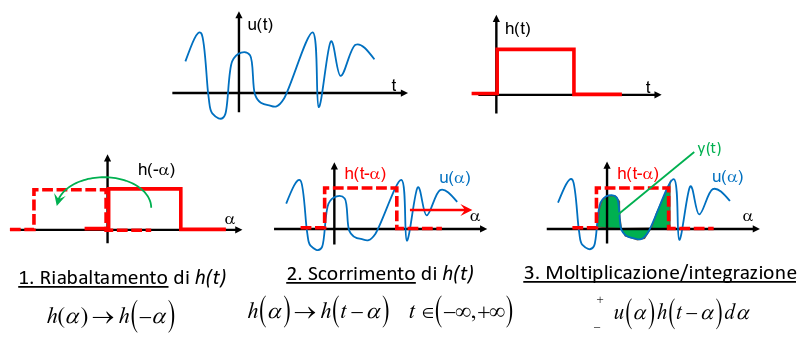

## Sistema analogico LTI

Un sistema di elaborazione di segnali è costituito in genere da una cascata di
blocchi che applicano una trasformazione al segnale.

I sistemi che studieremo in questo corso saranno lineari e tempo-invarianti.

### Linearità

La linearità viene espressa matematicamente come: dati 2 segnali $x_1(t)$ e
$x_2(t)$ e 2 numeri reali $a$ e $b$, un sistema $f(x)$ è lineare se:

$$
f(a\ x_1(t) + b\ x_2(t)) = a\ f(x_1(t)) + b\ f(x_2(t))
$$

Nei sistemi lineari, la relazione tra l'ingresso e l'uscita si esprime sempre
con una retta.

### Tempo invarianza

In un sistema tempo-invariante, la risposta non cambia al variare del ritardo
del segnale in ingresso.

$$
f(x(t)) = y(t) \implies f(x(t - t_0)) = y(t - t_0)
$$

## Convoluzione

Dato un sistema lineare tempo-invariante, è possibile calcolare la risposta ad
un segnale di ingresso $x(t)$ qualsiasi a partire dalla conoscenza della
risposta alla funzione impulso unitario $\fDelta{t}$.

Quindi ogni sistema può essere caratterizzato in base alla risposta su
$\fDelta{t}$.

**Dimostrazione**:

1. Prendiamo un segnale $x(t)$ e lo approssimiamo tramite una serie di
   rettangoli di durata $\Delta T$ e area unitaria.

   Chiameremo $x_R(t)$ il segnale approssimato e $R(t)$ ogni rettangolo. Inoltre
   $h_R(t)$ sarà la risposta del sistema per ogni rettangolo.

   

2. Poiché il sistema è LTI:
   - la risposta ad una somma pesata di ingressi $R(t)$ è la somma degli output
     $h_R(t)$;
   - la traslazione di $R(t)$ produce una pari traslazione della corrispondente
     uscita;

   Quindi la riposta al segnale $x_R(t)$ è:

   $$
   y_R(t) = \sum_k x(k\ \Delta T)\ h_R(t - k\ \Delta T)\ \Delta T \sim y(t)
   $$

3. Usando un $\Delta T$ più piccolo miglioreremo l'approssimazione (l'area
   dell'errore tende a 0).

   Al limite $\Delta T \to 0$ la funzione $R(t)$ tende ad una funzione di durata
   nulla, ampiezza infinita e area unitaria. Abbiamo definito questa funzione
   come $\fDelta{t}$.

   La risposta al rettangolo ($h_R(t)$) tende a sua volta alla risposta
   all'impulso (che chiameremo $h(t)$).

   $x_R(t)$ diventa integrale di una serie infinita di impulsi, coincidente con
   $x(t)$:

   $$
   \lim_{\Delta T \to 0} x_R(t) = \int_{-\infty}^{+\infty} x(\tau)\ \delta(t - \tau)\ d\tau = x(t)
   $$

4. La stessa cosa vale per la risposta del sistema:

   $$
   \lim_{\Delta T \to 0} y_R(t) = \int_{-\infty}^{+\infty} x(\tau)\ h(t - \tau)\ d\tau = y(t) = x(t) * h(t)
   $$

   L'integrale sopra definito prende il nome di **integrale di convoluzione** e
   rappresenta l'uscita esatta $y(t)$ di un sistema LTI in corrispondenza di un
   generico ingresso $x(t)$.

:::caution

Non è detto che l'integrale di convoluzione sia facilmente risolvibile.

:::

### Interpretazione grafica

Dato un segnale $u(t)$ e la risposta impulsiva $h(t)$, la loro convoluzione
$y(t) = u(t) * h(t)$ può essere interpretata come la sequenza di 3 operazioni:

### Proprietà

- restituisce una funzione che ha durata maggiore di quella degli operandi;
- è un operazione lineare (perché è un integrale);
- gode delle proprietà commutativa, associativa e distributiva;
