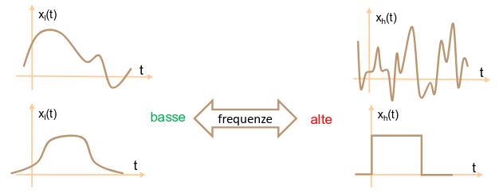
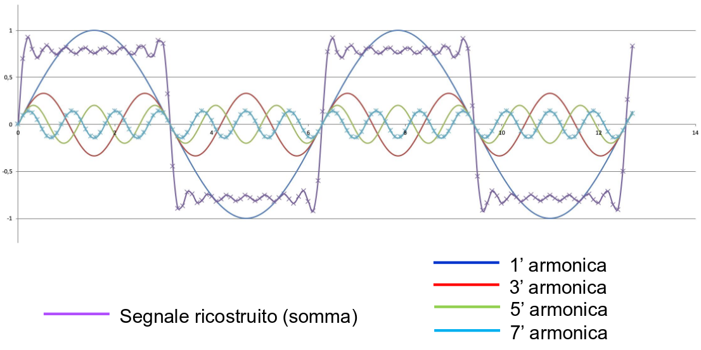

## Convoluzioni notevoli

### Convoluzione con impulso

- La convoluzione di un segnale qualsiasi con un impulso restituisce il segnale
  stesso.
- Se invece si esegue la convoluzione con un impulso traslato, la risposta è il
  segnale traslato.

### Convoluzione di 2 rettangoli simmetrici di pari durata

Consideriamo 2 rettangoli di uguale durata e simmetria pari:

- $x_1(t) = A_1 \fRectangle{\frac{t}{T}}$
- $x_2(t) = A_2 \fRectangle{\frac{t}{T}}$

La convoluzione sarà:

$$
y(t) = \int_{-\infty}^{+\infty} x_1(\tau)\ x_2(t - \tau)\ d\tau
$$

Posso dividere il calcolo dell'integrale di convoluzione in intervalli. Per
$t > |T|$ i rettangoli non si incontrano, quindi $y(t) = 0$, resta da calcolare
l'intervallo $t < |T|$.

- In $-T < t < 0$:

  $$
  y(t) = \int_{-\frac{T}{2}}^{t + \frac{T}{2}} A_1\ A_2\ d\tau = A_1\ A_2\ (t + T)
  $$

- In $0 < t < T$:

  $$
  y(t) = \int_{t - \frac{T}{2}}^{\frac{T}{2}} A_1\ A_2\ d\tau = A_1\ A_2\ (T - t)
  $$

Combinando i pezzi della funzione otteniamo un rettangolo isoscele centrato
nell'origine e di durata $2 T$.

### Convoluzione di 2 rettangoli simmetrici di diversa durata

In questo caso dobbiamo considerare 2 ulteriori punti notevoli:

- per $t < - (T_1 + T_2)$ e $t > T_1 + T_2$ i rettangoli non si incontrano;
- in $- \frac{T_1 + T_2}{2} < t < \frac{T_1 - T_2}{2}$ avremo una rampa
  crescente;
- in $\frac{T_1 - T_2}{2} < t < \frac{T_2 - T_1}{2}$ avremo una fase piatta con
  valore $A_1\ A_2\ T_1$;
- in $\frac{T_2 - T_1}{2} < t < \frac{T_1 + T_2}{2}$ avremo una rampa
  decrescente;

Otteniamo così un trapezio isoscele.

:::tip

Nel caso di rettangoli non simmetrici si possono usare le proprietà LTI della
convoluzione.

Infatti si può prendere il rettangolo all'origine moltiplicato per un impulso
traslato e quindi ricondursi al risultato dei casi sopra traslato dallo stesso
impulso.

:::

### Convoluzione di gaussiane

Prese 2 gaussiane con diverse medie e varianze:

- $x_1(t) = \Xgauss{\mu_1}{\sigma_1^2}{t}$
- $x_2(t) = \Xgauss{\mu_2}{\sigma_2^2}{t}$

Si dimostra che ottengo un'altra gaussiana:

$$
y(t) = x_1(t) * x_2(t) = \Xgauss{(\mu_1 + \mu_2)}{(\sigma_1^2 + \sigma_2^2)}{t}
$$

## Risposte impulsive alle trasformazioni sul segnale

- traslazione: $y(t) = x(t - \Delta t) \implies h(t) = \fDelta{t - \Delta T}$;
- amplificazione: $y(t) = \alpha\ x(t) \implies h(t) = \alpha\ \fDelta{t}$;
- guadagno: $y(t) = x(k\ t) \implies h(t) = k\ \fDelta{t} \sim \fDelta{t}$;
  (risposta non LTI);
- integrale: $y(t) = \int x(t) \implies h(t) = \fStep{t}$ (funzione gradino);
- derivata: $y(t) = \dv{x}{t}(t) \implies h(t) = \dv{\delta}{t}(t)$ (doppietto);

## Sistemi non LTI

Se un sistema non è lineare tempo-invariante, possiamo ottenere la risposta
all'impulso e l'integrale di convoluzione ma non è garantito che coincidano con
la risposta del sistema.

In questo caso possiamo modellare il comportamento del sistema tramite la
relazione ingresso-uscita. Essa determina l'uscita di un sistema per un dato
ingresso in un certo istante.

La relazione ingresso-uscita dà informazioni utili solo nel caso di sistemi
senza memoria. In quelli con memoria l'uscita dipende anche dai valori ricevuti
in precedenza.

## Rappresentazione dei segnali in frequenza

In fisica il concetto di frequenza è associato a fenomeni periodici. Nei segnali
il concetto viene allargato anche al contenuto frequenziale di un segnale non
periodico.

Come quantificare la frequenza? Il problema l'ha risolto Jean-Baptiste Joseph
Fourier.

### Serie di Fourier

Con la serie di Fourier si può rappresentare la frequenza di qualsiasi segnale
come una serie infinita di sinusoidali (sulle quali sappiamo già tutte le
proprietà matematiche).

Un generico segnale **periodico** di periodo $T_0$ può essere rappresentato
mediante la seguente serie (serie di Fourier):

$$
x(t) = a_0 + \sum_{k = 1}^{+\infty} a_k\ \fCos{2 \pi k f_0 t + \vartheta_k}
$$

- Le oscillazioni della serie hanno frequenza multipla della frequenza
  $f_0 = \frac{1}{T_0}$, detta **frequenza fondamentale**.
- Il termine $k$-esimo della serie è detto **armonica** di ordine $k$ ed è
  caratterizzato da 3 valori:
  - $k f_0$: frequenza dell'armonica;
  - $a_k$: ampiezza dell'armonica;
  - $\vartheta_k$: sfasamento dell'armonica;
- Il termine $a_0$ (a frequenza nulla) è detto **componente continua**.

**Esempio**: costruzione di un onda quadra con serie di Fourier

