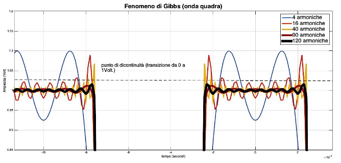

## Serie di Fourier

La serie può essere applicata solo se il segnale è integrabile sul periodo e
quell'integrale ha valore finito. I segnali reali usati in questo corso
verificano questa condizione.

Le frequenze delle sinusoidi non sono arbitrarie, si ricavano dalla frequenza
fondamentale. L'unica cosa che bisogna calcolare sono i valori dei coefficienti
$a_k$ e $\vartheta_k$.

### Forma esponenziale della serie di Fourier

La serie di Fourier si può riscrivere sfruttando la formula di eulero:

$$
x(t) = a_0
     + \sum_{k = 1}^{\infty} \frac{a_k}{2}\ e^{k\ \vartheta_k}\ e^{j 2 k \pi f_0 t}
     + \sum_{k = -\infty}^{-1} \frac{a_{-k}}{2}\ e^{-j\ \vartheta_{-k}}\ e^{j 2 k \pi f_0 t}
$$

e in forma più compatta:

$$
x(t) = \sum_{k = -\infty}^{+\infty} X_k\ e^{j 2 k \pi f_0 t}
$$

$$
X_k = \begin{dcases}
k > 0 \implies \frac{a_k}{2} e^{j\ \vartheta_k} \\[5pt]
k < 0 \implies \frac{a_{-k}}{2} e^{-j\ \vartheta_{-k}} \\[5pt]
k = 0 \implies a_0
\end{dcases}
$$

### Calcolo dei coefficienti

Il coefficiente $n$-esimo della serie è dato dalla seguente espressione:

$$
X_k = \frac{1}{T_0} \int_{- \frac{T_0}{2}}^{\frac{T_0}{2}} x(t)\ e^{-j 2 k \pi f_0 t}\ dt
$$

La formula equivale alla cross-correlazione tra il segnale $x(t)$ e la sinusoide
$e^{-j 2 k \pi f_0 t}$ (entrambi i segnali sono periodici e quindi di potenza).
Con $n = 0$ otteniamo il valor medio di $x(t)$.

Il coefficiente $X_n$ ci dice quanto l'armonica $n$-esima è presente nel segnale
$x(t)$. Se $x(t)$ non contiene quella frequenza, il coefficiente sarà nullo.
Altrimenti esso fornirà modulo e fase della corrispondente armonica.

La conoscienza dei coefficienti è sufficiente per ricostruire il segnale in
maniera perfetta. Per questo possiamo usarla come una rappresentazione
alternativa.

#### Frequenze negative

Eseguendo i calcoli, talvolta appaiono delle frequenze negative. In fisica non
esistono, sono solo anomalie necessarie per la correttezza dei calcoli
matematici.

### Proprietà della serie

- Simmetria Hermitiana: $X_{-n} = \overline{X_n}$

  Calcolando solo i coefficienti della parte positiva dello spettro, ottengo
  anche quella negativa per simmetria (simmetria Hermitiana).

- Linearità: dati 2 segnali $x(t)$ e $y(t)$ periodici, avremo:

  $$
  z(t) = a\ x(t) + b\ y(t) \implies Z_k = a\ X_k + b\ Y_k
  $$

- Dato un segnale periodico pari, i coefficienti saranno reali, per cui la serie
  sarà costituita solamente da coseni.

  $$
  X_k = \frac{2}{T_0} \int_0^{\frac{T_0}{2}} x(t)\ \cos(2 k \pi f_0 t)\ dt
  $$

- Dato un segnale periodico dispari, i coefficienti saranno immaginari, per cui
  la serie sarà costituita solamente da seni.

  $$
  X_k = - \frac{2j}{T_0} \int_0^{\frac{T_0}{2}} x(t)\ \sin(2 k \pi f_0 t)\ dt
  $$

  Il coefficiente $X_0$ sarà nullo perchè il valore medio di un segnale dispari
  è $0$.

## Segnale alternato

Si dice segnale alternato un segnale periodico di periodo $T$ e antisimmetrico
sul periodo, ovvero:

$$
x(t) = -x\left(t + \frac{T}{2}\right)
$$

- I segnali alternati non sono necessariamente dispari, ma hanno valor medio
  nullo.
- La serie di Fourier di un segnale alternato ha solo i coefficienti dispari.

## Spettro di un segnale

La rappresentazione dei coefficienti nel dominio delle frequenze armoniche viene
detta spettro.

Ce ne sono di 2 tipi:

- spettro di ampiezza: mostra quanto è ampia l'armonica ad una certa frequenza;

  

- spettro di fase: mostra quanto è sfasata l'armonica ad una certa frequenza;

  

## Considerazioni generali

- I segnali che presentano variazioni più brusche (tipo onde quadrate) hanno
  rappresentazioni spettrali più ampie (le frequenze distanti da $f_0$
  contribuiscono di più).
- Segnali con periodi minori implicano frequenze più alte.
- Se sono presenti discontinuità nel segnale, lo spettro contiene infinite
  armoniche (il cui valore tende a 0, quindi nella realtà si possono ignorare).

:::note

Nelle telecomunicazioni, l'estensione dello spettro prende il nome di **banda**.

- I segnali a banda larga hanno un contenuto significativo a frequenze più alte.
- Quelli a banda stretta contengono frequenze più limitate.

:::

## Fenomeno di Gibbs

Per rappresentare qualsiasi tipo di segnale in frequenze, ne servirebbe un
numero infinito.

Cosa succede quando si tronca una serie di Fourier è stato studiato dal fisico
statunitense Josiah Willard Gibbs.

Si osserva che il segnale oscilla intorno ai punti di discontinuità (**ripple**)
e presenta sovraelongazioni di ampiezza (**overshoot**). All'aumentare delle
armoniche i picchi si riducono e si avvicinano al punto di transizione.

