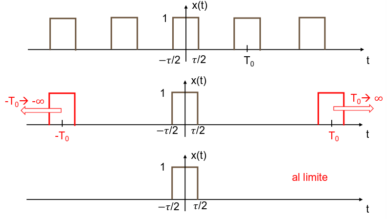

## Teorema di Parseval

Prendiamo la definizione di potenza di un segnale periodico e sostituiamo $x(t)$
con la sua rappresentazione di Fourier.

$$
P_x = \frac{1}{T_0} \int_0^{T_0} \left(\sum_{k = -\infty}^{+\infty} X_k e^{j 2 \pi k f_0 t} \sum_{k' = \infty}^{+\infty} X_{k'} e^{j 2 \pi k' f_0 t} \right)\ dt
    = \frac{1}{T_0} \sum_{k = -\infty}^{+\infty} \sum_{k' = -\infty}^{+\infty} X_k X_{k'} \int_0^{T_0} e^{j 2 \pi (k + k') f_0 t} \ dt
$$

$\int_0^{T_0} e^{j 2 \pi (k + k') f_0 t}$ vale $T_0$ se $k + k' = 0$ o $0$
altrimenti.

$$
P_x = \frac{1}{T_0} \sum_{k = -\infty}^{+\infty} \sum_{k' = -\infty}^{+\infty} X_k X_{k'} T_0
    = \sum_{k = -\infty}^{+\infty} X_k^2
$$

La potenza media del segnale è pari alla somma delle potenze delle singole
armoniche.

## Trasformata di Fourier

La serie di Fourier è limitata, infatti essa si può applicare solo a segnali
periodici. Noi vogliamo generalizzare.

### De-periodizzazione

Prendiamo un onda quadra di ampiezza unitaria con ritorno a $0$ e periodo $T_0$.
Ogni rettangolo avrà durata $\tau$. La sua serie di Fourier sarà:

$$
x(t) = \sum_{k = -\infty}^{+\infty} \fRectangle{\frac{t - k T_0}{\tau}} \iff X_k = \frac{\tau}{T_0}\ \fSinc{2 \pi k f_0 t}
$$

:::note

Il rapporto $\frac{\tau}{T_0}$ è detto **duty cycle**. In elettronica misura il
rapporto tra il tempo in cui un clock ha valore 1 su quello totale.

:::

Per de-periodizzare il segnale possiamo far tendere $T_0$ ad infinito, in questo
modo le prime repliche dell'onda si sposterebbero a $\pm \infty$, lasciando solo
un rettangolo centrato nell'origine.

$$
x(t) \sim \fRectangle{\frac{t}{\tau}}
$$

#### Generalizzazione

Prendiamo un segnale periodico $x(t)$ con $w(t)$ funzione che rappresenta il
segnale in ogni periodo. Riscriviamo il segnale come:

$$
x(t) = \sum_{k = -\infty}^{+\infty} w(t - k T_0) = w(t) * \sum_{k = -\infty}^{+\infty} \delta(t - k T_0)
$$

Per $T_0 \to \infty$ il segnale $x(t)$ coinciderà con $w(t)$.

### Deperiodizzazione e serie di Fourier

All'allontanarsi delle repliche del segnale, le righe dello spettro diventano
sempre più fitte (le frequenze hanno distanza $\frac{1}{T_0}$) mentre l'ampiezza
dei coefficienti di ogni armonica si riduce.

Lo spettro tende a diventare una funzione continua, la cui ampiezza tende a $0$.
Per evitare questo problema definiamo un coefficiente di Fourier modificato:

$$
X'_k = X_k\ T_0 = \int_{- \frac{T_0}{2}}^{\frac{T_0}{2}} w(t)\ e^{j 2 \pi k f_0 t}\ dt
$$

e quindi la relativa serie modificata:

$$
x(t) = \sum_{k = -\infty}^{+\infty} X'_k\ e^{j 2 \pi k f_0 t}\ f_0
$$

### FT e IFT

La trasformata di Fourier e la sua inversa si ottengono portando $T_0$ a
$\infty$:

- **Inversa** (IFT):
  $x(t) = \int_{-\infty}^{+\infty} X(f)\ e^{j 2 \pi k f t}\ df$
- **Diretta** (FT):
  $X(f) = \int_{-\infty}^{+\infty} x(t)\ e^{j 2 \pi k f t}\ dt$

A differenza della serie, $X(f)$ sarà una funzione continua in $f$, quindi lo
spettro sarà una funzione continua.

$x(t) \trFourierA X(f)$ costituisce una 'coppia' di Fourier. Posso passare da
uno all'altro con le IF e IFT, ma l'informazione contenuta è identica.

:::note

Dato un segnale $x(t)$, la sua trasformata di Fourier si denota con
$\mathcal{F}\{x(t)\}$.

:::

### Proprietà

- **Simmetrie**:
  - Hermitiana: $X(f) = \overline{X(-f)}$
  - segnale pari: $X(f) = 2 \int_0^{+\infty} x(t)\ \fCos{2 \pi f t}\ dt$
  - segnale dispari: $X(f) = - 2 j \int_0^{+\infty} x(t)\ \fSin{2 \pi f t}\ dt$

- **Linearità**: $z(t) = a\ x(t) + b\ y(t) \implies Z(f) = a\ X(f) + b\ Y(f)$

- **Fattore di scala**:
  $x(t) \trFourierA X(f) \implies x(\alpha\ t) \trFourierA \frac{1}{\alpha} X\left(\frac{f}{\alpha}\right)$

  Se comprimiamo un segnale, le frequenze diventano più alte e quindi lo spettro
  si allarga. Se lo espandiamo succede il contrario.

  :::note

  Principio di indeterminazione tempo-frequenza:
  - un segnale compresso a durata limitata avrà un'estensione spettrale
    infinita;
  - un segnale espanso a durata infinita avrà un'estensione spettrale finita;

  :::

- **Ritardo**:
  $x(t) \trFourierA X(f) \implies x(t - T) \trFourierA X(f)\ e^{-j 2 \pi f T}$

  Non modifico le componenti frequenziali, cambia solo la loro fase. Lo
  sfasamento è proporzionale alla frequenza.

- **Teorema di dualità**:
  $(x(t) \trFourierA X(f)) \iff (X(t) \trFourierA x(-f))$

  Nella seconda corrispondenza, $X(t)$ è un segnale nel tempo che ha la stessa
  forma di $X(f)$, $x(-f)$ è la rappresentazione in frequenza che ha la stessa
  forma di $x(t)$.

  Se conosciamo la trasformata di un segnale, allora possiamo ricavare anche
  quella del segnale che ha l'andamento del suo spettro.

  :::note

  **Esempio**:
  $\mathcal{F}\{1\} = \fDelta{f} \implies \mathcal{F}\{\fDelta{t}\} = 1$

  L'impulso è l'unica funzione che contiene tutte le frequenze con uguale
  intensità.

  :::

- **Teorema della convoluzione**: $x(t) * y(t) \iff X(f) Y(f)$

### Trasformate di segnali notevoli

- rettangolo:
  $x(t) = A \fRectangle{\frac{t}{T}} \trFourierA X(F) = A\ T\ \fSinc{f\ T}$
- costante: $x(t) = A \trFourierA X(f) = A\ \fDelta{f}$
- esponenziale causale (con $\alpha > 0$):
  $x(t) = \fStep{t}\ e^{-A\ t} \trFourierA X(f) = \frac{1}{\alpha + j 2 \pi f}$
- sinusoidi, contengono una sola componente frequenziale:
  - $x(t) = \fCos{2 \pi f_0 t} \trFourierA X(f) = \frac{1}{2}(\fDelta{f + f_0} + \fDelta{f - f_0})$
  - $x(t) = \fSin{2 \pi f_0 t} \trFourierA X(f) = \frac{j}{2}(\fDelta{f + f_0} - \fDelta{f - f_0})$
