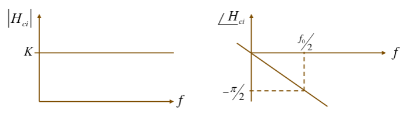
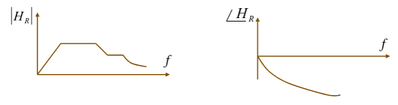
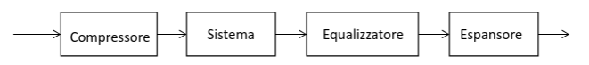

## Filtri ideali e filtri reali

I filtri ideali sono irrealizzabili nella realtà. Per esempio la risposta
impulsiva di un filtro passa-basso è una $fSinc{t}$, che rende il segnale non
causale (fisicamente impossibile).

Per questo motivo, i filtri reali seguono un andamento più dolce (più è alta la
pendenza, maggiore sarà il costo del circuito e la distorsione che genera).

I più semplici da realizzare sono quelli passa-basso (basta la risposta di un
circuito RC). Quelli passa-alto sono effettivamente dei passa-banda perchè non
si può arrivare a frequenze infinite.

I filtri passa-banda sono più difficili, per loro si definisce la banda
frazionaria $\frac{\Delta f}{f_1}$. Se questo valore è al di fuori del range
$0.01 < \frac{\Delta f}{f_1} < 0.1$, allora il filtro diventa molto più
difficile da realizzare.

## Distorsione ed equalizzazione

Per definire la distorsione, bisogna prima definire cosa deve fare un sistema
per non distorcere.

Un sistema non distorcente deve avere una risposta in frequenza
$H(f) = k e^{- j 2 \pi f t_0}$. Quindi un sistema non distorcente è in realtà un
filtro passa-tutto.

Per non distorcere, il fattore di amplificazione deve essere una costante,
mentre la fase deve aumentare linearmente rispetto alle frequenze (il ritardo di
gruppo deve essere costante).

- Spettro di un sistema non distorcente:

  

- Spettro di un sistema distorcente:

  

### Misura delle distorsioni lineari

Per misurare la distorsione generata da un sistema:

1. Metto in ingresso un segnale (sinusoidale) con frequenza nota e vedo come
   viene ritardato/attenuato.
2. Faccio la stessa cosa variando la frequenza. Così posso ricavare gli spettri
   della funzione di trasferimento.

### Equalizzatori

Se è presente una distorsione si può provare a correggerla. I sistemi che
producono tale correzione vengono chiamati equalizzatori (equalizzare significa
appiattire la risposta in frequenza).

Il sistema equalizzatore viene messo in serie a quello distorcente.

Per trovare $H_\text{eq}(f)$ dobbiamo imporre
$H_\text{tot}(f) = k e^{- j 2 \pi f t_0} \implies H_\text{eq}(f) = \frac{H_\text{tot}(f)}{H_\text{dist}(f)}$

### Distorsioni non lineari

Quando il sistema non è lineare, non possiamo trattarlo in termini di risposta
impulsiva e risposta in frequenza.

Per capire cosa succede, si può approssimare il segnale usando funzioni
polinomiali $y(t) = \sum_i a_i (x(t))^i$, dove, in frequenze, si nota che i
termini di grado $> 1$, diventano auto-convoluzioni del segnale. Di conseguenza,
lo spettro del segnale si deforma e si allarga e occupa più frequenze.

Se mettiamo in ingresso una sinusoidale otteniamo:

$$
y(t) = a_1 \fCos{2 \pi f_0 t} + a_2 (\fCos{2 \pi f_0 t})^3 + \dots
     = K + \alpha \fCos{2 \pi f_0 t} + \beta \fCos{2 \pi 2 f_0 t} + \dots
$$

La componente continua è facile da rimuovere. Mentre i termini frequenziali
danno più fastidio.

Una misura di linearità del sistema è data dalla **distorsione di seconda
armonica**:

$$
\left|\frac{\beta}{\alpha}\right| 100 [\%]
$$

Se la non linearità è troppo alta, bisogna equalizzare il sistema (senza basarsi
sulla $H(f)$). Se si deve comunque usare un sistema non lineare, si può usare
una tecnica chiamata companding:

1. Si comprime il segnale con un altro sistema non lineare che limita il suo
   valore alla zona lineare del sistema da usare.
2. Il segnale viene fatto passare nel sistema, correggendo eventuali distorsioni
   con un equalizzatore lineare.
3. Si ri-espande il segnale con un sistema non lineare inverso a quello
   compressore.

