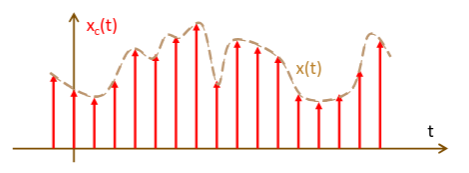
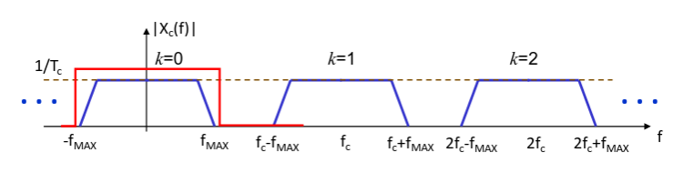
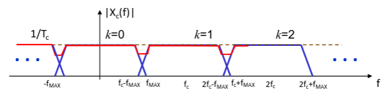

## Segnali digitali

I computers al giorno d'oggi trattano bit, non segnali continui. I vantaggi di
un segnale digitale sono l'efficienza e la robustezza della trasmissione e
archiviazione.

Un segnale digitale rimane invariato anche se viene applicata una certa quantità
di rumore, basta definire una soglia adeguata tra i vari valori.

### Conversione analogico-digitale

I segnali digitali sono discreti sia nel dominio che nell'ampiezza, quindi per
convertire segnali analogici bisogna operare 3 trasformazioni:

- **campionamento**: discretizzazione del dominio;
- **quantizzazione**: discretizzazione dell'ampiezza;
- **codifica**: rappresentazione dei campioni quantizzati (di solito è binaria);

## Campionamento

Campionare un segnale significa estrarre i valori che esso assume in istanti
temporali equi-spaziati, multipli di un intervallo di tempo $T_c$ chiamato
**periodo di campionamento**.

Matematicamente un campione si può modellare come la funzione continua,
moltiplicata per l'impulso traslato:

$$
x(t) \fDelta(t - n T_c) = x(n T_c) \fDelta(t - n T_c)
$$

A questo punto basta ripetere l'operazione attraverso un treno di impulsi:

$$
x_c(t) = x(t) \sum_{n = -\infty}^{+\infty} \fDelta(t - n T_c)
$$

### Aliasing e periodo di campionamento

Dobbiamo ora capire come fissare un $T_c$ opportuno. Apparentemente,
l'operazione sembra distruttiva, infatti si perdono le informazioni
sull'andamento del segnale tra 2 impulsi successivi.

Quindi, intuitivamente si dovrebbe far tendere $T_c$ a $0$, ma è impossibile
prendere un numero infinito di campioni.

Dimostriamo che non è vero: se un segnale $x(t)$ ha durata infinita allora il
suo spettro sarà limitato alla frequenza $f_\text{max}$. Se trasformiamo (con
Fourier) il segnale campionato, otterremo un segnale con lo spettro di $x(t)$
moltiplicato per $\frac{1}{T_c}$ e ripetuto con periodicità $\frac{1}{T_c}$
sull'asse delle frequenze.

Se isoliamo solo lo spettro della banda di base e lo moltiplichiamo per $T_c$,
otteniamo esattamente lo spettro di $x(t)$. Quindi nessuna informazione sul
segnale è stata persa.

L'unico caso in cui questo non vale è quello in cui il valore di $T_c$ è
abbastanza basso da permettere agli spettri di sovrapporsi. Per risolvere è
necessario aumentare la frequenza di campionamento.

Questo fenomeno viene chiamato **aliasing** e coinvolge tutto il range delle
frequenze.

#### Teorema del campionamento

**Teorema del campionamento** (o condizione di Nyquist): per non avere aliasing,
le repliche devono essere distanziate di almeno 2 volte $f_\text{max}$
($f_c \geq 2 f_\text{max}$).

Avvicinandosi al limite $f_c = 2 f_\text{max}$ si rischia comunque di cadere in
casi limite dove non è possibile ricostruire il segnale. Poi anche considerato
il funzionamento di un filtro passa basso reale che taglia le frequenze in
maniera graduale, è consigliato aggiungere una costante, detta **banda di
guardia** ($\varepsilon$) e quindi si ottiene:

$$
f_c \geq 2 f_\text{max} + \varepsilon
$$

:::note[Campionamento di segnali limitati]

Per applicare il criterio di Nyquist a segnali limitati si prende solo la banda
significativa del segnale (ad esempio quella corrispondente al 90%
dell'energia).

:::

### Ricostruzione ideale del segnale campionato

Il filtro di ricostruzione sarà
$H_\text{LPF}(f) = T_c \fRectangle{\frac{f}{f_c}} \iff h_\text{LPF}(t) = \fSinc{\frac{t}{T_c}}$.

Quindi il segnale ricostruito sarà:

$$
x(t) = \sum_{-\infty}^{+\infty} x(n T_c) \fSinc{\frac{t - n T_c}{T_c}}
$$

Si nota che il picco di una singola $\fSinc{t}$ dà il valore del segnale nel
punto di campionamento. Negli altri punti invece essa viene annullata dalle
$\fSinc{t}$ degli istanti precedente e successivo.

### Campionamento reale

Campionare un segnale con impulsi è impossibile, perchè essi sono fisicamente
irrealizzabili. La soluzione che si adotta tipicamente è il **Sample&Hold**,
ovvero si prende il segnale nell'istante di campionamento e lo si trattiene per
un periodo di tempo pari a quello di campionamento.

Quindi si ottiene un rettangolo con ampiezza pari al valore del segnale
all'inizio del periodo e durata è pari a $T_c$.

Per modellare matematicamente si può immaginare una cascata tra un campionatore
ideale e un filtro $H$ di trattenimento. Quindi il segnale campionato reale
sarà:

$$
x_{SH}(t) = x_c(t) * h_H(t)
$$

dove $h_H(t)$ è una funzione rettangolare. La $H_H(f)$ sarà una $\fSinc{f}$,
quindi si introduce per forza una distorsione lineare che si può correggere con
un altro filtro equalizzatore.
