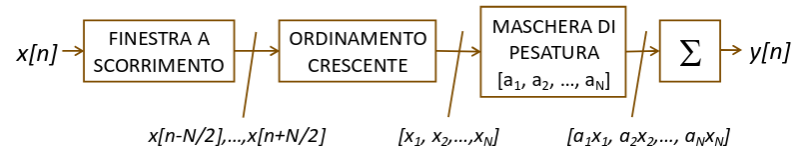

## Filtri non lineari

I filtri non lineari sono complessi da realizzare nel dominio analogico,
bisognerebbe usare una componentistica non lineare. Sui segnali numerici invece
tutto è più semplice e si possono sfruttare i vantaggi offerti dalla non
linearità.

### Rimappatura dei livelli

L'operazione di quantizzazione è un'operazione non lineare. Sull'output si può
agire nuovamente in maniera non lineare usando funzioni che rimappano i livelli
(per esempio per espandere i livelli in un certo intervallo e comprimere quelli
negli altri).

Operazioni di questo tipo vengono usate per:

- evidenziare caratteristiche del segnale o del suo contenuto;
- cancellare alcune variazioni;
- estrarre alcune parti, azzerandone altre;

### Filtri di rango

I filtri di rango si basano sull'ordinamento dei valori all'interno della
finestra di filtraggio e poi sul calcolo di una media pesata basata sul valore
(rango) anziché sulla posizione dei campioni.

L'effetto dipende dalla dimensione della finestra e dai pesi utilizzati.

Alcuni filtri di rango molto usati sono:

- massimo:
  $a_i = \begin{dcases} i \neq N \implies 0 \\ i = N \implies 1 \end{dcases}$;
- minimo:
  $a_i = \begin{dcases} i \neq 1 \implies 0 \\ i = 1 \implies 1 \end{dcases}$;
- mediana:
  $a_i = \begin{dcases} i \neq \lfloor \frac{N}{2} \rfloor \implies 0 \\ i = \lfloor \frac{N}{2} \rfloor \implies 1 \end{dcases}$;

:::note

Un filtro mediano si usa solitamente per rimuovere variazioni non volute nel
segnale, particolarmente quelle di tipo impulsivo.

Si riescono ad eliminare picchi isolati senza introdurre un effetto di
passa-basso (che abbassa e allarga i picchi ma non li rimuove completamento).

:::

I filtri di rango presentano una maggiore complessità computazionale, dovuta al
bisogno di eseguire l'operazione di sorting (che al minimo è $O(N\ \fLog{N})$).

## Discrete Fourier Transform (DFT)

La DFT è l'analogo discreto della formula che restituisce i coefficienti della
serie di Fourier. La IDFT (inversa) è l'analogo della serie (che ricostruisce il
segnale nel tempo).

- DFT:

  $$
  X[k] = \frac{1}{\sqrt{N}} \sum_{n = 0}^{N - 1} x[n] e^{- j 2 \pi \frac{k}{N} n}
  $$

- IDFT:

  $$
  x[n] = \frac{1}{\sqrt{N}} \sum_{k = 0}^{N - 1} X[k] e^{j 2 \pi \frac{k}{N} n}
  $$

### Funzioni base

Le armoniche campionate $e^{- j 2 \pi \frac{k}{N} n}$ sono $N$ sinusoidi
complesse, discretizzate nel tempo e prendono il nome di **funzioni base**. Il
numero di funzioni base equivale al numero di campioni trasformati.

La $k$-esima funzione base è una sinusoide a frequenza pari a $k$ volte la
frequenza fondamentale (ovvero la frequenza che compie un intero ciclo nella
durata del segnale).

La discretizzazione del segnale in frequenza, rende il segnale originale
periodico nel tempo. Allo stesso modo in cui la discretizzazione nel tempo
rendeva il segnale periodico nel dominio delle frequenze (come nella serie di
Fourier, dato che i coefficienti sono discretizzati e non continui).

Se un segnale discreto ha $N$ campioni, la sua FT sarà una funzione continua e
periodica. La DFT rappresenta la discretizzazione di tale rappresentazione e
genera una periodizzazione nel tempo (si pensi al contrario di una trasformata
di Fourier).

### Proprietà della DFT

La DFT mantiene tutte le proprietà della FT (linearità, invertibilità,
simmetria, traslazione, etc...)

#### Teorema di Rayleigh

Per calcolare l'energia di una sequenza discreta, è possibile lavorare
direttamente sui coefficienti nel dominio della frequenza:

$$
E_x = \sum_{n = 0}^{N - 1} x[n]^2 = \frac{1}{N} \sum_{k = 0}^{N - 1} X[k]^2
$$
