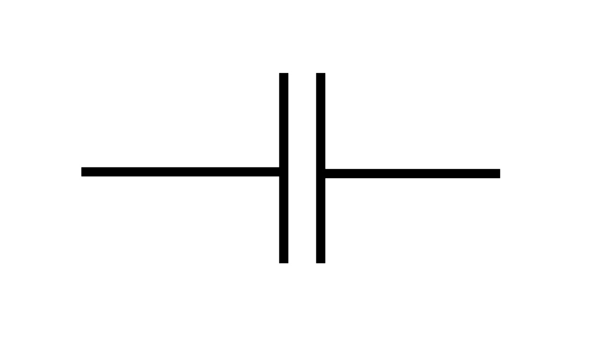
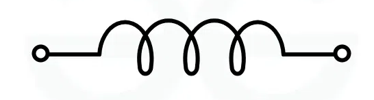

## Trasferimento di segnale e di potenza

Prendiamo un circuito composto da un generatore di tensione ($V_s$: $s$ sta per
source) e 2 resistenze $R_s$ (source resistance) e $R_l$ (load resistance).

```
┌──R_s──┐
│+      │
V_s     R_l
│-      │
└───────┘
```

:::tip

Le lettere 'l' e 's' sono una convenzione standard in elettronica, per
distinguere la parte che invia il segnale (source) e quella che lo riceve
(load).

:::

### Segnale

Se volessimo un efficiente trasferimento di segnale, la resistenza $R_l$
dovrebbe essere molto più grande di $R_s$ perché vogliamo massimizzare la
tensione ai capi della resistenza di carico.

### Potenza

La potenza è data da $P = V_l\ I_l$. Quindi dobbiamo trovare un valore della
resistenza che massimizzi questo valore.

$V_l = V_s \frac{R_l}{R_s + R_l}$ e $I_l =  \frac{V_s}{R_s + R_l}$, quindi
$P = \frac{{V_s}^2\ R_l}{(R_s + R_l)^2}$. Per massimizzare, trovo la derivata
rispetto ad $R_l$ (l'unico parametro che può cambiare) e studio i punti in qui
essa si annulla.

In condizioni ideali, il risultato è che la resistenza che devo mettere su $R_l$
per massimizzare la potenza trasferita è sempre uguale a $R_s$.

## Condensatore

$$
Q(t) = f(V(t))
$$

Simbolo:



Restrizioni:

- linearità: $Q(t) = C(t)\ V(t)$;
- tempo-invarianza: $Q(t) = C\ V(t)$;

Corrente che passa attraverso un condensatore:
$I(t) = \dv{Q}{t}(t) = C \dv{V}{t}(t)$.

Se inverto l'equazione posso trovare la differenza di potenziale del
condensatore a partire dalla corrente che passa:

$$
I(t)\ dt = C\ dV(t) \iff \int_{V(t_0)}^{V(t)} dV = \frac{1}{C} \int_{t_0}^t I(t)\ dt \iff V(t) = \frac{1}{C} \int_{t_0}^t I(t)\ dt + V(t_0)
$$

I condensatori sono oggetti che mantengono la carica anche quando la corrente
del circuito viene spenta. Infatti in mancanza di essa la tensione è costante
rispetto al tempo (conta solo quella presente a $t_0$).

:::danger

Quando si lavora con un circuito elettrico bisogna assicurarsi che i
condensatori siano scarichi, altrimenti si rischia di rimanere fulminati.

:::

## Induttore

$$
\Phi_B(t) = f(I(t))
$$

Simbolo:



Restrizioni:

- linearità: $\Phi_B(t) = L(t)\ I(t)$;
- tempo-invarianza: $\Phi_B(t) = L\ I(t)$;

Tensione sui capi di un induttore: $V(t) = \dv{Q}{t}(t) = L \dv{I}{t}(t)$

Conseguenze:

- se la corrente è costante nel tempo, la sua derivata è 0 e la tensione diventa
  0;
- l'induttore immagazzina l'energia attraverso la corrente, solo al suo
  cambiamento c'è una reazione;

### Calcolo dell'induttanza di un induttore

Il solenoide è un classico esempio di induttore, quindi preso uno di lunghezza
$l$ e numero di spire $N$, il campo magnetico al suo interno è dato dalla legge
di Ampère:

$$
\oint \vec{B(t)} \cdot \vec{dl} = \mu_0\ I(t) \iff B(t) = \mu_0\ I(t) \frac{N}{l}
$$

Per trovare l'induttanza $L$ devo conoscere l'area $A$ di una singola spira, da
cui posso ricavare il flusso magnetico totale passante attraverso il solenoide.

$$
\Phi_B(t) = B(t)\ A = \mu_0\ I(t) \frac{N}{l} A
$$

L'induttanza è definita come il rapporto tra il flusso magnetico e la corrente
che lo genera.

$$
L = \frac{\Phi_B(t)}{I(t)} = \mu_0 \frac{N}{l} A
$$
