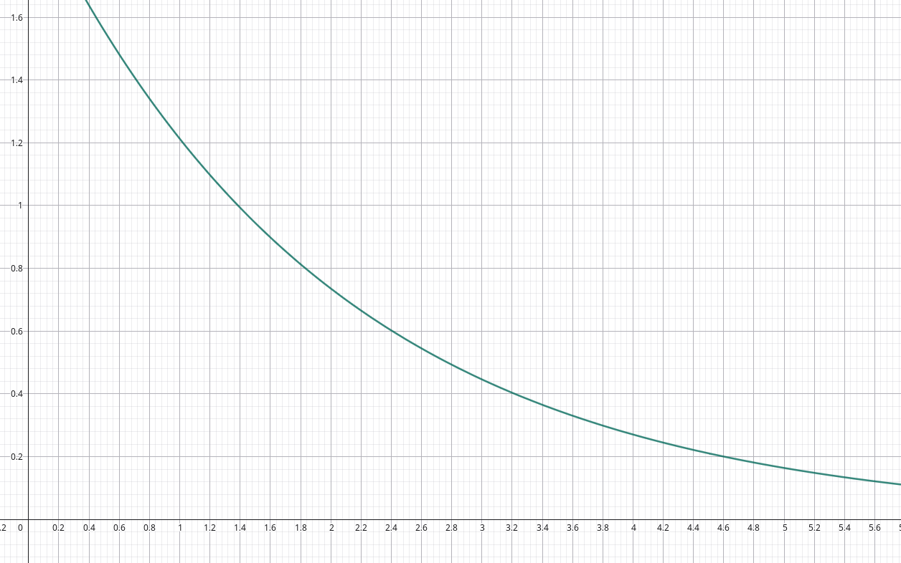
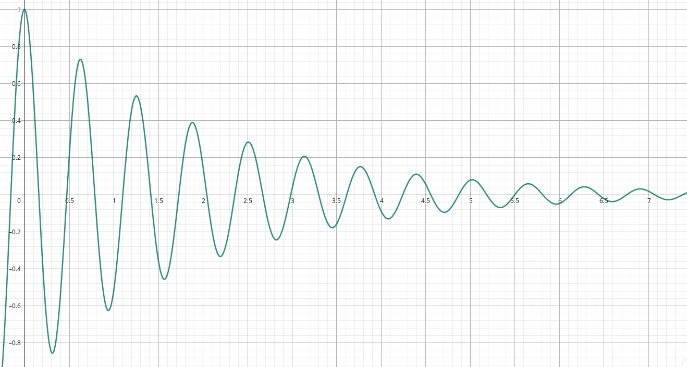
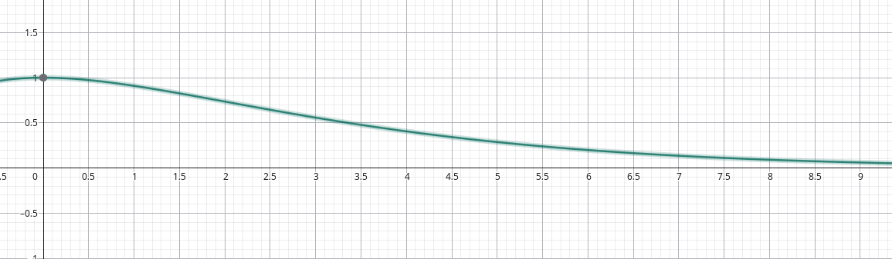
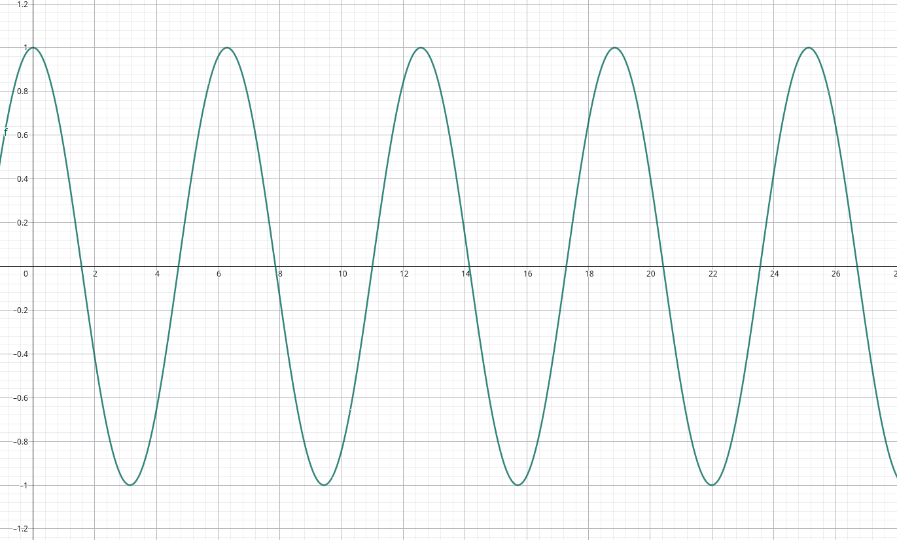

## Risposta all'impulso e al gradino

Chiamiamo:

- $g(t)$ la risposta a stato $0$ ad un gradino unitario: $Z_0[\theta(t)]$;
- $h(t)$ la risposta a stato $0$ ad una delta di Dirac: $Z_0[\delta(t)]$;

### Delta di Dirac in termini di gradini

Possiamo scrivere un impulso come una combinazine di 2 gradini:

- $\frac{\theta(t)}{d}$: gradino a $0$ alto $\frac{1}{d}$;
- $\frac{\theta(t - d)}{d}$: gradino a $d$ alto $\frac{1}{d}$;

L'impulso si ottiene così:

$$
P_d(t) = \frac{\theta(t)}{d} - \frac{\theta(t - d)}{d}
$$

Quindi la risposta a questo impulso sarà:

$$
\begin{darray}{ll}
Z_0[P_d(t)] &= \frac{1}{d} (Z_0[\theta(t)] - Z_0[\theta(t - d)]) \\[10pt]
            &= \frac{1}{d} (g(t) - Z_0\ \Tau_d[\theta(t)]) \\[10pt]
            &= \frac{1}{d} (g(t) - \Tau_d[g(t)])
\end{darray}
$$

Per $d$ che tende a $0$ (e quindi per la delta di Dirac), si nota che
l'equazione sopra corrisponde a quella della definizione di derivata di $g$:
$Z_0[\delta(t)] = h(t) = \frac{dg}{dt}(t)$.

## Circuiti RLC di 2° ordine a ingresso 0

Prendiamo un circuito dove a $t_0$ la tensione ai capi dei componenti in
parallelo è $V_{C_1}(t_0) = V_0$ e la corrente passante per l'induttore è
$I_{L_1}(t_0) = I_0$.

```
┌────┬────┐
C_1  L_1  R_1
└────┴────┘
```

Costruiamo il solito sistema:

$$
\begin{dcases}
V_{C_1}(t) = V_{R_1}(t) = V_{L_1}(t) = V(t) \\
I_{C_1}(t) + I_{L_1}(t) + I_{R_1}(t) = 0 \\
V_{R_1}(t) = R_1 I_{R_1}(t) \\
I_{C_1}(t) = C_1 \frac{d V_{C_1}}{dt}(t) \\
V_{L_1}(t) = L_1 \frac{d I_{L_1}(t)}{dt}(t) \\
V_{C_1}(t_0) = V_0 \\
I_{L_1}(t_0) = I_0
\end{dcases}
$$

Semplificando otteniamo il seguente problema di Cauchy, che contiene
un'equazione differenziale di 2° grado:

$$
\begin{dcases}
C_1 \frac{dV}{dt}(dt) + I_{C_1}(t) + \frac{V(t)}{R_1} = 0
  \iff L_1\ C_1\ \frac{d^2 I_{L_1}}{dt^2}(t) + \frac{L_1}{R_1} \frac{d I_{C_1}}{dt}(t) + I_{L_1}(t) = 0
  \iff \frac{d^2 I_{L_1}}{dt^2}(t) + \frac{1}{R_1\ C_1} \frac{d I_{C_1}}{dt}(t) + \frac{I_{L_1}(t)}{L_1\ C_1} = 0
V_{C_1}(t_0) = V_0 \\
I_{L_1}(t_0) = I_0
\end{dcases}
$$

Definisco 2 parametri reali e sempre positivi:

- $\alpha = \frac{1}{2\ R_1\ C_1}$ **costante di smorzamento**: indica quanto
  velocemente la corrente viene smorzata;
- $\omega_0 = \frac{1}{\sqrt{L_1\ C_1}}$ **frequenza di risonanza**: frequenza
  con la quale C e L si scambiano energia;

Il sistema diventa:

$$
\begin{dcases}
\frac{d^2 I_{L_1}}{dt^2}(t) + 2 \alpha \frac{d I_{C_1}}{dt}(t) + \omega_0^2\ I_{L_1}(t) = 0 \\
V_{C_1}(t_0) = V_0 \\
I_{L_1}(t_0) = I_0
\end{dcases}
$$

Si può notare che l'equazione assomiglia ad un polinomio di 2° grado:
$x^2 + 2 \alpha x + \omega_0^2 = 0$, con soluzioni:

$$
x_1, x_2 = \frac{-2 \alpha \pm \sqrt{4 \alpha^2 - 4 \omega_0^2}}{2} = - \alpha \pm \sqrt{\alpha^2 - \omega_0^2}
$$

Le soluzioni possono essere:

- reali e distinte se $\Delta > 0$: nel caso sopra saranno $x_1 < x_2 < 0$.

  La soluzione dell'equazione differenziale è:

  $$
  I_{L_1}(t) = k_1\ e^{x_1\ t} + k_2\ e^{x_2\ t}
  $$

  Questo caso prende il nome di **sovrasmorzato** perchè avremo la somma di 2
  esponenziali che decrescono.

  

- complesse se $\Delta < 0$:

  Chiamo $- w_d = \alpha^{2} - w_0^2$.

  Nel caso sopra saranno
  $- \alpha \pm \sqrt{- w_d^2} = - \alpha \pm \sqrt{-1} w_d^2 = - \alpha \pm j w_d^2$.

  :::note

  In fisica l'unità dei numeri complessi si denota con $j$ e non $i$ per evitare
  confusione con la corrente.

  :::

  A differenza di prima $x_1$ e $x_2$ sono numeri complessi. La soluzione
  dell'equazione differenziale è:

  $$
  \begin{darray}{ll}
  I_{L_1}(t) &= k_1\ e^{x_1\ t} + k_2\ e^{x_2\ t} \\
             &= k_1\ e^{(- \alpha + j\ w_0)\ t} + k_2\ e^{(- \alpha + j\ w_0)\ t} \\
             &= e^{- \alpha\ t} (k_1\ e^{j\ w_0\ t} + k_2\ e^{- j\ w_0\ t}) \\
             &= e^{- \alpha\ t} (k_1\ (\cos(w_0\ t) + j\ \sin(w_0\ t)) + k_2\ (\cos(w_0\ t) - j\ \sin(w_0\ t))) \\
             &= e^{- \alpha\ t} (\cos(w_0\ t)\ (k_1 + k_2) + j\ \sin(w_0\ t)\ (k_1 - k_2)) \\
             &= e^{- \alpha\ t} (\cos(w_0\ t)\ A + \sin(w_0\ t)\ B) \\
             &= e^{- \alpha\ t} \sqrt{A^2 + B^2} \left(\frac{A \cos(w_0\ t)}{\sqrt{A^2 + B^2}} + \frac{B \sin(w_0 t)}{\sqrt{A^2 + B^2}}\right) \\
             &= e^{- \alpha\ t} \sqrt{A^2 + B^2} (\cos(\phi) \cos(w_0\ t) + \sin(\phi) \sin(w_0\ t)) \\
             &= e^{- \alpha\ t} K (\cos(\phi) \cos(w_0\ t) + \sin(\phi) \sin(w_0\ t)) \\
             &= e^{- \alpha\ t} K (\cos(\phi) \cos(w_0\ t) + \sin(\phi) \sin(w_0\ t)) \\
             &= e^{- \alpha\ t} K \cos(w_0\ t - \phi)
  \end{darray}
  $$

  Le variabili che 'appaiono' sono:
  - $A = k_1 + k_2$
  - $B = j\ (k_1 - k_2)$
  - $K = \sqrt{A^2 + B^2} = \sqrt{k_1\ k_2}$: è un numero reale per le
    condizioni iniziali che abbiamo dato;
  - $\phi$: angolo del triangolo rettangolo con cateti $A$ e $B$. Indica la fase
    del circuito;

  Il grafico è quello di una sinusoidale che viene smorzata progressivamente.
  Questo caso prendi il nome di **sottosmorzato**.

  

  :::note

  Lo stesso procedimento si usa molto comunemente anche in altri fenomeni
  fisici, ad esempio un oggetto oscillante su una molla con attrito.

  :::

- coincidenti se $\Delta = 0$, $x_1 = x_2 = - \alpha$:

  La soluzione dell'equazione differenziale è:

  $$
  I_{L_1}(t) = k_1 t e^{- \alpha\ t} + k_2 e^{- \alpha\ t}
  $$

  Il grafico è sempre una somma di 2 esponenziali decrescenti. Questo caso viene
  detto **criticamente smorzato**.

  

:::note

Nel caso sottosmorzato con $\alpha = 0$, il grafico è quello di una sinusoidale
con valori periodici costanti all'infinito.

Questo caso viene detto **senza attriti** e non si può mai verificare nella
realtà perchè ci sarà sempre almeno una resistenza intrinseca nel circuito.



:::
