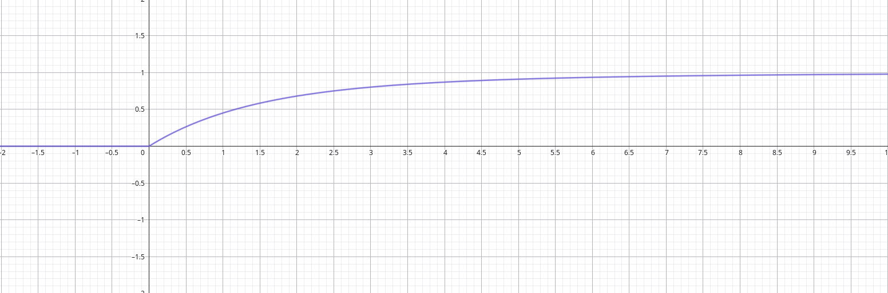
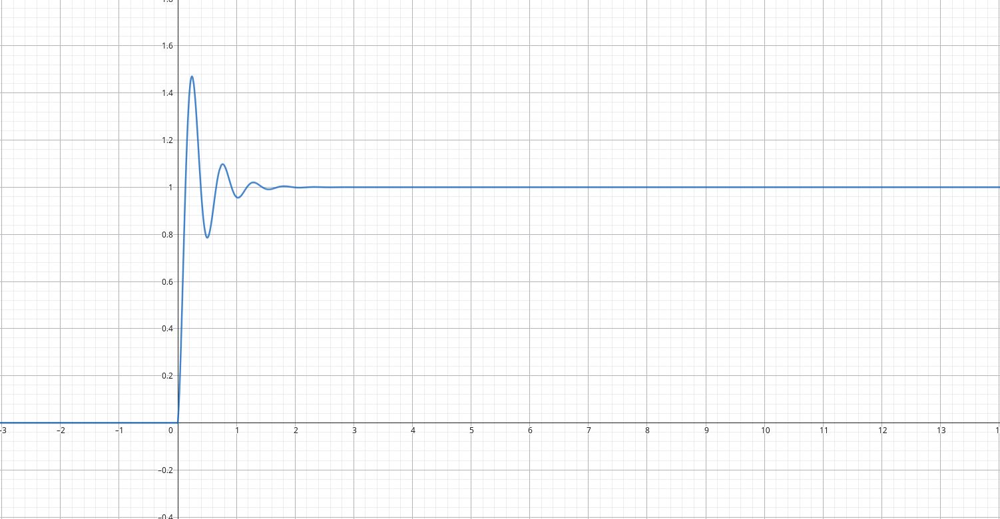

## Circuiti RLC di 2° ordine a stato 0

Prendiamo un circuito dove a $t_0$ viene acceso un generatore di corrente $I_s$:

```
┌────┬────┬────┐
I_s  C_1  L_1  R_1
└────┴────┴────┘
```

Costruiamo il solito sistema:

$$
\begin{dcases}
V(t) = V_{C_1}(t) = V_{L_1}(t) = V_{R_1}(t) \\
I_s(t) = I_{C_1}(t) + I_{L_1}(t) + I_{R_1}(t) \\
V_{R_1}(t) = I_{R_1}(t)\ R_1 \\[3pt]
I_{C_1}(t) = C_1 \frac{d V_{C_1}(t)}{dt} \\[3pt]
V_{L_1}(t) = L_1 \frac{d I_{L_1}(t)}{dt} \\
I_{L_1}(t_0) = 0 \\
V_{C_1}(t_0) = 0
\end{dcases}
$$

Otteniamo circa la stessa equazione differenziale dell'altra volta:

$$
\begin{dcases}
I_s(t) = L_1\ C_1\ \frac{d^2 I_{L_1}(t)}{dt^2} + \frac{L_1}{R_1} \frac{d I_{L_1}(t)}{dt} + I_{L_1}(t) \\
I_{L_1}(t_0) = 0 \\[3pt]
\frac{d I_{L_1}(t_0)}{dt} = 0
\end{dcases}
$$

L'analisi ci dice che il risultato di un'equazione differenziale non omogenea è
uguale al risultato dell'omogenea corrispondente + una soluzione particolare:

$$
I_{L_1}(t) = I_{L_1}(t)^H + I_{L_1}(t)^P
$$

### Caso particolare: $I_s(t) = \theta(t)$

Per $t > t_0$:

$$
\begin{dcases}
L_1\ C_1\ \frac{d^2 I_{L_1}(t)}{dt^2} + \frac{L_1}{R} \frac{d I_{L_1}(t)}{dt} + I_{L_1}(t) = 1 \\
I_{L_1}(t_0) = 0 \\[3pt]
\frac{d I_{L_1}(t_0)}{dt} = 0
\end{dcases}
$$

Riprendiamo l'equazione omogenea vista nell'ultima lezione. In 3 casi su 4
(escludiamo quello criticamente smorzato che ha un espressione leggermente
diversa), la soluzione si può scrivere come:

$$
I_{L_1}(t) = k_1 e^{x_1\ t} + k_2 e^{x_2\ t}
$$

Quindi la soluzione della nostra equazione non omogenea sarà:

$$
\begin{dcases}
I_{L_1}(t) = (k_1 e^{x_1\ t} + k_2 e^{x_2\ t} + 1)\ \theta(t) \\
I_{L_1}(t_0) = 0 \\[3pt]
\frac{d I_{L_1}(t_0)}{dt} = 0
\end{dcases}
$$

Per trovare $k_1$ e $k_2$ basta sfruttare le uguaglianze fornite dal problema di
Cauchy.

Per $x_1, x_2 \in \R$ l'andamento della corrente sarà:



Per $x_1, x_2 \in \mathbb{C}$ l'andamento della corrente sarà:



### Soluzione generale

Data una rete LTI con un ingresso $x(t)$ e un uscita y(t) sarà sempre possibile
scrivere un'equazione differenziale che le mette in relazione. Essa sarà del
tipo:

$$
\begin{dcases}
a_n \frac{d^n y}{dt^n}(t) + a_{n-1} \frac{d^{n-1} y}{dt^{n-1}}(t) + \dots + a_0 = b_m \frac{d^m x}{dt^m}(t) + b_{m-1} \frac{d^{m-1} x}{dt^{m-1}}(t) + \dots + b_0 x(t) \\[10pt]
y(t_0) = k_0 \\[5pt]
\frac{dy}{dt}(t_0) = k_1 \\
\vdots \\
\frac{d^{n-1} y}{dt^{n-1}}(t_0) = k_{n-1}
\end{dcases}
$$

## Approssimazione di un ingresso arbitrario

Finora abbiamo visto le soluzioni $g(t) = Z_0[\theta(t)]$ e
$h(t) = Z_0[\delta(t)]$.

Preso un ingresso arbitrario, posso suddividerlo in $n$ intervalli
$t_0, \ldots, t_n$, di ampiezza $d$ e altezza $x(t_i)$.

L'ingresso diventa una somma di impulsi allargati di area $x(t_i)\ d$:

$$
x_{\text{approssimato}}(t) = \sum_{i=0}^n x(t_i)\ d\ P_d(t - t_i)
$$

E l'uscita sarà data dalla somma delle risposte ad ogni impulso:

$$
Z_0[x_{\text{approssimato}}(t)] = \sum_{i=0}^n x(t_i)\ d\ Z_0[P_d(t - t_i)]
$$
